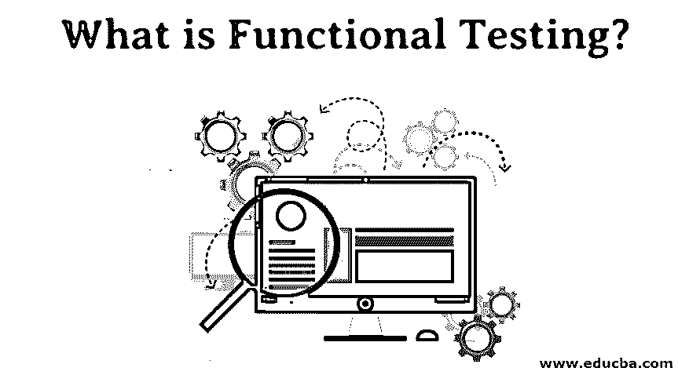
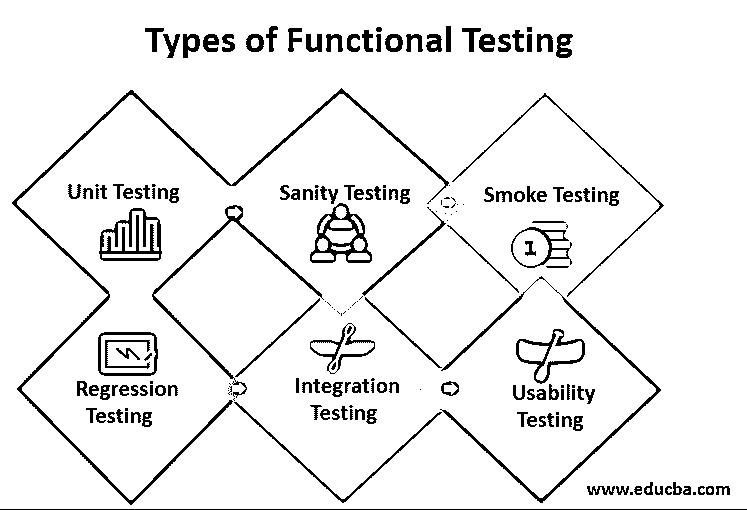

# 什么是功能测试？

> 原文：<https://www.educba.com/what-is-functional-testing/>

## 功能测试简介

功能测试是基于对组件或系统功能的规格分析的测试。基于 ISO 9126 的指定行为被认为是关注适用性、互操作性测试、安全性、合规性和准确性而完成的。用于功能测试的技术通常是基于规范的，但是也可以使用基于经验的技术。测试条件和测试用例源自系统或组件的功能，为了设计测试，可以开发模型，例如状态转换模型、过程模型或简单语言规范。

### 什么是软件测试？

软件测试是一种评估软件应用程序功能以发现软件缺陷的方法。它检查所创建的软件满足特定需求的事实，并为生产高质量的产品识别任何软件缺陷。它执行一个系统来识别任何与实际需求相反的缺陷、错误或需求缺失。

<small>网页开发、编程语言、软件测试&其他</small>

在软件测试中，有两种测试类型:

*   功能测试
*   非功能测试

### 功能测试和非功能测试的比较

执行功能测试验证软件行为，非功能测试用于检查软件的效率。它总是关注用户的需求，而非功能测试关注用户的期望。它很容易在黑盒测试中执行。非功能性测试在白盒测试中很容易执行。它解释了项目正在做什么。非功能测试描述了产品的工作方式。

### 功能测试的好处

执行测试是必要的，它验证系统是固定的并且没有错误。

*   该测试是真实方案的复制品，即产品是真实环境的复制品。测试集中在客户需求上。
*   这个系统的结构不基于任何假设。
*   这种测试保证高质量的产品满足客户的要求，并保证客户对最终结果感到满意。
*   它保证了一个无 bug 的产品具有根据客户需求工作的所有特性。此外，进行基于风险的测试是为了降低产品中任何风险的可能性。

### 功能测试的特点

自动化工具，例如 Test Complete，通过自动化其重复的元素以及灵活性和过滤其结果来帮助指南。此外，提供完整的测试增强了它的功能。即使是最简单的功能测试也应该适用于项目的整个生命周期，以便可以根据已经验证的标准输出来自动测量结果。因此，应该尽可能地保持它在应用程序之外。

TestComplete 提供了满足这一标准的必要特征:

*   在测试中使用任何编程结构的测试和脚本都是可视化设计的循环；如果当时的情况是，捕捉块，备注等。
*   仔细测试第三方控制应用程序的具体功能和技术有 Windows 格式、Developer Express、Syncfusion、Qt、Infragistics、Telerik、MFC 等。
*   Test Complete 提供了对内部属性和应用技术进行更深入的功能测试的无与伦比的途径。
*   开发人员需要确保通过测试来检查与他们相关的精确代码。这就产生了一个可能的问题。一方面，它应该独立于应用程序；另一方面，应用程序应该检查内部项目。
*   TestComplete 可以访问应用程序的内部信息来解决这个潜在的问题。

### 功能测试的类型

类别有很多，可以根据场景使用。

但是，首先，让我们看看最重要的功能测试种类:

**1。单元测试**通常由开发人员完成，他们编写各种代码单元，这些代码单元可以与特定的特性相关联，也可以不相关联。代码覆盖率是单元测试的重要组成部分，其中测试实例必须存在于代码行覆盖率、代码路径覆盖率和方法覆盖率中。

**2。健全性测试:**确保所有重要和关键的应用程序/系统功能正常运行。这通常在烟雾测试后进行。

**3。冒烟测试:**在测试每个部件时进行，以保证施工的稳定性。它也被称为压力增大测试。

**4。回归测试:**为保证添加新代码、增强和修复错误不会违反当前功能或造成不稳定性而进行的测试。

**5。集成测试**:当系统依赖于各种功能模块时，这些功能模块可以完美地独立运行，但必须一致地运行以获得端到端的情况，集成测试被称为这些场景的验证。

**6。** **可用性测试:**在类似生产的环境中，产品被暴露给实际的客户，并接受测试。获得用户的便利，并接收反馈。这相当于对用户准入的筛选

### 结论

它是软件测试中的一种系统测试方法，保证系统按照公司文件中规定的功能运行。该测试的目的是验证该方案的性能。

### 推荐文章

这是一个什么是功能测试的指南？这里我们分别讨论功能测试的好处、特点和类型。您也可以看看以下文章，了解更多信息–

1.  [软件测试的类型](https://www.educba.com/types-of-software-testing/)
2.  [测试 Java 框架](https://www.educba.com/testing-frameworks-for-java/)
3.  [软件测试职业](https://www.educba.com/careers-in-software-testing/)
4.  [软件测试原则](https://www.educba.com/software-testing-principles/)

