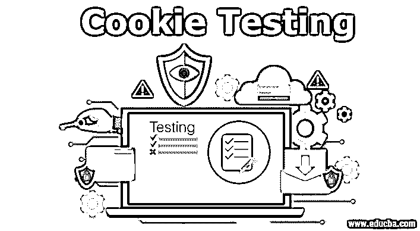
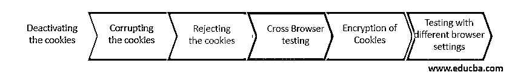

# Cookie 测试

> 原文：<https://www.educba.com/cookie-testing/>

## Cookie 测试简介

 **每当通过使用 web 应用程序的服务器访问 web 应用程序时，都会执行 Cookie 测试来测试保存在 web 浏览器中的 cookie。术语 cookie 可以被定义为以文本形式保存在浏览器历史中的数据部分，用于每次将请求细节发送回服务器。从 web 应用程序的服务器为特定的 web 页面发送相同的页面请求，这个 cookie 用于更快地访问网站&用户在网站上的导航模式。

### 为什么我们需要 Cookie 测试？

需要 Cookie 测试来检查特定信息是否被发送回服务器。每次浏览器向服务器请求页面时，都应该保存这些信息。检查网站功能是必要的，也是重要的。验证 cookies 是如何写入文件和存储在硬盘中的，这一点很重要。应该对 Cookies 进行测试，因为它们在其中存储了非常重要的信息，扮演着重要的角色。

<small>网页开发、编程语言、软件测试&其他</small>

### 如何测试 Cookies？

测试 cookies 时，可以遵循以下步骤。

#### 步骤 1:禁用 cookies

要开始测试，应首先禁用 cookies。这可以通过转到浏览器设置来完成。一旦 cookies 被禁用，就可以测试不同的功能。网站页面及其不同的功能和一般功能的监控可以很容易地完成。当 cookies 被禁用时，这些行为可能会很奇怪。网站应该能够主动从任何故障中恢复，应该是好的。一些网站还在 cookies 被禁用时通过帮助消息向用户提供信息。测试应该以这样一种方式进行，它应该确保所有这样的场景都被预先处理。

#### 步骤 2:通过编辑 cookies 来测试它们

为了测试应用程序，可以使用 cookie 中的信息对其进行编辑。当 cookies 存储用户名、密码等信息时，这种情况是有效的。测试可以通过访问 cookie 文件来完成。通过用任何其他有效或无效的数字更改当前 id，可以很容易地编辑该文件。一旦更改完成，网站应该不允许您登录。这是因为用户名已更改，应该发送正确的错误消息作为拒绝访问。

#### 步骤 3:删除 cookies 以进行测试

在这种情况下，有必要完全删除或移除 cookies。删除它们后，您可以重新测试网站并观察其行为。在这种情况下，不应该有任何错误或失败。浏览器应该像预期的那样工作，并一如既往地提供所有信息。Cookies 并不总是强制性的。这取决于用户是否希望它被保存。

#### 第四步:破坏饼干

这是不应该错过的重要场景之一。从安全角度来看，这非常重要，因为黑客会使用这些信息，并试图访问有关您和您的应用程序的未经授权的信息。这通常是通过破坏 cookie 或覆盖 cookie 信息来实现的，目的是通过 cookie 文件获得对您的信息的访问权。从银行、金融和投资应用的角度来看，这项测试很重要。这些应用程序的安全性是最大的。当 cookies 被销毁时，应该对其行为进行监控。这种监控有助于发现 cookies 中的错误(如果有的话)。

#### 步骤 5: Cookie 加密测试

出于安全的唯一目的，存储在网站 cookie 文件中的所有用户名、用户 id 和其他敏感信息都应该加密，这一点很重要。在发送到本地计算机之前，[加密](https://www.educba.com/what-is-encryption/)应该被验证。

#### 步骤 6:跨不同浏览器测试 cookies 的行为

存储在一个浏览器上的 cookie 不应该在任何其他浏览器上运行。它应该只能在创建它的浏览器上运行。这种跨浏览器测试应该适当地进行。

### Cookie 测试技术

如上所述，cookie 测试技术可以总结如下:

*   停用 cookies
*   破坏饼干
*   拒绝饼干
*   跨浏览器测试
*   Cookies 的加密
*   使用不同的浏览器设置进行测试

通过使用这种技术，可以正确地测试 cookies 的功能和工作情况，并且可以验证所有数据。

### Cookie 测试的优点和缺点

以下是 cookie 测试的一些优点和缺点:

#### 优势

*   cookies 很容易实现，并且不需要任何服务器。它们存储在用户的计算机上。
*   Cookies 可以配置为在会话过期时过期。这使得它们只在用户激活之前保持不变。这也保证了安全性。
*   Cookies 有助于存储信息，其工作方式是用户在不知道信息被存储的情况下工作。
*   它们存储更少的内存，并且因为不涉及服务器，所以不需要将数据发送回服务器。
*   cookie 是持久的，如果不局限于一个会话，cookie 中的信息可以保留几天、几个月甚至几年。用户很容易检查信息。
*   Cookies 存储在客户端的硬盘上，即使服务器崩溃，这些信息仍然可用。
*   Cookies 使浏览互联网更快更容易。

#### 不足之处

*   **网站流量损失:**禁用 cookies 后，一些功能将无法运行。
*   **过度使用 cookie:**一些浏览器在使用 cookie 时会弹出窗口。进行测试时，需要启用和禁用许多 cookies
*   **敏感信息:**有时候敏感信息是不加密存储在 cookies 里的。这损害了安全性。

### 结论

Cookies 是非常有用的轻量级对象，它在系统中存储用户信息。测试它们是很重要的，因为它们存储敏感信息。Cookies 可以通过编辑、拒绝甚至销毁来进行测试。这有助于检查所有视角，并验证所有数据是否都正确地存储在 cookies 中。

### 推荐文章

这是 Cookie 测试的指南。这里我们讨论了为什么我们需要 cookie 测试，如何测试 cookie，优点和缺点等。您也可以看看以下文章，了解更多信息–

1.  [响应式测试工具](https://www.educba.com/responsive-testing-tool/)
2.  什么是自动化测试？
3.  [跨浏览器测试工具](https://www.educba.com/cross-browser-testing-tools/)
4.  [硒负荷测试](https://www.educba.com/selenium-load-testing/)

**