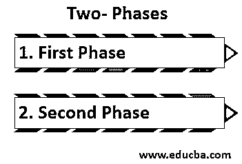

# 阿尔法测试

> 原文：<https://www.educba.com/alpha-testing/>

## 什么是阿尔法测试？

Alpha 测试是由潜在用户或客户或独立测试团队在开发人员的站点上执行的模拟或实际操作测试，但是在开发组织之外。在 alpha 测试中，测试在开发人员的站点进行，邀请潜在用户和组织成员使用系统，开发人员观察用户并记录问题。

### 为什么我们需要阿尔法测试？

在软件准备好发布给[最终用户进行 beta 测试](https://www.educba.com/beta-testing/)之前，当软件、硬件组件的所有模块都正确集成时，软件团队、开发人员或测试人员有责任对软件应用程序进行最终测试。主要目的是快速检查、发现和修复以前没有发现的或由于某些原因新引入的软件缺陷。

<small>网页开发、编程语言、软件测试&其他</small>

一些主要目标如下:

*   从最终用户的角度理解软件应用程序的行为。
*   主要目标是在软件即将开发时发现新引入的缺陷。
*   执行它是为了获得构建是否足够稳定以准备发布给最终用户的信心。
*   它揭示了由于用户对应用程序的不当行为而可能产生的缺陷。

### Alpha 测试是如何工作的？

谈到 Alpha 测试到底是如何工作的，有一个系统的和详细的程序可以遵循。第一步是设计规范，开发人员和测试人员在其中审查应用程序的所有功能需求和核心功能。然后，QA 团队创建测试计划、测试套件，包括所有详细的测试用例。在此之后，开发的测试用例由测试人员或参与测试的开发人员进行测试，测试过程中提出的 bug 交给开发人员快速修复。一旦修复，测试团队将再次测试这些错误，并根据测试结果向更高的层次进行相应的操作。根据最终结果，从最终用户的角度来判断软件产品的稳定性和质量。

执行该测试基本上包括两个阶段:

1.  第一阶段:由开发人员或[软件工程师执行，目的是](https://www.educba.com/careers-as-a-software-engineer/)发现许多错误，如崩溃、安装问题、开发人员遗漏的功能等。
2.  第二阶段:由 QA 团队执行，包括许多测试人员和 QA 工程师。执行创建了所有详细测试用例的适当测试套件，并在发布软件进行 beta 测试之前分析软件的质量。

应用程序的测试有进入和退出的标准。

#### 入围标准

*   业务需求和软件需求文档。
*   整个软件的测试用例。
*   为执行上述测试用例而设置的测试环境。
*   为缺陷记录和测试结果更新设置的工具。
*   可追溯性矩阵，以确保涵盖每个测试要求。

#### 退出标准

*   涵盖了为 Alpha 测试创建的所有测试用例。
*   交付测试状态报告。
*   涵盖了所有主要问题/关键功能。
*   确保开发团队已经修复了记录的问题，并且测试人员已经完成了重新测试。
*   停止阿尔法测试。

### 阿尔法测试的优势

下面给出了一些优点:

*   在市场上发布软件应用程序之前获得软件团队的信任。
*   发现许多可能实时出现的、在测试环境中无法检测到的缺陷。
*   它能更好地洞察软件应用程序的可靠性。
*   如果在 beta 测试中发现最少的缺陷，并且大部分缺陷都包含在 alpha 测试中，有助于获得客户的满意。
*   从市场的角度来看，Alpha 测试发布软件的最大优势之一是，如果测试中一切顺利，它将有助于软件的早期发布。
*   每次反馈都有助于提高软件的质量。

### 阿尔法测试的缺点

尽管在将软件应用程序发布给最终用户之前测试是非常重要的。但是在执行之前，开发人员和测试人员都需要记住一些缺点，比如:

*   如果缺陷留在开发阶段的功能测试中，它们仍然没有被发现，因为 Alpha 测试的主要目的是检查用户的可接受性。它不是对软件应用的每个需求的深入测试。
*   alpha 测试环境是生产环境的复制品，但是仍然会出现一些不必要的缺陷，因为一些环境问题在生产环境中是不真实的。
*   同样，内部开发人员和测试人员执行 Alpha 测试，有时他们会因为发布截止日期而忽略缺陷。
*   对于大型项目，已经经历了如此多的严格测试，对它们执行 Alpha 测试是非常耗时的，因为很有可能存在错误，但是需要完成适当的测试计划、测试用例、文档工作，这是发布延迟的间接原因。
*   小型项目的 Alpha 测试是不够的。在 IT 项目中，时间投入与成本成正比，这反过来会增加项目预算。
*   在 Alpha 测试中，只有业务需求被覆盖。

### 结论

上面的描述清楚地解释了 Alpha 测试及其在现实世界中的重要性。尽管我们不能说任何软件应用程序在任何阶段都没有缺陷。但是，向最终用户交付高质量的产品是软件团队的责任，为此，执行 alpha 测试，从用户的角度用适当的测试计划和文档来验证软件，这被认为是软件发布前的重要测试之一。

### 推荐文章

这是阿尔法测试指南。在这里，我们讨论阿尔法测试的需要，工作，优点和缺点。您也可以浏览我们推荐的其他文章，了解更多信息——

1.  [软件测试的类型](https://www.educba.com/types-of-software-testing/)
2.  什么是阴性测试？
3.  [动态测试](https://www.educba.com/dynamic-testing/)
4.  [软件测试的级别](https://www.educba.com/levels-of-software-testing/)

