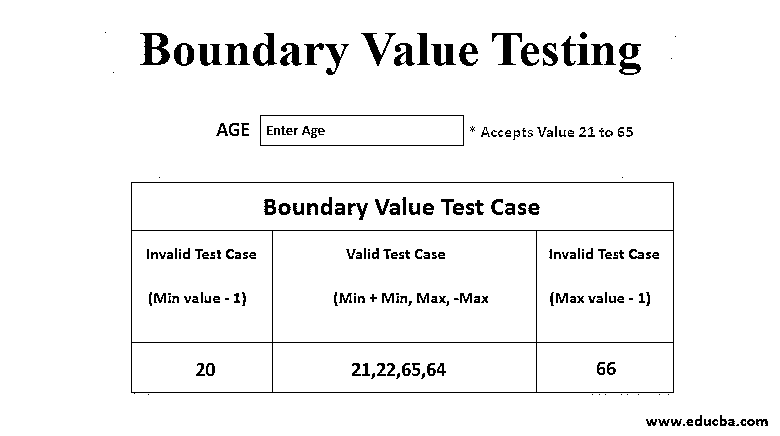

# 边界值测试

> 原文：<https://www.educba.com/boundary-value-testing/>

## 边界值测试简介

边界值测试是一种流行的软件测试机制，其中数据测试是基于边界值或在两个相对端之间进行的，其中两端可能从头到尾都是这样，或者从下到上，或者从最大值到最小值。引入该测试过程是为了基于测试值不同端的输入来选择来自边界的边界值。这种黑盒测试策略是在等价类划分之后引入的，在等价类划分中，首先进行类的划分，然后在边界进行划分。

### 什么是边界值测试？

*   测试是一个分析测试过程，它在覆盖所有测试缺陷的划分的边界上进行测试实践，其中仅仅等价测试很难处理那些缺陷。
*   该测试机器与等价测试机制相结合，当存在有序分区并且数据由数字格式组成时，该等价测试机制提供有效的测试场景。
*   这种测试机制的边界值由极限边界值确定，即最小值和最大值。
*   这主要用于分析分区边界处的测试，以及检测测试用例中可能出现的异常。
*   黑盒测试技术有助于检测在有效或无效分区的边界值处发生的任何错误或威胁，而不是集中在输入数据的中心。

### 解释边界值测试的测试用例

关于这一点的想法从上面的陈述中是清楚的。现在，是时候测试边界值测试的可能原因了。

<small>网页开发、编程语言、软件测试&其他</small>

#### 1 号测试案例

让我们假设一个测试案例，它的年龄值从 21 岁到 65 岁。

| **边界值测试用例** |
| **INVALID TEST CASE****(最小值–1)** | **VALID TEST CASES**

**(最小值，+最小值，最大值，-最大值)**

 | **INVALID TEST CASE****(最大值+ 1)** |
| **20** | **21，22，65，64** | **66** |

从上表中，我们可以看到以下给出的输入。

*   最小边界值给定为 21。
*   最大边界值为 65。
*   用于测试目的的有效输入是 21、22、64 和 65。
*   测试用例的无效输入是 20 和 66。

##### 测试用例场景

**1。**输入:输入年龄值为 20 (21-1)

**输出:**无效

**2。**输入:输入年龄值为 21

**输出:**有效

**3。**输入:输入年龄值为 22 (21+1)

**输出:**有效

**4。**输入:输入年龄值为 65

**输出:**有效

**5。**输入:输入年龄值为 64 (65-1)

**输出:**有效

**6。**输入:输入年龄值为 66 (65+1)

**输出:**无效

#### 测试案例#2

让我们假设下一个测试用例将输入名称的长度从 8 个字符增加到 14 个字符。

| **边界值测试用例** |
| **INVALID TEST CASE**

**(最小值–1)**

 | **VALID TEST CASES****(最小值，+最小值，最大值，-最大值)** | **INVALID TEST CASE****(最大值+ 1)** |
| **7** | **8，9，14，13** | **15** |

从上表中，我们可以看到以下给出的输入。

*   最小边界值给定为 8。
*   最大边界值为 14。
*   用于测试目的的有效字符长度是 8、9、14 和 13
*   测试用例的无效字符长度是 7 和 15。

##### 测试用例场景

**1。**输入:输入文本长度为 7(最小长度-1)

**输出:**无效

**2。**输入:输入文本长度为 8(最小长度)

**输出:**有效

**3。**输入:输入文本长度为 9(最小长度+1)

**输出:**有效

**4。**输入:输入文本长度为 14(最大长度)

**输出:**有效

**5。**输入:输入年龄值为 13(最大长度-1)

**输出:**有效

**6。**输入:输入年龄值为 15(最大长度+1)

**输出:**无效

### 重要

有很多重要的东西，我将在下面分享其中的一些:

*   这是在有大量测试用例可用于测试的情况下完成的，为了单独检查它们，这种测试非常有用。
*   在等价类划分发生和分析完成之后，测试数据的分析在划分的数据的边界上完成。
*   这个测试过程实际上被称为黑盒测试，它集中于有效和无效的测试用例场景，并帮助在极端情况下找到边界值，而不妨碍任何对测试目的有价值的有效测试数据。
*   它还负责测试任何类型的变量输入需要大量计算的地方，以及在各种应用中使用。
*   测试机制还有助于检测分区边界处的错误或故障，这是一个优点，因为大多数错误发生在应用程序提交给客户端之前的边界处。

### 实现边界值测试的示例

实现相同功能的示例如下:

**例#1:** 假设，一个打印机要制作并交付打印份数从 1 份到 150 份。因此，为了应用边界值测试，分析是在边界上完成的，取最末端。最大值为 150，最小值为 1。这个测试用例中的无效值将是 0 和 151。因此，对于这样的场景，将有四个边界值测试。

**例#2:** 另一个例子是考虑保存最多 5 位字符的字段。该字段的最大值是 99999，最小值是 10000。这些是边界值以及低于最小值和高于最大值的值，都属于无效情况，测试是根据这些情况进行的。

### 结论

为了设计和测试用于创建主要应用程序的大量数据，需要各种技术，并且为了运行和执行这样的测试用例，边界值测试在测试过程中实现 100%的效率、质量和可靠性方面起着重要作用。

### 推荐文章

这是一个边界值测试指南。这里我们讨论一个介绍，什么是边界值测试，用测试解释，以及例子。您也可以浏览我们的其他相关文章，了解更多信息——

1.  [应用测试](https://www.educba.com/application-testing/)
2.  [灰箱测试](https://www.educba.com/grey-box-testing/)
3.  [软件测试面试问题](https://www.educba.com/software-testing-interview-questions/)
4.  [硒负荷测试](https://www.educba.com/selenium-load-testing/)

