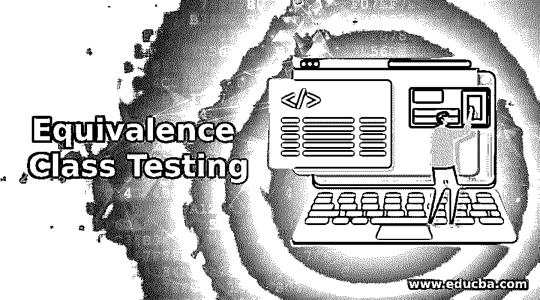

# 等价类测试

> 原文：<https://www.educba.com/equivalence-class-testing/>

## 等价类测试简介

在软件测试模型中使用的所有其他技术中，最重要的技术之一是等价类测试。它被认为是在软件测试生命周期中起重要作用的黑盒测试。执行测试的测试人员保证结果是准确的，并且在输入场景中花费非常有限的时间。测试用例以这样一种方式设计，即输入数据可以分成等价类，并应用于各种类型的测试目的。

### 什么是等价类测试？

等价类测试更好地被称为等价类划分和等价划分。在市场上所有其他软件测试技术中，这是一种著名的测试方法，它允许测试团队开发和划分用于分析和测试的输入数据，并基于此将软件产品划分和划分为多个等价类进行测试。

<small>网页开发、编程语言、软件测试&其他</small>

*   被划分的等价类执行相同的操作，并产生所提供的输入的相同特征或行为。
*   测试用例是基于类的不同属性创建的，来自每个类的每个输入都用于测试用例的执行，验证软件功能，此外还验证软件产品针对为各个类给出的输入的工作原理。
*   它也被称为功能测试模型方法中的逻辑步骤，通过消除测试方法中可能存在的任何冗余或错误来提高测试类的质量。

### 等价类测试的类型

等价类测试分为四种不同的类型，它们构成了测试机制的组成部分，并基于不同的数据集执行操作。

它们如下:

*   **弱正态测试类:**这种类型的测试在测试用例中只使用每个等价类中的一个变量。单词 weak 表示单一故障，在测试场景中，只有一个元素。测试人员以系统的方式识别这些值。
*   **强正态测试类:**这种类型的测试与多个故障假设相关联，测试用例需要用于等价类中的每个元素，测试团队通过使用每个可能的输入覆盖整个等价类。
*   **弱鲁棒性测试类:**这种类型的测试会导致单一故障，因为它是弱的，并且无效测试用例的预期输出无法定义。测试人员通常花费大量的时间来定义测试用例的预期输出。测试团队主要关注测试用例中的无效值。
*   **强健壮测试类:**这种形式的类测试是多余的。因此，存在多种故障假设，并且等价类是根据来自测试用例的有效和无效输入来度量的。然而，对于测试团队来说，减少冗余是不可行的。

### 为什么我们需要等价类测试？

对于测试目的来说，这是比边界值分析更好的实践，边界值分析是一种压力和负面测试的形式。

因此，我们要求并主要使用等价类测试方法来测试以下特性:

*   它使用黑盒测试方法，抑制测试人员从外部测试和分析软件产品。
*   等价类测试，也称为等价类划分，用于细分或划分为多组具有相似行为的测试输入。
*   用这种方法，家庭依赖于团队成员，如果任何一个成员工作得好，那么整个家庭就会运转得好。
*   这种测试方法用于其他级别的测试，如单元测试、集成测试等。
*   当输入数据包含离散值并且在区间内可用时，它非常适合 ECT。
*   使用测试类的输入没有这样的特定规则，测试人员可以选择使用多个输入。
*   如果实现做得很好，那么测试方法会减少冗余测试用例。
*   等价类测试或划分的整个概念来自等价关系中出现的等价类。
*   它也有助于减少寻找和执行测试用例的时间，同时保持效率。

### 等价类测试的重要性

它是整个软件测试方法中功能强大的测试过程之一，有助于减少测试方法中的冗余并使过程敏捷。它是一种测试技术，为测试团队提供了无限的好处，并确保向客户交付更高质量的软件产品。

其有用性列表如下:

*   它有助于减少测试用例的总数，而不会妨碍应用程序的测试覆盖率。
*   这种测试方法在最小化测试用例的总执行时间方面是有用的，因为它有助于最小化用于测试目的的大量数据，同时保持其效率。
*   类测试也是有帮助的，因为它可以应用于所有种类的测试方法，例如单元测试、系统测试、验收测试和集成测试，这有利于将整个测试方法结合到单一技术中。
*   测试方法还使测试团队能够主要关注较小的数据集，这增加了在软件产品交付给客户之前发现和解决软件产品中越来越多缺陷的可能性。
*   这种测试方法也用在某些情况下，此时很难进行彻底的测试，同时也能保持整体的测试覆盖率。

### 结论

纯粹基于规范的等价类测试是测试目的的流行和最佳方法，它减少了开发软件产品所需的测试用例。这种测试方法以其更大的测试覆盖率和最小化的时间而闻名于世。

### 推荐文章

这是等价类测试指南。在这里，我们讨论介绍，类型，为什么我们需要等价类测试和重要性。您也可以看看以下文章，了解更多信息–

1.  [域测试](https://www.educba.com/domain-testing/)
2.  [等价划分](https://www.educba.com/equivalence-partitioning/)
3.  [阴性测试](https://www.educba.com/negative-testing/)
4.  [黑盒测试技术](https://www.educba.com/black-box-testing-techniques/)

