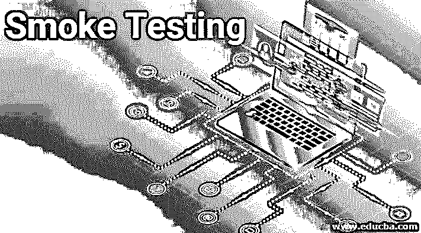
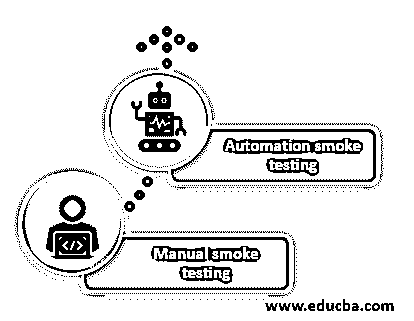

# 烟雾测试

> 原文：<https://www.educba.com/smoke-testing/>

## 什么是烟雾测试？

冒烟测试是一种属于验证类别的测试方法，因为它用于测试和确认应用程序在构建方面的工作情况。这个测试在测试过程的开始执行，以确保所有的主要模块在功能上都是活动的，并且没有阻碍测试人员进行功能测试。

### 为什么我们需要烟雾测试？

这种测试通常在软件应用程序的启动/初始阶段进行，这时软件被发布用于 QA 团队的测试。考虑一个电子商务应用程序的场景，当软件构建被部署在测试环境上用于测试，但是在测试期间，发现用户不能登录应用程序以进一步进行和执行任何任务，或者我们可以说用户被阻止使用应用程序，因为登录的第一步不起作用。

<small>网页开发、编程语言、软件测试&其他</small>

如果关键功能不能正常工作，就没有必要对其他模块进行详尽的测试。为了处理这些类型的情况，如果构建不够稳定而无法执行测试，那么执行这样的测试有助于减少测试团队在详细测试上浪费的时间和精力。

执行该测试的一些主要原因如下:

*   它有助于发现应用程序中的主要问题。
*   它有助于减少 QA 团队的时间和精力，如果构建不稳定，这些时间和精力可能会被浪费。
*   它有助于缺陷的早期识别。
*   它有助于发现软件应用程序的稳定性。

### 烟雾测试技术

它通常由手工或者自动化来执行，这取决于项目的类型和组织的政策。

#### 1.手动烟雾测试

一般来说，它是手动执行的，以便发现软件应用程序的关键功能运行良好。手动测试就像一般的健康检查，通过快速浏览应用程序，在软件测试的初始阶段发现高质量和关键的错误。这是通过执行有限数量的测试用例来手动完成的，以便发现应用程序的稳定性，如果它准备好进一步进行详尽的测试的话。

#### 2.自动化烟雾测试

这是回归测试的一部分，现在测试人员在构建发布到测试团队之前自动化测试用例。测试用例可以使用市场上可用的各种自动化框架来自动化。自动化测试用例非常有用，因为它们有助于减少测试团队每次发布新版本时的手工工作。一旦 smoke 测试的测试用例实现了自动化，QA 团队就可以运行这项工作，让自动化测试套件快速提供结果，而无需任何人工干预来确定应用程序的稳定性。

### 烟雾测试是如何工作的？

让我们通过一步一步的过程来了解烟雾测试的工作原理:

1.  一旦软件构建就绪，它就被部署到 QA 团队进行测试(在测试环境中)。
2.  在收到软件构建时，测试团队[根据需求创建测试用例](https://www.educba.com/what-is-test-case/),以便检查构建的稳定性。
3.  只有创建的重要和关键的测试用例现在由测试团队手动或通过自动化脚本来执行。
4.  在测试环境上执行测试脚本之后，决定构建是否足够稳定以进行功能测试或更严格的测试，或者如果构建失败，则认为它是不稳定的，因此返回给开发人员，并且不对该构建执行进一步的测试。

### 烟雾测试的优点和缺点

下面是提到的一些优点和缺点:

#### 优势:

*   冒烟测试的最大优势之一是，它有助于早期识别系统关键功能中发现的缺陷。
*   冒烟测试有助于降低故障风险，因为缺陷可以及早发现。
*   烟雾测试很容易进行，因为不需要测试团队的特别努力。
*   冒烟测试有助于节省测试团队的时间和精力。
*   它有助于软件应用程序质量的整体提高。
*   它只需要执行有限数量的测试用例，覆盖大多数积极的场景。
*   冒烟测试还有助于确认 SRS 中提到的要求。

#### 缺点:

*   烟雾测试需要适当的文件，因此需要一个专门的测试团队。
*   如果软件构建不稳定，冒烟测试有时会浪费时间。
*   如果应用程序中有一些微小的变化，从头到尾围绕整个应用程序执行冒烟测试是不值得的。
*   有时，即使在对整个应用程序进行冒烟测试之后，关键问题也会在集成和系统测试中出现。
*   任何遗留在冒烟测试中的错误/问题都可能在将来导致失误。
*   在任何软件项目中，时间与成本成正比，冒烟测试是完全脚本化的，因此需要特殊的人力，这反过来增加了项目预算。

### 结论

上面的描述清楚地解释了什么是冒烟测试以及为什么要进行冒烟测试。在向最终用户发布任何软件应用程序之前，会在不同的点执行各种类型的测试。它是最重要的测试类型之一，有一个简单明了的动机，就是在早期阶段发现缺陷，以验证软件的关键功能运行良好。它是验收测试的一个子集，测试人员和开发人员都可以完成。

### 推荐文章

这是烟雾测试的指南。这里我们分别讨论一下为什么需要烟熏技术，优缺点。你也可以看看下面的文章来了解更多-

1.  [主机测试](https://www.educba.com/mainframe-testing/)
2.  什么是功能测试？
3.  [软件测试生命周期](https://www.educba.com/software-testing-life-cycle/)
4.  [稳定性测试](https://www.educba.com/stability-testing/)

