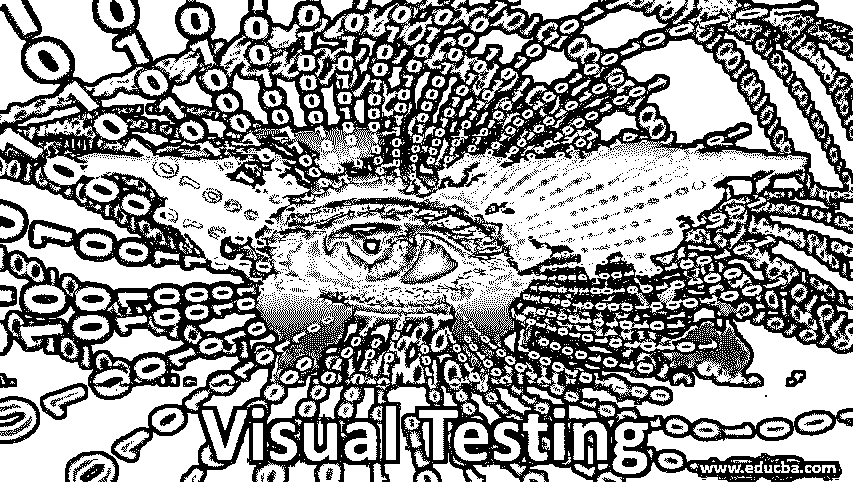

# 视觉测试

> 原文：<https://www.educba.com/visual-testing/>

## 什么是视觉测试？

在用户界面上执行视觉测试，以确保界面支持由客户提供的作为功能或非功能规范的一部分的所有视觉规范。此外，众所周知，测试任何应用程序的功能以保持产品质量是非常重要的，同样重要的是，产品要有一个友好的、吸引人的用户界面，以吸引和方便应该访问应用程序产品的最终用户。

### 为什么我们需要视觉测试？

如果应用程序的用户界面不好，那么无论应用程序的功能多么有效和准确，都是没有价值的。包括谷歌、Adobe、雅虎、Twitter 在内的许多大公司雇佣了一个专门的测试团队来对应用程序进行视觉测试，因为他们了解视觉测试的重要性，以及视觉测试不正确会对他们的业务产生什么样的负面影响。

<small>网页开发、编程语言、软件测试&其他</small>

下面给出了描述视觉测试在现实世界中的重要性的一些原因:

*   任何软件应用程序糟糕的用户界面或外观都会给客户使用带来不便，从而影响公司的市场形象。
*   在不同浏览器上使用应用程序的困难会影响客户，从而导致客户流失，进而影响公司的整体收入。
*   由于市场上有大量不同屏幕尺寸的操作系统和设备，因此应用程序能够根据不同的屏幕尺寸和操作系统做出足够的响应是非常重要的。
*   客户对软件产品的第一印象来自于用户界面和应用程序的易用性，如果不是这样，或者客户的使用体验不佳，即使功能运行良好，投资在软件上的所有资金几乎都是浪费，客户也不会考虑进一步使用它。

### 视觉测试是如何工作的及其技术？

它可以手动执行，也可以通过自动化工具执行。在手动视觉测试中，部署手动测试人员来发现在各种设备、屏幕尺寸、操作系统和不同浏览器上使用应用程序的问题。在手动测试中，它更像是使用开发人员提供的快照或手册来发现差异。测试了具有各种组件大小、颜色、风格的应用程序的 UI。应用程序 UI 也随着网络变化进行测试。

由于不可能通过手动视觉测试来检测微小的 UI 变化，自动化视觉测试应运而生，因为应用程序可以跨不同的屏幕和浏览器同时进行测试，从而提高工作速度。自动化视觉测试允许我们验证 web 应用程序的各种组件，并关注网页布局中内容的正确性。它检查网页中元素的位置以及其他因素，如文本的重叠、隐藏元素的颜色、大小、形状等。

市场上有各种各样的工具可以帮助应用程序的自动化可视化测试。其中一些列举如下:

1.  硒
2.  瓦特尔
3.  WebdriverCSS
4.  双子星座
5.  小说

手动视觉测试和自动测试的主要区别是[手动测试](https://www.educba.com/manual-testing/)非常耗时，因为在各种设备和浏览器上执行测试需要时间。此外，人眼不可能逐个像素地测试应用程序。虽然[自动化测试解决了](https://www.educba.com/automation-testing/)这个准确性的问题，并且通过微小的改变来测试应用程序，但是自动化测试需要对各种屏幕、分辨率、操作系统和浏览器的预期图像进行大量的基线测试。如果我们逐个像素地比较每个组件，有时会出现不必要的错误，这将导致测试用例在没有任何重大问题的情况下连续失败。因此，有必要了解应用程序的可视部分应该在多大程度上实现自动化，才能获得有效的结果。

### 视觉测试的优点和缺点

下面是解释的优点和缺点。

#### 优势

1.  围绕应用程序的回归视觉测试会导致更少的问题，而使用应用程序会给客户留下关于软件产品的良好印象，并允许他们进一步使用它。
2.  它和应用程序的功能测试一样重要。如果用户界面不够好，不能让用户使用它并执行期望的任务，那么应用程序的功能就无关紧要了。
3.  应用程序的良好用户界面会吸引客户，因此有助于增加整体产品收入。
4.  跨不同浏览器的自动化视觉测试同时减少了每次在一个浏览器上执行每个测试用例所花费的时间。
5.  对每一次提交进行可视化测试可以降低应用程序失败的几率，并让用户确信 UI 中的每一个变化都可以在生产环境中正常工作。

#### 不足之处

1.  实际上，不可能在不同分辨率的不同屏幕上测试任何软件应用程序。有一些特定于分辨率的错误，即使经过严格的视觉测试，它们仍然没有被测试。
2.  人眼无法识别的小 UI 问题在应用程序的视觉测试过程中不会被注意到。只有较大的错误才能在视觉测试中识别出来。
3.  在不同的测试人员中发现错误的不一致性的可能性很高。
4.  在这种情况下，错误还取决于各种因素，如时间、网络、设备等。一些错误是由于网络问题而被归档的，不必要的时间被浪费在修复它们上，而这些错误在真实环境中运行良好。
5.  自动化视觉测试需要大量的维护，因此不值得在小项目中实施。

### 结论

上面的描述清楚地解释了什么是可视化测试以及它在真实 IT 世界中的重要性。它在[软件测试领域](https://www.educba.com/what-is-software-testing/)中扮演着非常重要的角色，因为正是应用程序的所有 UI 首先给客户留下了印象，并鼓励他们使用它。大的 IT 公司雇佣专业的测试人员，因为这在很大程度上影响了他们的业务。如今，自动化视觉测试已经在很大程度上[取代了手动测试](https://www.educba.com/manual-testing/)，因为它可以快速地执行测试(这反过来又节省了时间)，并且能够检测到小的 UI 变化。

### 推荐文章

这是一个视觉测试指南。在这里我们讨论它是如何工作的及其技术？有优点也有缺点。您也可以阅读以下文章，了解更多信息——

1.  [功能测试工具](https://www.educba.com/functional-testing-tools/)
2.  [什么是 ETL 测试？](https://www.educba.com/what-is-etl-testing/)
3.  [自动化测试生命周期](https://www.educba.com/automation-testing-life-cycle/)
4.  [手工测试 vs 自动化测试](https://www.educba.com/manual-testing-vs-automation-testing/)

