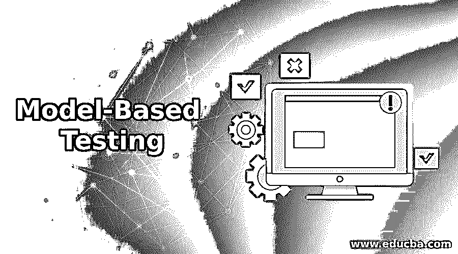

# 基于模型的测试

> 原文：<https://www.educba.com/model-based-testing/>

## 基于模型的测试简介

在今天的场景中，当我们测试一个软件产品并获取测试规范，理解标准并拥有最佳的测试覆盖率时，我们这些软件世界的人需要改变我们收集、分析和构建产品需求的方法。作为上述这些最新进展的结果，我们已经进入了一个基于模型的测试的世界，它允许软件测试团队更彻底地利用测试自动化的力量。测试自动化的主要目的不仅是为了更快更有效的测试，也是为了简化工作流程。

### 什么是基于模型的测试？

基于模型的测试在理论上被定义为一种软件测试技术，其中要执行的测试用例取自一个模型，该模型覆盖了被测试系统的整个功能方面。换句话说，我们使用一个模型来描述测试环境和测试策略以及测试用例的生成，执行这些测试用例，并识别测试设计质量。

<small>网页开发、编程语言、软件测试&其他</small>

我们从模型中遵循的用于自动生成测试用例的过程如下:

*   创建模型是为了捕捉被测试系统的行为。
*   手动测试脚本开发的行为解释是使用 fMBT、Modbat 等工具完成的。
*   然后，该工具会自动生成脚本。

在当今工业中，基于模型的测试已经成为从需求说明阶段开始的产品设计的一个组成部分。有了这种测试技术的使用，开发人员和测试人员现在可以专注于仅仅为了覆盖系统需求而创建的模型，并在开始时构建一个可测试的应用程序。之后，通过使用基于模型的技术，团队可以使用不同的算法开发更多的测试。

简而言之，基于模型的技术在与 Selenium 等流行的自动化框架一起使用时，可以帮助团队构建手动和自动化脚本，从而增加测试的覆盖率。

### 基于模型的测试示例

下面是提到的例子:

对于 MBT，我们需要记住的另一件事是，有许多可用的模型，每一个都描述了系统设计的方面。

#### 示例#1:数据流

作为 MBT 的一部分，在这种情况下，我们描述数据流的特征，并检查与变量或数据对象状态相关的事件序列的覆盖标准。测试的部分集中在从变量接收值到使用这些值的点上。

#### 示例 2:控制流

在这种类型的测试中，程序的控制流被用作执行软件结构测试的模型。在这种类型中，控制流程图被认为是测试的关键要素。

#### 示例 3:依赖关系图

在这种测试技术中，依赖图是基于我们正在测试的场景准备的。此图表示几个对象之间的依赖关系。

#### 例子#4:决策表

在这种类型的示例中，结果是直接比较的，即实际结果与预期结果的对比。只有当实际结果与预期结果相符时，测试才能通过。

#### 例子 5:状态转换机器

在这种类型的测试技术中，根据一些输入检查机器的状态，并在状态转换发生时通知系统的行为。该测试可用于检查复杂和真实系统的状态。

### 基于模型的测试的挑战

基于模型的测试的引入已经带来了巨大的希望，随之而来的是新的挑战，当我们试图在测试用例中获得更多的覆盖率时，新的挑战也随之而来。一旦我们克服了这些挑战，我们就能够从这项技术中获得最大的利益。

*   第一步是开发人员和测试人员为了理解 MBT 的技术和工作方式所需要的强化训练。关键的部分是开发人员熟悉编码范例，但是测试知识的需求是挑战之一，需要首先解决。对于测试人员来说，这是传统测试方法之外的新东西。
*   人们需要在架构上投入时间，并考虑团队所需的基础设施，以便工具可以扩展，能够处理复杂的方法，并提供可靠的测试覆盖。虽然这最初会增加前期时间，但在周期的后期会通过减少维护时间和增加覆盖率来提高可靠性而得到补偿。
*   最初，微调 MBT 工具可能是一项艰巨的任务，因为它与模型的创建并行运行，可能需要对工具进行重构。但是一旦你掌握了技巧和感觉，使用 MBT 就会非常流畅。
*   最后是测试技术以及开发和测试应用程序技术的思维和文化的转变，许多人对此并不开放。但是正如我们所说的“变化是唯一不变的”，一旦我们用 MBT 的测试方式装备自己，在以后的时间里会感觉更舒服。

### 结论

虽然我们知道我们在基于模型的技术中面临的挑战，但是它带来了许多优势。它确保 QA 参与在发现阶段的开始，从而确保产品设计的可测试性，甚至在特性开发的开始。作为这种参与的结果，人们甚至可以在代码存在之前就发现设计和规范中的缺陷。测试的彻底性会随着覆盖率的增加而增加，并且测试套件的维护可以忽略不计。我们可以在 MBT 进行详尽的测试。最后，由人工智能测试和机器学习技术支持的基于模型的技术将为企业带来巨大的时间和金钱节约。

### 推荐文章

这是一个基于模型的测试指南。这里我们分别讨论什么是基于模型的测试、测试挑战和例子。您也可以看看以下文章，了解更多信息–

1.  [压力测试工具](https://www.educba.com/stress-testing-tools/)
2.  [猴子测试](https://www.educba.com/monkey-testing/)
3.  [等价类测试](https://www.educba.com/equivalence-class-testing/)
4.  [性能测试工具](https://www.educba.com/performance-testing-tools/)

