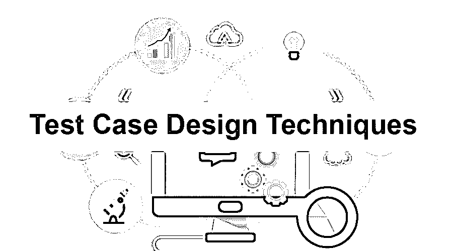

# 测试用例设计技术

> 原文：<https://www.educba.com/test-case-design-techniques/>

## 测试用例设计技术介绍

软件开发中最重要和最关键的阶段是测试阶段。测试不仅有助于确定产品的质量，而且还允许人们根据最终用户友好性和可用性来修改和升级产品。在本文中，我们将阐述各种测试用例设计技术的基本概念。

测试用例是组成测试阶段的基本构件。

<small>网页开发、编程语言、软件测试&其他</small>

### 什么是测试用例？

*   它们通常是一组预先定义的指令，说明为确定最终产品是否达到预期效果而需要采取的步骤。这些指令可以包括预定义的输入集合、条件以及它们各自的最终结果。
*   然而，为了完成一个人的测试，一个人可能经常会有太多的测试用例。为了避免这种情况，人们应该根据自己的需求找到最佳的测试用例设计技术，以便减少大量的测试用例。
*   这些测试用例设计技术有助于创建有效的测试用例，覆盖决定产品质量和价值的各种特性。

根据测试的性质，测试用例设计主要分为三种类型。它们是:

1.  基于规格的设计技术。
2.  基于结构的设计技术。
3.  基于经验的设计技术。

#### 1.基于规格的设计技术

这也是众所周知的黑盒设计技术。在这种设计技术中，通过考虑客户的功能需求和规范来编写测试用例。产品的内部运作是不相关的。因此在这种情况下使用名称[黑盒测试](https://www.educba.com/black-box-testing/)。它被进一步划分为子类型:

*   **等价划分技术:**

用作测试用例输入的数据根据特定的逻辑被分组。选择一个输入来代表它所属的组，并使用这个输入执行你的测试用例的过程被称为[等价划分](https://www.educba.com/equivalence-partitioning/) **。**

例如，考虑一个将验证您的密码的应用程序。有效密码的要求是至少包含八个字符，由字母数字组成，并且至少包含一个特殊字符。在这种情况下，输入可以在不同的等效分区中，例如满足特定标准的有效输入和无效输入，其中一个类别包含八个字符(所有字母)，另一个输入类别包含八个字符(所有数字)，而另一个分区包含八个字符(仅包含特殊字符)等等。

*   **边界值分析技术:**

在这种情况下，考虑来自下边界和上边界的值。

例如，应用程序只接受四位数的数值。这里的范围是从 1000 到 9999。这里，一个案例包含输入 999 和 9998，另一个案例包含输入 1000 和 9999，另一个案例包含输入 0001 和 10000。

*   **决策表技术:**

决策表可以更容易地将特定产品或应用程序可能出现的所有可能情况结合起来。因此，以决策表作为参考点来编写测试用例，可以提供有效的测试用例，从而提供出色的测试覆盖率。

*   **状态转换测试技术:**

在这种技术中，使用应用程序的不同转换状态的图形表示来测试应用程序，这些转换状态进一步依赖于该应用程序的各种特征和功能。它主要基于状态机模型。

*   **用例测试技术:**

最终用户在使用应用程序或与应用程序进行交互时会遇到不同的场景，这种技术对此进行了测试。

#### 2.基于结构的测试

*   基于结构的测试处理应用程序的内部结构和架构。在这里，测试用于开发应用程序的源代码。因此，在基于结构的测试中，为了能够设计测试用例，对代码及其内部流程的良好理解是必要的。基于结构的测试也称为白盒测试和[玻璃盒测试](https://www.educba.com/glass-box-testing/)。
*   基于不同的因素来分析代码的质量，例如代码覆盖率、可读性、可维护性、安全性或漏洞、可重用性等。

不同类型的基于结构的测试有:

*   **语句测试技术:**

在语句测试的情况下，源代码在测试时被执行，以便测量代码覆盖率。

*   **决策测试技术:**

这里考虑代码的决策点。决策点是“while”条件、“if-else”条件等。它计算正在执行的决策点的百分比，并确定代码中是否有不可到达的语句。

*   **条件测试技术:**

它检查布尔条件语句，即条件产生真或假的语句。为了确保条件在满足时得到执行，对每个条件语句使用 TRUE 和 FALSE 参数进行测试。

1.  **多条件测试技术**:这类似于条件测试，但由于涉及多个条件，与条件测试相比，可能需要大量的测试用例。然而，由于其复杂性，编写这些测试用例可能是一项单调乏味的任务。
2.  **路径测试技术**:这包括从头到尾测试应用程序中的每一个独立的可执行语句，以便定位错误代码(如果有的话)。

#### 3.基于经验的测试

顾名思义，这种测试技术基于测试人员在类似应用程序和技术中的经验和专业知识。这些进一步分为:

*   **错误猜测:**

测试人员根据他们以前的经验和对应用程序的了解来预见可能发生的错误。这完全基于测试人员提出有效测试用例的能力，这些测试用例能够根除可能导致错误的原因。

*   **探索性测试:**

在这种情况下，测试用例是并行编写和执行的。这项技术有助于识别传统测试中可能遗漏的关键错误。

### 结论

选择与您的需求相匹配的最佳测试用例设计将导致应用程序的有效测试和无错交付。这将导致更高质量的产品，从而增强最终用户的体验。

### 推荐文章

这是测试用例设计技术的指南。在这里，我们已经讨论了基本概念，有三个测试用例设计，主要是根据它们的测试性质分类的。您也可以阅读以下文章，了解更多信息——

1.  [硒测试](https://www.educba.com/selenium-testing/)
2.  [代码覆盖工具](https://www.educba.com/code-coverage-tools/)
3.  [什么是测试用例？](https://www.educba.com/what-is-test-case/)
4.  [测试用例的类型](https://www.educba.com/types-of-test-case/)

