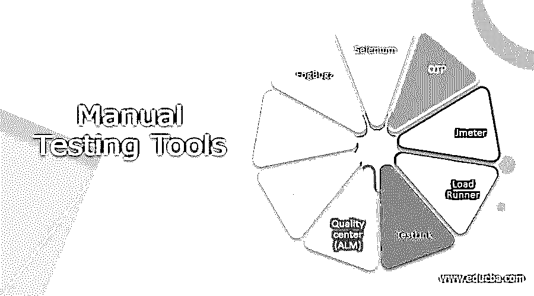

# 手动测试工具

> 原文：<https://www.educba.com/manual-testing-tools/>

## 手动测试工具简介

手动测试是一个软件测试过程，其中测试用例是手动执行的，不使用任何自动化工具。在自动化测试之前，手工测试对于每一个新开发的软件都是强制性的。要执行手动测试，测试人员不需要编程知识。它确保软件 100%没有错误。要执行手动测试，需要使用各种工具。利用这些工具，tester 自动化了手工测试。

### 9 大手动测试工具

下面是可以用来自动化手动测试的工具列表。

<small>网页开发、编程语言、软件测试&其他</small>

#### 1.硒

Selenium 是一个手动测试工具，用于测试 web 应用程序。它为创作功能测试提供了回放工具，而无需学习测试脚本语言。它还提供了特定于领域的语言，以各种编程语言编写测试，如 C#、groovy、PHP、Perl、java、python、ruby 和 Scala。Selenium 是一个开源工具，支持 Windows、Linux、MacOS 等操作系统。Selenium IDE、Selenium 客户端 API、Selenium 远程控制、selenium webDriver 和 selenium Grid 是 Selenium 的组件。

#### 2.QTP

QTP 是另一个手动测试工具，它支持关键字和脚本接口，并以图形用户界面为特色。它使用 VBscript 来指定测试过程、操作对象和控制测试中的应用程序。它允许开发人员从一个控制台测试所有层次的程序操作。使用用户界面，如网络浏览器和本地图形用户界面，QTP 执行功能和回归测试。也用于数据库测试、API 测试、web 服务测试和系统操作。

#### 3.Jmeter

Jmeter 是另一个手动测试工具，用于负载测试，以分析和测量 web 应用程序服务的性能。它支持各种参数化、线程前 cookies、断言、配置变量和各种报告。Jmeter 还支持与 selenium 的集成，允许它在执行性能或负载测试的同时运行自动化脚本。

#### 4.负载运行器

LoadRunner 是一个手动测试工具，用于测试应用程序、测量系统行为以及负载下的性能。它能够模拟成千上万的用户同时使用应用软件，记录并随后分析应用程序关键组件的性能。为了模拟用户活动，LoadRunner 在应用程序组件之间生成消息。生成的消息和交互存储在脚本中。负载生成器、VuGen、代理进程、控制器和分析是 LoadRunner 的组件。

#### 5.测试链接

TestLink 是一个手动测试管理系统，用于检查软件的质量保证。它支持测试用例、测试计划、测试套件、测试项目、用户管理以及各种报告和统计。这个工具可以集成其他软件，如 Bugzilla，吉拉，螳螂，Redmine，FogBugz 使用 API。为了访问 TestLink，管理员需要访问 web 服务器和数据库以安装和运行。它支持各种数据库，如 PostgreSQL。

#### 6.质量中心

质量中心是一个手动测试管理工具，也称为 ALM 工具，即应用生命周期管理。它有助于管理项目里程碑、可交付成果和资源。它还跟踪项目的健康状况，这是允许产品所有者评估产品当前状态的标准。这是一个基于 Java 2 企业版技术的企业级应用程序。它使用 Oracle 和 MS SQL 作为后端。

#### 7\. Bugzilla

Bugzilla 是一个基于 web 的 bug 跟踪工具，用 Perl 语言编写。它使用 MySQL 数据库。它使用户能够通过数据管理工具与他们的客户保持联系，有效地交流问题。它提供了各种功能，如高级搜索功能，时间跟踪，电子邮件通知，强大的安全性，通过电子邮件的文件错误，定制和本地化。

#### 8.螳螂

Mantis 是一个手动测试工具，用于跟踪系统或软件中的 bug 或缺陷。用户可以根据需要轻松定制。支持 Windows、iOS、Android、iPhone 等各种操作系统。Mantis 提供了各种插件来为 mantis 问题跟踪器添加自定义功能。它提供了电子邮件通知功能，可以通过电子邮件向相关利益方发送更新、评论和解决方案。

#### 9.牙齿填充物

它是一个基于 web 的跟踪工具，通常用于 bug 跟踪。由于其策略，它在市场上变得相当受欢迎。它以里程碑的方式显示项目的细节。因此，在短时间内跟踪和计算结果变得很容易。

### 结论

在本文中，我们已经讨论了各种手动测试工具。这些工具将帮助你理解测试和测试覆盖方面的好处。每种工具都有其自身的重要性。基于软件及其测试计划需求，您可以使用这些工具中的任何一个。希望你喜欢这篇文章。

### 推荐文章

这是手动测试工具的指南。在这里，我们还讨论了介绍和手动测试工具以及详细的解释。您也可以看看以下文章，了解更多信息–

1.  [静态测试与动态测试](https://www.educba.com/static-testing-vs-dynamic-testing/)
2.  [渗透测试与漏洞评估](https://www.educba.com/penetration-testing-vs-vulnerability-assessment/)
3.  [渗透测试开源工具](https://www.educba.com/penetration-testing-open-source-tools/)
4.  [PHP 测试框架](https://www.educba.com/php-testing-framework/)

