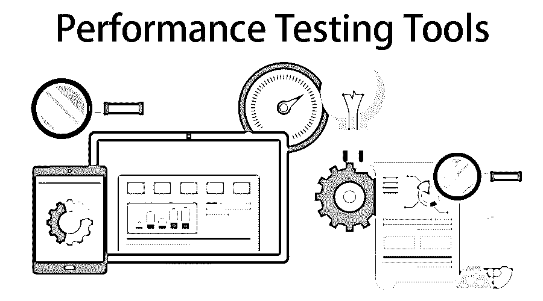
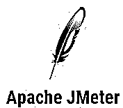
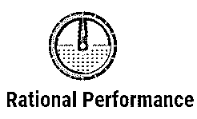

# 性能测试工具

> 原文：<https://www.educba.com/performance-testing-tools/>

## 性能测试工具介绍

性能测试是质量保证过程的一项重要措施。这是决定一个系统有效性的方法，也可以用来比较两个系统。此外，它在确保所发布软件的性能能够满足用户需求并满足批准的服务协议级别(SLA)方面也起着至关重要的作用。在过去的几年中，已经出现了一些工具来帮助我们进行性能测试。

### 顶级性能测试工具

让我们看看几个性能最好的性能测试工具。

<small>网页开发、编程语言、软件测试&其他</small>

#### 1) LoadNinja

LoadNinja 是 SmartBear 的一个性能测试工具。它帮助我们创建无脚本的、精炼的负载测试，将测试时间减少一半，用实际的浏览器替换模拟器，并获得浏览器的指标，所有这些都非常快。我们可以记录客户端的交流，感知性能故障并实时调试。LoadNinja 增加了代码的[测试覆盖率，而没有牺牲代码的质量。在 LoadNinja 的帮助下，开发人员可以专注于创建应用程序，而不是创建测试脚本。](https://www.educba.com/test-coverage/)

**特性:**

*   它创建了无脚本测试。
*   它包括 VU 调试器，可以实时调试负载测试。
*   它包括 VU 检查员，实时管理虚拟用户活动。
*   它托管在云上；因此不需要维护。
*   它使用了一个真实的浏览器测试实现。
*   它可以执行报告和指标分析。

#### 2) LoadView

LoadView 是 Dotcom-Monitor 的性能测试工具。借助 LoadView，我们可以通过显示负载下的应用性能来展示实际的用户体验。它使用负载测试，这是基于浏览器的应用程序和网站。

**特性:**

*   它有基于云的浏览器测试。
*   它支持 Java、Ruby、PHP、HTML5 等。
*   它帮助我们在没有一行代码的情况下构建脚本。
*   它有助于识别障碍以保证可伸缩性。
*   它提供了报告和性能指标，以便与几个内部利益相关者共享。

#### 3)应激刺激

StresStimulus 的目标是那些通常难以用其他性能测试工具测试的应用程序。它具有独特的自相关功能，因此可以自动纠正播放错误。它还监督对应用程序及其基础设施的响应的影响。它也搜索[功能测试](https://www.educba.com/what-is-functional-testing/)的隐藏错误。

**特性:**

*   它包括一个指南，包含从如何记录到显示测试结果的所有步骤。这缩短了学习曲线。
*   它是一个独立的工具。
*   它支持多个负载生成器。
*   它支持三种脚本语言，还提供了手动脚本选项。

#### 4)新负载

NeoLoad 是一个帮助分析响应时间和应用程序可以处理的用户数量的工具。它为所有团队自动化了测试的设计、维护和分析。NeoLoad 支持整个生命周期的性能测试，因为它已经与几个管道集成。

**特性:**

*   它有一个自动化的测试设计，使我们能够快速地创建和更新测试。
*   在 CI 服务器的帮助下，它在测试运行时是自动化的。
*   它在测试完成后提供测试脚本和报告。
*   它包括来自不同位置的云负载生成。

#### 5)网络负载

WebLOAD 是一个成熟的负载测试解决方案，它通过智能分析生成一致的实际负载环境，以提供性能愿景。它创建在一个灵活的平台上，支持多种技术。

**特性:**

*   它为我们提供了云部署。
*   它可以灵活地创建测试场景。
*   它有强大的验证引擎和智能脚本。
*   它是可扩展的，支持所有重要的 web 技术。
*   它可以自动检测瓶颈。
*   它有极好的客户支持，这是很容易得到的。

#### 6)阿帕奇 JMeter

Apache JMeter 是一个开源的性能测试工具，可以分析和测量多个应用程序的性能。Jmeter 主要[用于 web 应用](https://www.educba.com/what-is-web-application/)，包括静态和动态 web 应用。

**特性:**

*   它不需要顶级的基础设施，并且支持由一个控制器处理大量的负载注入器。
*   与其他工具相比，它需要更少的脚本工作，因为它有一个用户友好的 GUI。
*   它非常便携，而且由于它是用 Java 编写的，它支持所有的 Java 应用程序。
*   它为我们分析负载统计数据提供了简单的图表和图形。

#### 7) LoadRunner

LoadRunner 再现了实际的用户行为，让用户看起来好像有很多人同时访问了应用程序。它只需要最少的硬件就能准确运行。LoadRunner 跟踪发生的事务的响应时间，以便可以与它们的服务级别协议进行比较。

**特色** **:**

*   它既可以用于小型项目，也可以用于大型项目。
*   它通过预测系统的容量来降低硬件和软件的成本。
*   它利用高效的负载测试，从而降低安装不符合性能要求的系统的风险。
*   它准确地指出了应用程序所面临问题的根本原因。
*   它可以有效地跟踪工具的使用情况。
*   这是一种廉价的测试方法。

#### 8)丝绸表演者

Silk Performer 能够同时测试多个用户的多个应用环境。它还支持最广泛的协议。

**特性:**

*   它模拟虚拟用户，这些用户是可调整的。
*   它需要最少的硬件资源。
*   它支持服务器的综合监控。
*   除了具有用户友好的许可之外，对于单个协议不需要许可。
*   它使用项目方法来处理负载。
*   它支持六种工作负载模式。
*   它创建带有图形和表格的报告，并允许定制。
*   它为我们提供了服务器的诊断信息。
*   它为我们提供了资源管理和版本控制管理。

#### 9) Rational 性能测试器

这是一个由 IBM 公司开发的性能测试工具。它是一个调查工具，有助于创建和评估测试，并有助于在部署应用程序之前证明它们的可靠性和可伸缩性。

**特性:**

*   它不涉及编码。
*   它根据时间表和事件执行测试。
*   它为我们提供了一个可以在实时场景中使用的问题识别报告。
*   它可以通过大型多用户测试来执行。
*   它为我们提供了正确的工作负载。
*   它帮助我们自动识别服务器响应。

### 结论

这些工具帮助我们消除了由于应用程序在负载或其他情况下的性能而产生的问题。它们帮助我们规划可能需要的额外资源，以保证应用程序的高性能。我们已经看到了可以根据我们的需要和要求使用的各种工具。

### 推荐文章

这是性能测试工具的指南。在这里，我们将讨论顶级的性能测试工具及其特性，如 LoadNinja、StresStimulus、NeoLoad、WebLOAD、Apache JMeter 等。您也可以浏览我们推荐的其他文章，了解更多信息——

1.  [自动化测试工具](https://www.educba.com/automation-testing-tools/)
2.  [敏捷测试](https://www.educba.com/agile-testing/)
3.  [性能测试生命周期](https://www.educba.com/performance-testing-life-cycle/)
4.  [吉拉测试工具](https://www.educba.com/jira-testing-tool/)

