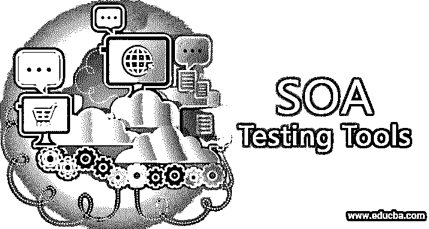

# SOA 测试工具

> 原文：<https://www.educba.com/soa-testing-tools/>

## SOA 测试工具简介

[SOA 可以定义为](https://www.educba.com/what-is-soa/)面向服务器的架构，其中应用程序开发基于 web 应用程序的服务器架构。为了测试基于 [SOA 架构](https://www.educba.com/soa-architecture/)构建的应用程序，可以使用两种不同的方法，比如自顶向下的方法和自底向上的方法。用于 SOA 测试的一些测试方法是功能测试、回归测试、数据驱动测试、服务水平测试、性能测试、安全测试等。为了实现这些测试方法，目前市场上有多种测试工具。一些这样的工具是 SOAP UI、SOArite、QUASAR、Worksoft for SOA、Parafost SOAtest、Matador QA 系统、SOA Cleaner、Advent Net QEngine、Testmaker、WebInject、Storm、Apache JMeter、SoapSonar 等。

### SOA 测试工具的策略

为了[执行 SOA 测试](https://www.educba.com/soa-testing/)，设计了各种方法来实现系统的最大稳定性。其中一些讨论如下:

<small>网页开发、编程语言、软件测试&其他</small>

1.  **自顶向下的方法:**用于测试设计。
2.  **自底向上方法:**用于测试执行。

#### 各种测试方法

**1)基于业务场景驱动数据的测试—**应该正确分析与系统相关的各种业务方面。

**2)存根-**为了创建测试服务，将创建虚拟接口。

**3)回归测试—**为了确保系统的稳定性和可用性，[回归测试应该](https://www.educba.com/regression-testing/)在多个版本中进行。

**4)服务水平测试—**测试组件的功能、安全性、性能和测试用例的互操作性。

**5)功能测试—**确保对每个请求做出正确响应的服务交付。

**6)安全测试—**[安全测试确保](https://www.educba.com/security-testing/)应用的安全性。

**7)性能测试—**需要进行重负载测试，以检查性能和功能。

**8)集成级测试—**单独检查服务的正常工作。

**9)端到端测试—**该测试确保业务功能或非功能的业务需求。

### 顶级 SOA 测试工具

SOA 测试中使用的不同工具解释如下:

#### 1.苏阿丽特

SOArite 工具主要面向测试人员，工具由 Runzyme 提供。要创建工作流，可以使用简单的拖放机制。使用该工具的主要优点是，用户可以快速设置和测试工作流。可以创建这些工作流来测试 web 服务、数据库、JMS、Rest 服务、HTTP 服务和 TCP。

#### 2.SOAP UI

SOAP UI 是使用最多的工具，这个工具基本支持 JMS，HTTP，SOAP。API 或服务测试可以通过 SOAP UI 轻松完成[。SOAP UI 是开源的。](https://www.educba.com/what-is-soapui/)

#### 3.Parasoft 支持者

Parasoft SOA tester 是 SOA 测试最常用的工具。基本上，这个工具用于简化测试用例的自动化和维护。这个工具确保了测试用例 100%的覆盖率。有许多平台可以自动生成测试。这些平台是 WSDL、WADL、UDDI、WSIL 等等。

#### 4.面向 SOA 的 Worksoft 认证

Worksoft 认证工具是一个支持无脚本测试的工具。这也适用于多种环境，如。NET、JAVA、SAP 和大型机。因此，业务流程也可以在验证 web 服务和最终用户应用程序的帮助下进行测试。这也允许模拟请求和响应。

#### 5.类星体

QUASAR 是一个工具，主要用于单元测试。这个工具在多种语言中都有帮助，比如 HTTP，JMS，SOAP。此外，它的主要优点是允许用户轻松地创建和监控 SOA 的事件。这个工具很容易使用。

#### 6.AdventNet QEngine

AdventNet QEngine 是一款[功能测试工具](https://www.educba.com/functional-testing-tools/)。主要优点是支持 SOAP Web 服务测试是最有益的。该工具用于轻松快速地识别代码瓶颈。该引擎还有助于测试系统的性能。还可以进行负载测试，以检查添加更多的服务器是否会有帮助，或者添加高质量的服务器是否会更好。

#### 7.SOA 清洁器

SOA Cleaner 工具使用起来非常简单。此外，它对于测试 Web 服务、REST 和 WCF 也很强大。使用这个工具的主要证据是，开发团队也可以使用这个工具来测试他们的代码，QA 团队也可以使用它。SOA 的免费版本也是可用的。该工具允许通过命令行运行测试。还有一些特性是它支持负载测试，并且不需要任何安装。

#### 8.斗牛士质量保证系统

Matador QA 系统工具基于自动化。该工具用于测试 web 服务。学习和使用这个工具非常容易和方便。斗牛士 QA 的报告功能非常出色，可以定制。使用这个工具的主要证明是，它可以用来测试任何复杂的集成。其他特点是，它不仅可以发现系统中的问题和错误，而且还可以确定错误的确切位置。

#### 9.网络注入

WebInject 工具用于测试 web 服务和 web 应用程序。这个工具是免费提供的。该工具用于测试具有 HTTP 接口的组件。使用该工具的主要证据是它可以监控实时测试执行，这之所以成为可能是因为名为服务级别监控的特性。这个特性用于收集 HTTP 响应时间。

#### 10.测试者

Testmaker 是一个开源工具。它的许多特点使其在测试中得到广泛应用。这允许用户在桌面上安装。此外，它还支持从 QTP 轻松迁移代码。这可以在云或者网格上运行测试。该工具还可以识别问题及其根本原因。

#### 11.阿帕奇 JMeter

Jmeter 工具是开源的 Apache 的产品。这是用来测试 API 的。该工具主要用于在不同类型的服务器和协议上对 Java 应用进行性能[测试。这个工具有非常好的 GUI，有助于构建简单的测试用例。](https://www.educba.com/applications-of-java/)

#### 12.暴风雨

Storm tool 用于测试用。NET 或 Java 应用程序。这是一个开源的免费工具。

#### 13.-肥皂

SoapSonar 是易于使用的 SOA 测试工具之一。该工具支持 HTTP、 [FTP](https://www.educba.com/what-is-ftp/) 、EMS 等多种协议。此外，该工具支持各种消息格式的测试，如 HTML、REST、 [SOAP](https://www.educba.com/what-is-soap/) 等。

#### 你在哭吗

使用这个工具有很多好处。iTKO LISA 工具基于 100%自动化。它的图形用户界面帮助用户创建和管理简单的测试用例。该工具适用于基于 SOA 的应用程序的所有层。

### 结论

所以，这篇文章是关于一些常用的 SOA 测试工具。我希望它能让您对它们的特性和应用有一个简单的了解。所有人都在特定环境下集成使用了 SOA 应用程序测试。

### 推荐文章

这是 SOA 测试工具的指南。这里我们讨论什么是 SOA 测试工具，测试方法，策略，以及几个顶级的 SOA 测试工具。您也可以浏览我们推荐的其他文章，了解更多信息——

1.  [安全测试工具](https://www.educba.com/security-testing-tools/)
2.  [性能测试工具](https://www.educba.com/performance-testing-tools/)
3.  [主机测试](https://www.educba.com/mainframe-testing/)
4.  [互操作性测试](https://www.educba.com/interoperability-testing/)

