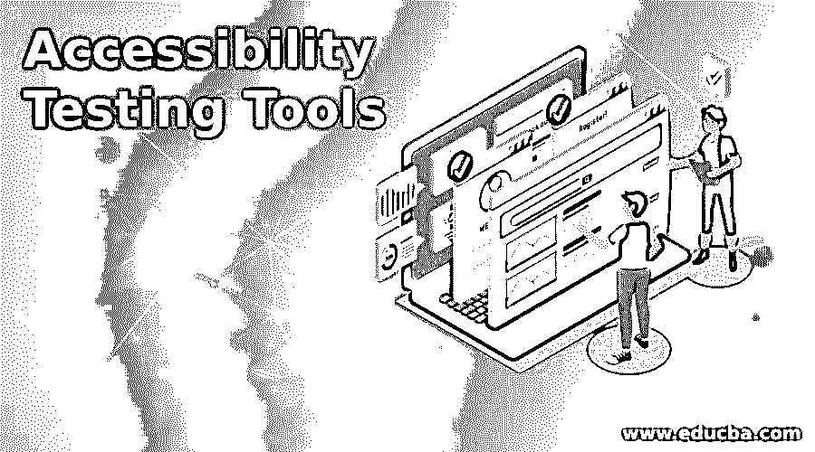

# 易访问性测试工具

> 原文：<https://www.educba.com/accessibility-testing-tools/>

## 易访问性测试工具介绍

易访问性测试工具被定义为用于执行应用程序测试的软件测试工具，该工具由具有色盲、听力问题、老年人和弱势群体等问题的专业人士使用。易访问性测试是可用性测试的一种。易访问性测试工具的主要目的是使应用程序可以被残疾人使用。开发网站的开发人员需要考虑可访问性指南，这些指南可用于使网站设计简单，便于残疾人使用。市场上有许多可访问性测试工具，用于不同的目的，主要用于检查网站的可访问性。辅助工具包括 Wave、TAW、Cynthia Says、OCAWA、MAGENTA 等等。所有这些工具都遵循 WCAG 1.0 和其他标准的指导方针，以便在网站开发期间可以遵循通用的规则和指导方针。这些可访问性测试工具突出了设计问题、内容问题和可访问性问题。

### 易访问性测试工具是如何工作的

使网站更加用户友好，更容易被专业人士接受，主要是网站应该易于访问。为此，有一个可用于检查网站可访问性的工具列表。在下一节中，这里给出了工具列表:

<small>网页开发、编程语言、软件测试&其他</small>

#### 1.波浪

WEBAIM 拥有的 Wave(网页可访问性评估工具)。wave 工具用于验证网页，以便通过该工具检查不同角度的可访问性。通过选择这个工具，我们可以用它来检查内部网，动态生成，密码保护，和敏感的网页。该工具可以识别网页组件。可以通过 wave 工具在线访问第三方，也可以通过该工具访问网页的替代视图。wave 工具的主要特点是它提供的安全措施。

#### 2.射石弹者站立的基线

TAW 是另一种用于检查网页可访问性的工具。网站的检查标准是 W3C 网站可访问性指南。该工具包含在在线工具中，也可以作为桌面应用程序安装在用户系统上。TAW 工具也是一个 Firefox 插件，可以添加到浏览器中。该工具可以显示网站注释版本。

#### 3.无障碍代客

根据 WCAG 合规性检查该工具中的网页。可以使用该工具免费版本中的辅助工具来检查网站的 URL。该工具的高级版本提供了使用该工具测试无限 URL 的功能。

#### 4.Web 辅助功能检查器

斯坦福大学开发了 web accessibility checker 工具，广泛用于分析单个网页的可访问性或不可访问性。在网站的可访问性期间报告的问题可以在网页可访问性检查器中列出，并且可以对每个检测到的问题进行评估。有一个用户可以使用的网站检查指南列表。这些准则是第 508 节，WCAG 1.0，WCAG 2.0，或斯坦察法案。

#### 5.奥卡瓦

OCAWA 工具由 Orange 和 Urbilog 开发。OCAWA 工具适用于 WCAG 1.0、RGAA 和法国无障碍法律。使用此工具，用户可以上传网站 URL，也可以直接上传 HTML 文件。该工具处理报告中提交的输入，然后生成包含 URL 和 HTML 文件的可访问性信息的完整报告。如果有任何违规行为，可以将其纳入报告本身。

#### 6.品红

这是 HIIS 实验室开发的另一种网络辅助工具。这个工具主要由视力受损的人使用，他们也有色盲的问题。用于检查网站可访问性的准则是斯坦察法案和 WCAG 1.0 规则和准则。

#### 7.FAE

功能性无障碍评估工具(FAE)用于评估采用 ITAA 无障碍标准的网页。用于检查网站可访问性的标准是第 508 条和 WCAG 1.0。当评估阶段完成时，总共有五个类别，包括文本等效、方向和导航、脚本、HTML 标准和样式。在评估之后，工具以警告和失败的形式给出警告。这样，我们可以对问题进行根本原因分析。

#### 8.EvalAccess

西班牙的巴斯克大学开发了这个 EvalAccess 工具。完整的网站可以很容易地在 WCAG 1.0 合规性的基础上进行评估。该报告以非常简单的格式生成，以便用户可以了解网站上出现的错误。检测到的每个错误都在报告中列出。大多数开发人员使用这个工具来使他们的网站具有交互性，便于用户访问。

#### 9.辛西娅说

这种辅助工具用于检查网站上的网页内容。可以识别内容中存在的错误，这些错误遵循 Section 508 的标准，并且也符合 WCAG 标准。该工具有多种应用，因为它可以帮助进行在线测试，用于教育目的，也有助于验证网页。使用 Cynthia Says 工具也可以识别网站设计错误。

### 结论

在软件工程领域，易访问性测试工具的主要用途是帮助开发残疾人可以使用的应用程序。主要的测试标准是几个标准中定义的可访问性指南。如果任何开发者不能遵循这些指定的可访问性指南，那么就需要开发两个版本的网站。网站的一个版本需要由普通用户使用，而网站的一个版本可以由残疾人使用。

### 推荐文章

这是一个易访问性测试工具的指南。在这里我们讨论一个易访问性测试工具的介绍，以及它是如何工作的。您也可以浏览我们的其他相关文章，了解更多信息——

1.  [移动测试工具](https://www.educba.com/mobile-testing-tools/)
2.  [云测试工具](https://www.educba.com/cloud-testing-tools/)
3.  [静态测试](https://www.educba.com/static-testing/)
4.  [云计算应用](https://www.educba.com/cloud-computing-application/)

