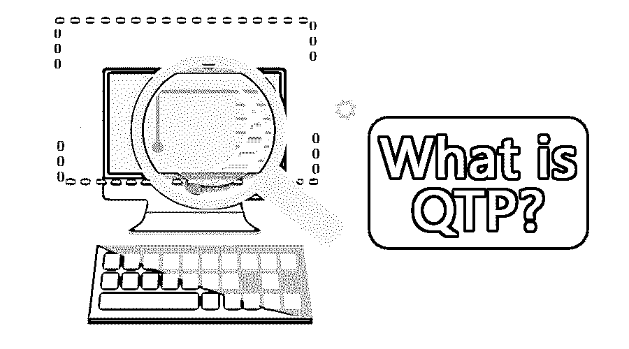

# 什么是 QTP？

> 原文：<https://www.educba.com/what-is-qtp/>

## QTP 简介

QTP 可以扩展为 Quick Test Professional，一个自动化测试工具，用于自动化软件应用程序测试过程，尤其是功能和回归测试。QTP 最初是由 Mercury Interactives 开发的，后来被惠普收购，并更名为统一功能测试(UFT)。它以简单的自动化测试脚本创建、用于对象识别的屏幕记录选项而闻名，脚本可以根据变化或新需求在需要时进行编辑，维护工作量低，并且它还有一个测试报告生成选项。

### 了解 QTP

如前所述，QTP 是一个功能和[回归测试工具](https://www.educba.com/regression-testing-tools/)。回归测试很重要，因为软件中的一些新变化不应该影响软件的现有功能。[功能测试和回归测试](https://www.educba.com/what-is-functional-testing/)有着和[一样的重要性。最终用户关心的是功能，因此产品应该在适当的测试阶段交付。这些测试程序有它们自己的时间和能量需求。现在，快速测试专家出现了，它试图解决测试人员面临的问题。它节省了重复做同样的步骤所浪费的时间和精力。它帮助测试人员以最小的努力执行测试。在 QTP 的例子中，一旦测试脚本被编写，就不需要监控了。](https://www.educba.com/regression-testing/)

<small>网页开发、编程语言、软件测试&其他</small>

### QTP 是如何让工作变得如此简单的？

QTP 的主要区别因素是它的用户界面功能。它附带了一个所谓的[集成开发环境](https://www.educba.com/what-is-ide/) (IDE)，该环境提供了允许轻松生成脚本的用户界面。QTP IDE 允许使用基于图标的风格开发复杂的自动化脚本。此选项称为“录制和回放”，在 QTP 默认情况下受支持。这个特性也允许非技术用户开发脚本。

它允许使用各种数据表和外部源向应用程序提供多组数据。它允许用户界面在结果查看器选项中查看结果。所有这些功能使得使用 QTP 非常容易。

### 你能拿 QTP 怎么办？

它允许生成脚本，而无需逐行编写..特征记录和回放使它变得非常容易。当测试人员启动 QTP 并执行一些操作时，QTP 为测试人员执行的每个步骤生成代码行。现在，当 tester 想要执行与之前相同的步骤时，他只需要使用回放特性。该脚本根据需要执行相同的步骤。

虽然它主要用于基于 UI 的测试用例自动化，但它也可以用于自动化一些非基于 UI 的测试用例，如数据库测试、文件系统操作或 web 服务测试。

### 与 QTP 合作

QTP 允许通过用户界面的方式进行测试。顺便说一句，它是有效的。它识别屏幕上的对象和相关操作，如鼠标点击或键盘输入。将它们存储在内存中并生成脚本。对于用户，即测试人员只需[执行手动测试过程](https://www.educba.com/manual-testing/)一次，并在 QTP 进行记录。QTP 还支持异常处理，因此测试将在意外失败的情况下继续运行。它只能在 T2 的 Windows 环境下工作，在今天的市场上被称为 UFT。

### QTP 的优势

*   主要优点是不需要手动编写脚本，即记录和回放功能。
*   它支持几乎所有主要技术，包括 Web、Net、Java、Oracle apps、SAP、Siebel、终端仿真器(Unix、大型机)、Power Builder、Visual Age、Flex(由 Adobe 开发)
*   它有一个活动的屏幕记录，允许测试人员识别对象。
*   它有一个非常好的对象识别机制。
*   因此，它允许编辑脚本并增强它们。
*   对于分析，测试报告也可以通过 QTP。
*   它有内置的 IDE
*   很容易维护。

### 所需技能

学习最基本的要求是对软件测试的理解。一个人必须有测试和相关概念的基本知识。其次，QTP [使用 VB 脚本](https://www.educba.com/what-is-vbscript/)作为它的脚本语言。所以，知道 VB 脚本将是一个额外的优势。

### 我们为什么要用 QTP？

测试和自动化测试是软件开发中的重要需求。自动化测试节省了时间，而且 QTP 允许我们在不直接写代码的情况下生成自动化测试用例，这最终节省了很多时间。同样，因为它允许我们通过使用具有附加功能的用户界面来生成脚本，所以生成脚本变得非常容易。

### 范围

对于测试人员来说，它是一个非常重要的工具。今天 It 行业还在用。它易于使用，并且有供应商的稳定支持，因此总是需要这些专业人员。记住，UFT 是 QTP 的最新版本。

### 我们为什么需要 QTP？

它最适合测试人员，用于生成自动化测试脚本。如果计划得当，自动化与 QTP 相比，我们可以节省大量的精力和时间投入。

### 谁是学习 QTP 技术的合适受众？

任何对软件开发生命周期有基本了解的人或者任何熟悉软件工程的人都有资格学习 QTP 技术。

### 这项技术将如何帮助你的职业发展？

对于测试人员来说，作为一项技能，这无疑是一个额外的优势。以 QTP 为技能的软件测试专业人士将会有相当大的需求。

### 结论

所以，它是最流行的回归和[功能测试工具](https://www.educba.com/functional-testing-tools/)。它允许通过使用用户界面来生成测试脚本。它仅支持 windows 环境。它不是一个开源工具，使用它需要购买许可证。QTP 对于测试人员来说是一项热门技能，现在市场上很多人都在使用它。

### 推荐文章

这是一本关于什么是 QTP 的指南？.这里我们讨论了 QTP 的概念、理解、工作、用途、优势、所需技能、需求和范围。您也可以浏览我们推荐的其他文章，了解更多信息——

1.  什么是虚拟化？
2.  [硒 vs QTP](https://www.educba.com/selenium-vs-qtp/)
3.  [Joomla 是什么？](https://www.educba.com/what-is-joomla/)
4.  [测试用例的类型](https://www.educba.com/types-of-test-case/)

