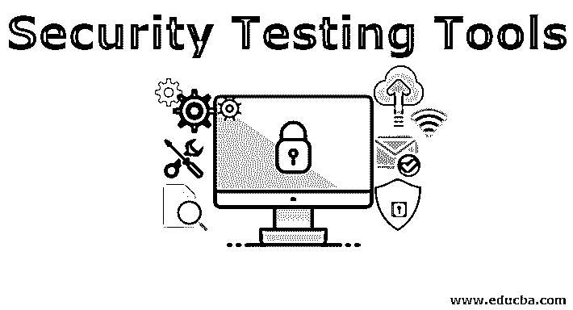
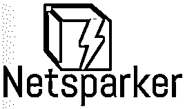
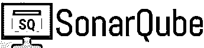
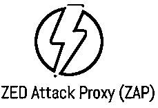
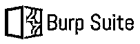
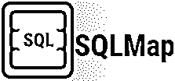
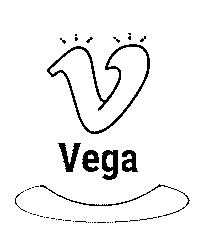

# 安全测试工具

> 原文：<https://www.educba.com/security-testing-tools/>

## 安全测试工具简介

如今，安全性已经成为一个重要的问题。随着 IT 行业的发展，每天都有大量新网站上线，因此黑客攻击的新方法也在增加。因此，保护具有用户和组织的私人信息的网站及其数据不被泄露或被未授权的用户访问变得非常重要。大多数组织雇佣人员对他们的网站进行安全测试，因为这有助于在将网站发布到生产环境之前发现网站中的缺陷和漏洞。不管是付费的、免费的还是开源的，现在市场上有很多工具可以用来测试 web 应用程序的安全性。

### 安全测试工具

下面我们就来逐一了解一下其中的一些安全测试工具。

<small>网页开发、编程语言、软件测试&其他</small>

#### 1.网络火花

Netsparker 是市场上用于 web 应用程序安全的最好、最准确的工具之一。它使用防弹扫描来自动验证误报。它被用来发现漏洞，如 SQL 注入 T2 和 web 应用程序中的跨站脚本。它涵盖了 1000 多个漏洞，可以轻松地与任何 CI/CD 应用程序集成，在这些应用程序中，查找漏洞的过程是完全自动化的，并发布在错误跟踪系统上。该工具非常容易设置和使用，它在仪表板上显示漏洞，非常容易阅读和理解。

#### 2.索纳库贝

*   SonarQube 是一个开源软件测试工具，用于测量代码质量和发现漏洞。它还强调了代码中严重的内存问题。SonarQube 是用 Java 编写的，但可以用 20 多种语言进行分析。
*   SonarQube 能够发现跨站点脚本、SQL 注入、内存问题、HTTP 响应分裂等漏洞。此外，它能够发现棘手的缺陷，如空指针异常、逻辑错误等。SonarQube 可以轻松地与任何 CI/CD 应用程序集成。它提供了特殊的质量关口，这个关口告诉我们整个应用程序的质量是否适合在产品中发布。

#### 3.W3af 的

W3af 是市场上流行的开源 web 安全应用工具之一。它是用 Python 编写的，涵盖了 200 多个安全问题。它涵盖了盲 SQL 注入、缓冲区溢出、跨站点脚本、CSRF 等问题。

W3af 为新手提供 GUI，而对于专家来说，它也有一个控制台界面。此外，它为用户提供了出色的身份验证支持，并提供了根据特定要求将输出记录在文件、电子邮件或控制台中的工具。

#### 4.ZED 攻击代理

ZAP 是一个开源的安全测试工具，可以在多个平台上运行。它是用 Java 编写的，涵盖了如此多的安全漏洞。它提供了 GUI 和命令行来简化新手和专家的工作。ZAP 曝光 XSS 注射、SQL 注入、应用程序错误泄露、私有 IP 泄露等。此外，它还提供了应用程序扫描器、认证支持、Web socket 支持、AJAX 蜘蛛等。它还可以用作应用程序的扫描仪/过滤器。

#### 5.打嗝组曲

Burp Suite 是一个用 Java 编写的 Web [渗透测试](https://www.educba.com/penetration-testing/)框架。它有各种版本，如社区版，专业版和企业版。虽然社区版是免费的，但是专业版和企业版是试用期过后收费的。付费版本有许多先进的工具，如蜘蛛，中继器，解码器等。，而免费版只提供基本服务。

Burp Suite 涵盖了 100 多个漏洞，并以一种极具分析性和互动性的方式提供结果。Burp 套件中的结果以树形方式显示，即用户可以通过深入特定分支来获得漏洞的详细信息。它还提供了使用静态和动态技术的 Javascript 分析。

#### 

#### 6.麋鹿

Wapiti 是测试一个
应用程序安全性的有效开源工具之一。它只提供了一个命令行界面，没有 GUI，这使得初学者很难使用它。在处理马鹿之前，应该完全了解这些命令。它不同于市场上的其他工具，因为它有助于应用程序的[黑盒测试](https://www.educba.com/black-box-testing/)。

Wapiti 在不同的位置注入有效载荷，以检查应用程序的安全性。它还允许使用 GET 和 POST 方法进行安全性测试。马鹿识别数据库注入、文件泄露、XSS 注入、XXE 注入、潜在危险文件等。它可以生成各种格式的漏洞报告(如 HTML、XML、.txt 等)。

#### 7.sqlcmap

SQLMap 是一款用于发现 SQL 注入漏洞的开源软件。它
自动化了在
任何应用的数据库中检测和利用 SQL 注入的整个过程。它支持广泛的数据库，如微软 SQL Server、微软 Access、SQLite、MySQL、Oracle 等。此外，它支持从数据库服务器下载和上传任何文件。

SQLMap 可以绕过 SQL 注入直接与数据库连接。它支持各种 SQL 注入技术，如基于时间的盲、基于错误的、堆栈查询、基于布尔的盲和带外。此外，它有一个强大的搜索机制，能够在数据库表中搜索特定的数据库名称及其列。

#### 8.低湿平原

Vega 是一个测试应用程序安全性的开源 web 安全工具。它是用 Java 编写的，并且支持 GUI，这使得它对于新手和有经验的人来说都更容易使用。它可以帮助找到跨站点脚本，找到并验证 SQL 注入，外壳注入，远程文件包括等。它包含一个自动扫描仪，有助于快速测试。Vega 可以在 Windows、Unix、Linux 和 Mac OS 等多种平台上运行。Vega 用 Javascript 编写，具有可扩展性，即用户可以使用丰富的 API 根据具体需求创建多个攻击模块。它还可以对 Http 网站进行 SSL 拦截。

### 结论

市场上有很多安全测试工具，而且这些工具过于开源。我希望上面提到的工具能让你了解不同的测试工具是如何提供各自特定的测试服务的。在使用任何工具对您的应用程序进行安全性测试之前，非常重要的是要详细了解该工具，并知道它是否有特定的用途。非常整洁干净，丰富的文档网站可以在互联网上为每个工具提供完整的用户指南。现在，几乎所有的工具都发布了漂亮的 GUI，以方便新用户使用。

### 推荐文章

这是安全测试工具的指南。在这里，我们讨论不同类型的安全测试工具的简要概述。您也可以浏览我们推荐的其他文章，了解更多信息——

1.  [网络应用安全](https://www.educba.com/web-application-security/)
2.  [系统测试](https://www.educba.com/system-testing/)
3.  [黑盒测试技术](https://www.educba.com/black-box-testing-techniques/)
4.  [吉拉测试工具](https://www.educba.com/jira-testing-tool/)

