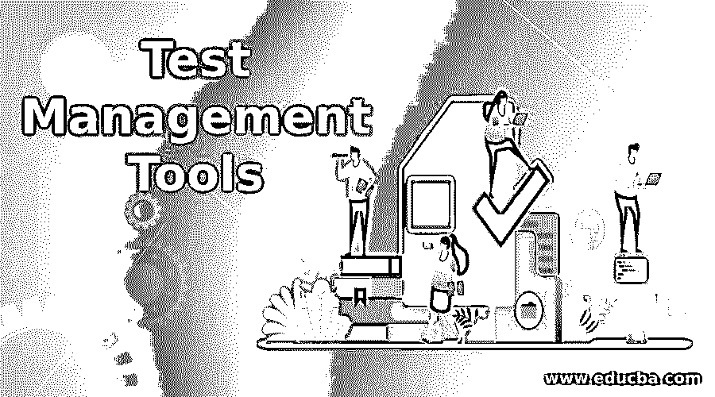
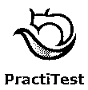

# 测试管理工具

> 原文：<https://www.educba.com/test-management-tools/>

## 测试管理工具简介

测试管理工具是用来存放所有测试相关文档的工具，比如测试脚本、测试计划、测试状态报告等等。，可以存储和维护。测试管理特性依赖于软件开发模型，软件应用程序是基于该模型开发的。作为一个附加的特性，大多数工具允许测试用例的执行，跟踪测试状态，并记录缺陷生命周期。一些常用的测试管理工具有泽法、TestMonitor、IBM Rational Quality Manager、HP ALM、Rally 等。

### 测试管理工具的实现

一个测试管理工具，它包含了处理测试过程所需的一切，可以测试引入对测试过程至关重要的独立应用程序的问题。考虑到简单的安装和对多个项目组的测试程序的观察，它们可以用最少的编程能力来执行。安装后，小组可以立即访问 UI，并快速开始运行和记录测试用例。

<small>网页开发、编程语言、软件测试&其他</small>

### 认识项目环境

如果我们看一下目前市场上可获得的测试工具，在这一点上，有一些工具被驱动到在线应用程序、移动应用程序、用于手动操作测试和自动化测试阶段的测试情况监督程序。

### 互操作性方面

一个组织或公司有各种各样的机器，带有不同的操作系统，比如 Linux、Mac OS 和 Windows，所以可以认为一个测试管理工具被批准用于这些平台中的每一个或者仅仅一个。

### 不同的测试管理工具

关于测试管理工具，有非常多的选择。加剧这种情况的是，一些卖家自己提供了大量的商品，使选择过程变得更加困难。因此，要处理这些方面中的每一个，很少有工具是方便和有用的。

以下是绝对熟练的测试管理和 QA 工具:

#### 1.泽法

它在最畅销的测试管理工具中排名第一，为各种规模的活跃群体提供从头到尾的答案。获得适应性、清晰性和深入的洞察力，从而更快地交付高质量的软件。

**基本特征参考如下:**

*   一键合成与詹金斯，合流，JIRA，竹子，然后其他人。
*   数据中心部署、服务器和云的可选选项。
*   配备了 [DevOps](https://www.educba.com/what-is-devops/) 仪表盘和尖端分析。
*   不需要每年参与。

#### 2.HipTest

对于[敏捷团队和 DevOps](https://www.educba.com/agile-vs-devops/) 团队来说，这是一个持续的测试阶段，它使团队能够在一个概念上合作，一致地测试代码，并根据实时的深入洞察创建文档。它被分布在 140 个国家的 25000 多名消费者使用。

**主要亮点参考如下:**

*   原生 BDD 有助于调整您的团队，简化工作流程和项目文档。
*   测试自动化有二十多个系统可供选择，包括 Java 或 Junit、 [Cucumber](https://www.educba.com/what-is-cucumber/) 、Selenium、Specflow 和 sky。
*   CI 或 CD 与 TravisCI、Jenkins、Shippable、Bamboo 等工具的结合，这只是冰山一角。
*   情境管理器，可重用的进步，以及简单的测试重构来简化测试创建。
*   免费、快速、专业的支持以及专注的客户成就团队。

#### 3.实践测试

它开始完成一个测试管理工具。这是一个典型的所有 QA 股东的聚会场所，它使测试过程完全清晰，并对测试结果有更深刻、更广泛的理解。

**下面引用了重要亮点:**

*   大量的第三方组合，包括标准的 bug 追踪器、自动化工具和健壮的 API。
*   完全个性化并可适应 QA 团队定期变化的需求:重做测试、授权、视图、问题工作流程，从那里开始，天空就是极限。
*   重复利用测试并连接多个放电和项目之外的结果。
*   非常多层次的精制树组成的整体，发现什么都很快。
*   永不超生操作两次反 bug 拷贝、修改、步骤参数和调用测试。
*   利用尖端的仪表盘和报告来展望信息。
*   快速专家和方法帮助。

#### 4.测试轨道

它提供了全面的测试用例管理，使您能够安排测试工作，并不断深入了解测试活动。惊人的报告和指标使 QA 团队能够提高效率并传达快速审查。

**基本要点参考如下:**

*   有效地跟踪特定测试的状态。
*   通过信息仪表板和移动报告衡量增长。
*   检查大量测试运行、安排和成就的结果。
*   跟踪小组工作量以改变任务和资源。
*   适应性非常强，无论是放在一起还是从开始安装的选择来看。

#### 5.泽法代表吉拉

它将项目周期与测试结合起来；您能够跟踪和生成授权的去或不去的决定和软件质量。测试问题可以被执行、产生、跟踪和报告，就像任何其他的[吉拉问题](https://www.educba.com/what-is-jira-software/)一样。

**下面引用了重要亮点:**

*   构建、查看、编辑测试计划并进行测试。
*   链接到故事、任务、必需品、故障等。
*   构建测试用例并实现测试。
*   构建仪表板，生成报告并跟踪质量指标。
*   与竹，JIRA，詹金斯，硒等工具的集成。

#### 6.测试协作

它是管理和帮助开发团队有效执行测试和避免失败的工具。它提供了所有流行的 bug 跟踪器和测试自动化工具的组合。

**下面引用了重要亮点:**

*   控制项目质量趋势、花费的时间、测试指标、报告的缺陷，并进一步从中央仪表板。
*   测试用例及测试任务管理。
*   全面的测试执行报告。
*   它支持与关注点管理器的集成，比如 Redmine、JIRA、FogBugz 等。，并使双向组合能够直接从您的关注点管理器构建测试用例并执行。

#### 7.测试链接

它是市场上独一无二的开源测试管理工具之一，基于 web，提供报告、测试规范、需求规范、测试计划和执行，并与著名的 bug 追踪器合作。

**下面引用了重要亮点:**

*   需求管理。
*   测试用例的创建、维护和执行。
*   与问题跟踪器和 bug 跟踪集成。
*   指标和图表支持。

#### 8.质量中心

它以前被确定为惠普质量中心是由微焦点提供的质量管理软件。微焦点获得了惠普企业软件部门的惠普软件部门。

**下面引用了重要亮点:**

*   需求管理。
*   测试和缺陷管理。
*   [敏捷测试](https://www.educba.com/what-is-agile-testing/)。
*   自动化测试。
*   度量管理。

### 结论

从各方面来看，选择不正确的样本领导工具都是一个代价高昂的错误。这不仅仅是不正确的决定，还可能意味着从评估到仪器被获得和发送的一系列浪费时间。

### 推荐文章

这是测试管理工具的指南。在这里，我们详细讨论了基本概念、工具的实现、项目环境的识别以及不同的测试管理工具。您还可以浏览我们推荐的其他工具，了解更多信息——

1.  [敏捷的吉拉](https://www.educba.com/agile-jira/)
2.  [敏捷软件开发](https://www.educba.com/agile-development/)
3.  [互操作性测试](https://www.educba.com/interoperability-testing/)
4.  [测试计划模板](https://www.educba.com/test-plan-template/)

