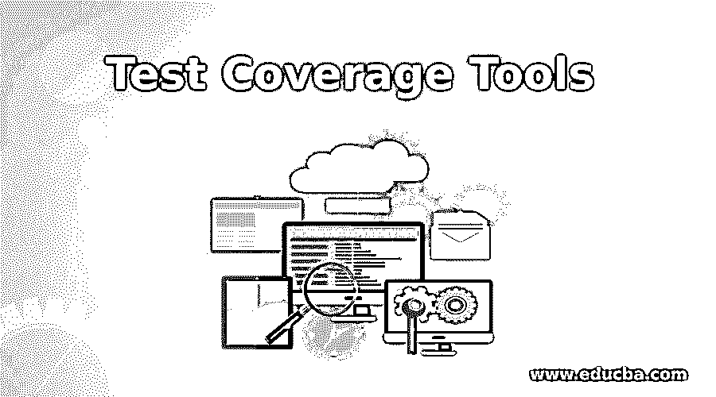

# 测试覆盖工具

> 原文：<https://www.educba.com/test-coverage-tools/>

## 测试覆盖工具简介

测试覆盖工具可以被定义为关注测试过程的重要目标的工具。它根据为测试软件提供的功能性和非功能性需求来评估测试执行的范围。此外，这些工具还用于执行一系列活动，如确保编码标准的维护、跟踪测试执行百分比、将可重用的测试用例移到回归套件下、删除过时的测试用例、添加额外的测试用例以填补已确定的差距(如果有的话)等。类似于测试管理工具，用于测试覆盖评估目的的工具是测试覆盖工具。

### 测试覆盖的 10 大工具

在真实的软件开发项目中，一些著名的测试覆盖工具及其显著的属性如下:

<small>网页开发、编程语言、软件测试&其他</small>

| **工具** | **显著属性** |
| 智能熊泽法 | 可能与吉拉、詹金斯、Confluence 等整合 |
| X 光 | 自动化需求可追溯性 |
| 测试轨道 | 针对不同测试环境比较结果的选项 |
| 实践测试 | 可重用、可定制的用户界面 |
| 请求 | 缺陷分配的即时通知 |
| 文字路径 | 测试工件的简单组织选项 |
| 测试监视器测试监控程序 | 更简单的用户界面，高效的测试管理和缺陷管理 |
| Qase | 测试运行消耗的时间更少 |
| 测试链接 | 对测试工件执行的每个创建和编辑功能的一般测试管理特性和事件日志。 |
| 狼蛛 | 需求可追溯性，以及从缺陷中挑选的滞后原因 |

#### 1.智能熊泽法

Smartbear 泽法因工具中的各种可用选项以及测试覆盖评估而成为首选，测试覆盖评估包括部署设施、与其他类似工具的集成、开发运维活动、报告生成，以对工具内容、项目管理活动、基于敏捷的仪表板等进行分析。这些工具有助于提供项目中每个人分配和执行的所有活动的透明信息。

#### 2.X 光

选择 Xray 是因为它能够支持完整的测试生命周期，包括根据需求的手工测试和自动化测试。在内置选项的支持下，测试覆盖活动变得不复杂，这些内置选项用于在任何需要的时候查看测试活动的进度，并用于项目中的每个人。它还提供了集成项目中每个团队的测试进展的可见性，以便管理层可以将该信息用于重要的决策过程。

#### 3.测试轨道

TestRail 在测试覆盖推断和操作测试活动方面拥有卓越的技术，比如跟踪测试用例的数量，将测试分类到不同的测试类型下，记录每个测试用例必须经历的测试运行次数，根据输入标准或所需的配置重新安排测试，等等。它还保留了缺陷生命周期的证据，这是测试覆盖评估的主要部分。

#### 4.请求测试

ReQTest 是另一个测试管理工具，它给出了完美的测试覆盖结果，并提供了与其他项目管理工具如吉拉、confluence 等的集成选择。众所周知，这是为数不多的基于云的系统之一，可以通过网络浏览器访问。用户界面具有多种用于处理测试过程的有用特性，与其他工具相比，使得测试覆盖率的评估非常简单。

#### 5.实践测试

PractiTest 是测试管理工具，它为执行测试覆盖评估过程提供了完美的输入。输入的特征可以是缺陷管理过程、测试流程和相关活动的用户友好显示、适应测试过程所需变更的选项、正在开发的应用程序的质量管理、测试工件的可重用性等。

#### 6.测试路径

TestPad 是一个基于网络的工具，可以容纳各种类型的测试程序，并允许测试人员创建他们自己的测试文档范围。TestPad 工具的能力有助于评估各个测试管理流程的测试覆盖率所需的性能和效率。它还允许与其他测试管理或项目管理工具集成。

#### 7.测试监视器

TestMonitor 是一个有效的工具，在测试管理过程和测试生命周期中为测试覆盖率的进展创造一个视觉吸引力。它是一个众所周知的工具，因为它的极简主义和对测试执行活动的感知。作为测试过程的一部分，提取测试覆盖的光学结果和解决方案格式可能是项目特别选择这个工具的原因。它也偏好与其他工具、devops 活动、项目管理派系、报告生成过程等的集成。

#### 8.Qase

Qase 也是一个基于云计算的项目管理工具，它非常适合于确定测试管理过程中定期确定的测试覆盖范围。它提供了制定完整的端到端测试流程的选项，包括创建测试计划、编写测试用例、针对不同的输入条件运行测试，以及使用不同的测试实例对其进行识别。

#### 9.测试链接

TestLink 是另一个基于网络的测试管理工具，任何人都可以免费使用。它在维护和评估测试覆盖率方面有更好的效率。它支持测试过程活动每一步的前景，包括计划、创建图表、创建测试相关文档、生成分析结果、提取具有一系列参数的报告等。

#### 10.狼蛛

Tarantula 是一个高度专业的测试管理工具，用于挖掘和收集测试覆盖因素。它是一个著名的测试管理工具，以仪表盘、分析结果、报告生成等形式提供即时结果。它还为项目管理提供了集成特性，以便为所有项目集成和提取一个组合的测试覆盖报告。

### 结论

类似于软件测试生命周期和缺陷生命周期，测试覆盖也是软件开发生命周期内测试管理过程中的一个重要步骤。为了更好地与客户共享的功能/非功能需求相匹配，它将质量保证实践向前推进了一步，以开发一个高效且价值更高的软件产品。

### 推荐文章

这是测试覆盖工具的指南。在这里，我们还将讨论测试覆盖的介绍和 10 大工具，包括 smartbear zephyr、x-ray 和 testrail。您也可以看看以下文章，了解更多信息–

1.  [测试覆盖率](https://www.educba.com/test-coverage/)
2.  [玻璃箱测试](https://www.educba.com/glass-box-testing/)
3.  [Web 测试工具](https://www.educba.com/web-testing-tools/)
4.  [数据库测试工具](https://www.educba.com/database-testing-tools/)

