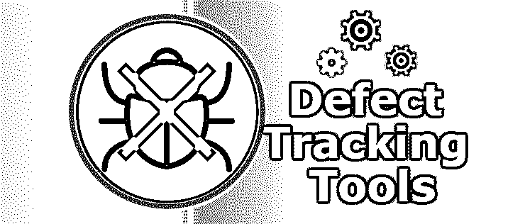

# 缺陷跟踪工具

> 原文：<https://www.educba.com/defect-tracking-tools/>

## 缺陷跟踪工具介绍

缺陷跟踪工具是主要用于跟踪软件开发过程中缺陷生命周期的每一步的工具。缺陷是指在实施产品和向客户交付产品之前，在任何形式或形状上与客户要求的差异。因此，缺陷经历了不同的阶段，需要被处理。这些是用于这一过程的工具。一些著名的工具，以实现螳螂，JIRA，大本营，团队合作项目，雷德布斯，Asana 等。

### 什么是缺陷跟踪工具？

这些工具是用来报告在软件测试过程中发现的错误并跟踪这些错误的工具或软件。

<small>网页开发、编程语言、软件测试&其他</small>

#### 因此，缺陷跟踪工具的使用可以被称为:

1)在软件测试期间报告错误

2)跟踪那些被报告的错误

请注意，无论是 bug 跟踪工具还是缺陷跟踪工具都是一回事。在本文中，这两个术语的意思相同。

### 缺陷跟踪工具的类型

下面是跟踪缺陷的一些关键工具。

#### 1\. Bugzilla

Bugzilla 于 1998 年为用户在线制作。它是一个高度成熟的 bug 跟踪工具或缺陷跟踪工具。它帮助测试人员报告错误，跟踪现有的或报告的错误，还提供了将错误标记为问题或增强或类似类型的请求的功能。

**定价:**

它是开源的，可以免费使用。然而，如果需求增加，那么可以购买额外功能和支持的付费版本。

**特性:**

*   **高级搜索—**Bugzilla 具有高级功能，用户可以使用 bug 的完整文本来搜索 bug。高级搜索 bug 可以进一步扩展，根据用户需求定制搜索。
*   **电子邮件通知–**Bugzilla 提供了一个电子邮件通知功能，如果对 bug 进行了任何更改，如添加了注释或对 bug 进行了任何其他更改，用户会收到电子邮件通知

#### 2.JIRA

JIRA 是由澳大利亚公司 Atlassian 开发的，JIRA 最初主要是一个事故管理工具。JIRA 提供了所有的功能，比如记录错误、报告错误、管理错误阶段等等。

**定价:**

最初，人们可以免费使用它的试用版。之后，人们可以购买它

**功能:**

*   **定制仪表板—**JIRA 有一个功能，可以根据个人需求定制仪表板。
*   **敏捷支持—**[JIRA 仪表板](https://www.educba.com/jira-dashboard/)可以扩展以满足敏捷环境的支持。类似地，它可以扩展到看板。
*   **丰富的 API–**JIRA 支持大量可用于自动化的 API。
*   **移动应用—**JIRA 提供移动应用，从而使缺陷跟踪变得容易。人们可以追踪手机本身的漏洞。
*   **可扩展插件****–**JIRA 可以与各种第三方应用集成，以便更好地使用。

#### 3.电子追踪

这是另一个最流行的跟踪工具。它可以用来报告和跟踪缺陷。然而，它不仅限于跟踪缺陷，还可以用于跟踪其他软件开发相关的事情。

在这里，因为它可以被定制来跟踪事物，因此目标受众可能是不同的。这个工具的另一个最重要的特性是，解决缺陷所需要遵循的过程或者解决缺陷的周期是可以定制的。一个人可以定义他自己的缺陷解决周期集来跟踪这些缺陷。这些定制的定义周期被称为模板，在跟踪工具时非常重要。

#### 4.精益测试

精益测试是一种缺陷跟踪工具，可以免费使用。它也是一个测试用例管理工具。作为一个测试用例管理工具，人们可以描述与软件开发相关的特定任务的测试用例。

精益测试既可以在网络上使用，也可以在手机上使用。它可以通过使用扩展扩展到网络浏览器。因此，随着扩展的使用，人们可以在浏览器中使用它。还有，它有移动支持；因此，缺陷的报告和跟踪也可以在手机上完成。精益测试非常容易使用。它不需要安装任何类型的软件。

### 一个理想的缺陷跟踪工具必须具备哪些特性？

下面指出了一些基本特征。

*   **报告工具–**它必须有一个报告工具，这意味着测试人员应该能够记录一个 bug 以及所有附加的细节，比如它的环境、严重性、附件等等
*   **分配–**它必须有一个功能，将 bug 分配给相关人员，以便修复它。测试人员也可以跟踪它。
*   **跟踪不同生命周期的 bug—**bug 一旦被记录，就会经历不同的阶段。一个理想的缺陷跟踪工具应该有不同的阶段，并清楚地描述每个阶段的含义。
*   **维护日志–**一个理想的缺陷跟踪工具必须能够维护不同事物的日志，比如用户评论、缺陷描述中的任何添加等等。
*   **提供唯一的 id–**使用此方法报告的每个 bug 都必须自动分配一个唯一的 id。这个唯一的 id 将进一步用于跟踪 bug 信息等。

上述功能是任何 bug 跟踪工具都应该具备的基本功能。但是，该工具也可能提供一些附加功能。但是上面提到的特性是追踪 bug 所必需的。

### 结论

对于软件开发来说，维护它是非常必要的。要维护软件，需要检查。测试中发现的任何缺陷都需要报告并得到解决。为了记录和跟踪这些缺陷，软件测试人员需要一个工具。这些工具，称为缺陷跟踪工具，有助于跟踪缺陷。这些工具有助于维护软件及其文档。

### 推荐文章

这是缺陷跟踪工具的指南。在这里，我们讨论了缺陷跟踪工具的基本概念、类型及其用途，以及一些基本特性。您也可以浏览我们推荐的其他文章，了解更多信息——

1.  [软件测试人员工作](https://www.educba.com/software-tester-work/)
2.  [15 款最受欢迎的 Bug 报告工具](https://www.educba.com/15-best-bug-reporting-tools/)
3.  [JIRA 面试问题](https://www.educba.com/jira-interview-questions/)
4.  [软件测试职业](https://www.educba.com/careers-in-software-testing/)

