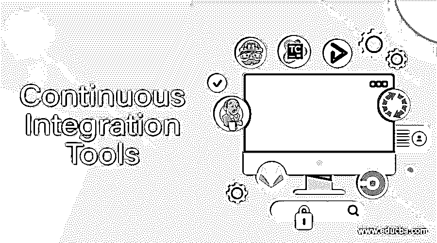
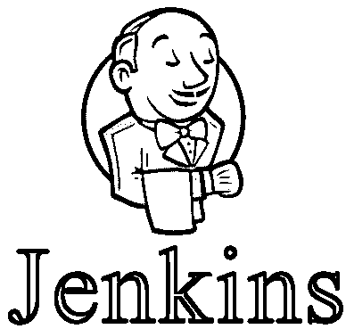
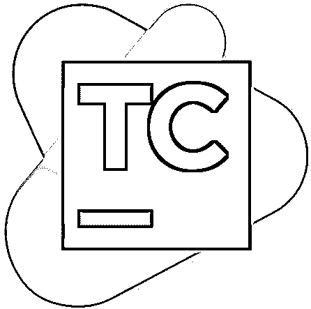
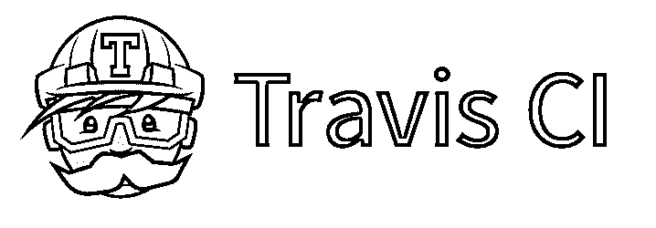
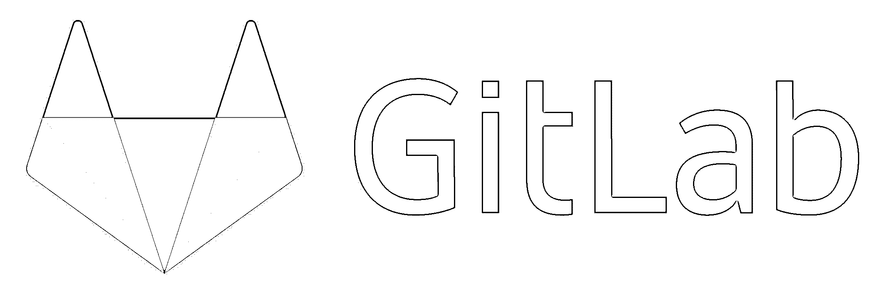
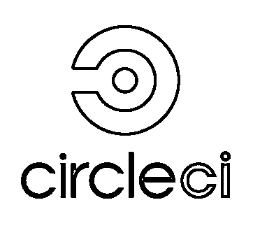

# 持续集成工具

> 原文：<https://www.educba.com/continuous-integration-tools/>

## 持续集成工具简介

作为软件开发设置的一个组成部分，持续集成工具允许开发人员将他们的代码合并到一个存储库中。一旦代码变更被合并，自动化的构建和测试就会运行。为了提高软件质量，解决缺陷，减少时间，等等[持续集成扮演着](https://www.educba.com/continuous-integration-in-devops/)非常关键的角色。

在交付增量特性的同时，为了不破坏构建，团队一个接一个地冲刺。然而，软件可能会变得不稳定，当开发人员关注添加新功能时，可能会出现代码错误。为了保持对代码质量的监控，持续集成服务器充当了看门人的角色，防止这种错误的发生。持续集成工具可以识别是否存在任何错误。

<small>Hadoop、数据科学、统计学&其他</small>

为了保持产品处于工作状态，变更被连续地合并。在初始阶段，不使用任何工具，经常与主代码合并。然而，工具的使用现在已经成为一种必须。

### 不同类型的持续集成工具

下面是一些您可以使用的持续集成工具:

#### 1.詹金斯

Written in Java, [Jenkins is an open-source](https://www.educba.com/what-is-jenkins/) continuous integration tool. When Oracle bought the Sun Microsystems, Jenkins originated as the fork of Hudson. Through both the Graphical User Interface and the console commands, the configuration is offered by the Jenkins, which is a cross-platform tool.

通过插件，特性扩展属性使得 Jenkins 非常灵活。你将自己的插件添加到已经很丰富的 Jenkins 插件列表中。在多台机器上，构建和测试负载由 Jenkins 和可扩展性一起分配。詹金斯是免费的，在麻省理工学院的许可下出版。詹金斯既强大又灵活。虽然学习曲线很陡，但其灵活性值得探索。以云中詹金斯的形式，托管解决方案由 Cloudbees 提供。

#### 2\. TeamCity

从 JetBrains 公司的实验室来看，TeamCity 是一个成熟的持续集成服务器。像 WebStorm 和 ReSharper 这样的工具是 JetBrains 的一些流行工具，被全世界的软件开发者使用。

虽然是免费的，但是所有的特性都是由 TeamCity 提供的，但是限制是一百个构建配置和三个构建代理。您需要为额外的构建代理和构建配置付费。没有内部安装的麻烦，对于一个项目，您可以尝试 TeamCity 的云试用版。

它支持各种各样的工具和框架，并且可以在多种平台上工作。JetBrains 和其他第三方都开发了一些公开可用的插件。最好的。NET 支持是由 TeamCity 提供的，尽管它本身是一个基于 Java 的解决方案。基于公司的需要，企业包可以由多个代理来扩展。总的来说，TeamCity 提供了一个很好的解决方案。由于其价格和复杂性，它更适合企业需求。

#### 3.特拉维斯·CI

最古老、最值得信赖的持续集成工具之一。它以企业包的形式提供内部版本和托管解决方案。对于最初的一百个版本，在 GitHub 上，这个持续集成工具对所有的 T2 开源项目都是免费的。并发构建的数量是不同的，并且有定价选项可供选择。

在运行构建时，会执行包含在. travis.yml 文件中的构建任务。为了支持它们，好的文档以各种语言呈现。一个记录良好的受欢迎的 CI 工具，为托管和本地变体提供了成熟的解决方案。

#### 4.GoCD

由 ThoughtWorks 公司制造，它是最新的巡航控制化身。GO 是免费的，也有 ThoughtWorks 的商业支持。GO 可用于 Mac、Windows 和各种 Linus 操作系统。

复杂构建工作流的建模因其管道概念而变得简单，这一概念将其从人群中分离出来。随着任务的并行执行，构建过程的瓶颈被消除，并且从零开始，GOCD 支持管道。对于复杂的场景。内部解决方案等等，可以使用这个工具。

#### 5.竹子

JIRA 和 Bitbucket 是 Atlassian 为软件开发创造的一些工具。云解决方案和内部解决方案最初都是由 Bamboo 提供的，但云版本于 2016 年 5 月停止，以支持 BitBucket 管道。

通过利用 Docker 的[能力，位桶流水线提供了高效快速的构建。作为竹云当之无愧的继承者，Bitbucket 正在快速成长。在 30 天内，Bamboo 是免费的，对于小型和成长中的团队来说，之后还有一些计划。Jenkins 配置可以很容易地导入到竹子中，并拥有 JIRA 和 Bitbucket 的本地支持。Bamboo 的管道快速而现代，30 天免费计划也很有用。](https://www.educba.com/what-is-docker-in-linux/)

#### 6.GitLab CI

GitLab 由 GitLab Inc .创建，是一个开源的 Rails 项目。问题跟踪、访问控制等功能由一个名为 GitLab.com 的免费托管服务提供和托管。

使用 GitLab API，项目可以很容易地挂钩，而使用 GitLab，项目可以很容易地集成。在 Windows 上，Linux 可以用 Go 语言运行和编写。有一个内置的 Docker 支持，可以同时运行多个作业。GitLab 企业版和 GitLab 社区版都自带。一个非凡的工具，提供企业和免费服务。

#### 7.圆形 CI

Python、Java 等语言。，连同 GitHub，都由 Circle CI 支持。Circle CI 提供服务的方式使其与众不同。容器是它的主要定价块，而你想要的许多项目你都可以构建。一旦添加了更多的容器，就可以根据您的需要选择并行化的级别。

并行化分为五个级别，因此从 16 个容器开始，一个构建可以实现 16 倍的并行化。Docker 也得到了 Circle CI 的支持。

### 结论

[连续积分的选择取决于](https://www.educba.com/what-is-continuous-integration/)几个因素。工件的本地存储和构建过程的灵活性由内部解决方案提供，这对于一些公司来说可能是强制性的。另一方面，托管解决方案提供了更大的可伸缩性。Docker 支持和用户界面是另外两个应该记住的东西。

### 推荐文章

这是持续集成工具的指南。这里我们讨论持续集成工具的介绍和各种类型。您也可以浏览我们推荐的其他文章，了解更多信息——

1.  [自动化测试工具](https://www.educba.com/automation-testing-tools/)
2.  爪哇的 JNI 是什么？
3.  [DevOps 自动化工具](https://www.educba.com/devops-automation-tool/)
4.  [数据仓库工具](https://www.educba.com/data-warehouse-tools/)

