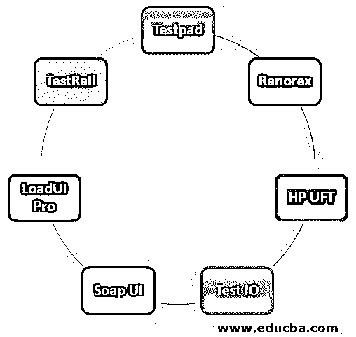

# Web 测试工具

> 原文：<https://www.educba.com/web-testing-tools/>

## Web 测试工具简介

web 应用程序的测试工具提高了可靠性，减少了停机时间并提高了投资回报率。它们是不同类型的工具，有助于各种 web 测试活动，从需求捕获到测试管理。

### 各种 Web 测试工具

以下是各种 Web 测试工具的列表:

<small>网页开发、编程语言、软件测试&其他</small>

#### 1.测试路径

Testpad 是一个更简单的手动测试工具，非常适合测试 web 应用程序。请记住，实用主义比方法更重要，测试计划受清单的启发，可以定制成各种风格，如发现测试、敏捷手工、BDD 语法，甚至传统的测试用例管理。现在我们将讨论 Testpad 的一些关键特性:

*   当你谈论新的想法时，填写新的测试。
*   与问题跟踪器快速集成， [JIRA 包括](https://www.educba.com/what-is-jira-software/)。
*   不需要账户的客测员通过邮件邀请。

#### 2\. Ranorex

Ranorex Webtestit 使用 TypeScript 或 java 提供现成的 Selenium 和量角器 web 测试自动化。通过自动创建页面对象、UI 特性的定位器和样板代码来节省宝贵的时间。向本地 WebDriver 端点和 selenium 网格传播跨浏览器研究。让我们来看看 Ranorex 的一些关键特性:

*   截图并生成 UI 选择器，并立即使用 Chrome DevTool 的 Ranorex Selocity 扩展。
*   集成 CI 服务器，包括用于缺陷监控的 VSTS、詹金斯和 TestRail 案例管理系统，如吉拉。
*   产生可维护的健壮测试套件。

#### 3.惠普 UFT 公司

HPE 统一功能测试是衡量跨平台自动化的主要方法。云、Windows、SAP、Delphi、Web、ActiveX、Flex、Android、Oracle 和 Ios 可以自动安装在其他应用程序中。PowerBuilder、Siebel、Stingray、Visual Basic 和许多其他软件。关于它可以自动化的开发环境的列表是巨大的！UFT 的一些特性包括业务流程监控、基于关键字的结构、XML 支持、可靠的控制点和测试结果。惠普 UFT 的特点:

*   以监视器或 GUI 对象的形式保存预期结果，并将其与显示或事件进行比较。
*   将测试总结发送到软件进行测试管理。
*   测试数据访问的数据管理。

#### 4.测试 IO

通过在真实的设备上和真实的浏览器中检查网站和应用程序，确保它们在世界各地都能运行。测试 IO 允许您使用成千上万测试专家的技能和洞察力来提高 web 应用程序和网站的质量。两百多家热爱客户的公司依靠测试 IO 的力量和灵活性来快速生产最高质量的应用程序。让我们来看看测试 IO 的特性:

*   在真实世界条件下，将您的覆盖范围扩大到数百个设备、平台和人员。确保您的软件可以在所有设备、操作系统和浏览器上运行。
*   我们专业的专家用干净公正的眼睛看着您的公司。测试人员发现了内部团队可能没有发现的错误。
*   人力驱动并不慢。借助满足您需求的按需定制评估，消除 QA 瓶颈。

#### 5.Soap UI

[SoapUI 是](https://www.educba.com/what-is-soapui/)世界上最流行的用于测试 REST 和 SOAP APIs 的 API 测试工具——它是专门为 API 测试而设计的。数百家世界领先的公司，包括苹果、微软、思科、IBM、惠普、NASA、PayPal、万事达卡、星巴克、联邦快递、辉瑞以及其他公司，都在使用 soapui NG Pro。

*   加载 Excel 信息、文件和数据库，以模拟消费者和 API 之间的交互。
*   只需点击几下鼠标，就可以重用您的测试用例进行负载测试和安全扫描

#### 6\. LoadUI Pro

Smartbear LoadUI Pro 允许您快速创建复杂的无脚本加载测试，使用加载代理将它们分布在云上，并随着负载的增加监控服务器性能。在 Jenkins、Bamboo、TFS 和其他自动化框架上，您可以查看详细的报告，并轻松自动化您的负载测试——如果您已经使用了 SoapUI，您可以将您的测试用例转换为 3-click 负载测试——无需编写任何脚本行。

*   SoapUI 功能测试到负载测试的快速转换。
*   云分配器上的拖放负载测试。

#### 7.测试轨道

TestRail 提供全面的案例管理，帮助您组织试验，并实时了解测试活动。强大的报告和指标允许 QA 团队提高生产率并提供快速反馈。TestRail 的特点:

*   高度个性化的云或现场设置选项。
*   通过信息仪表板和监控活动跟踪进度。

### 结论

在本文中，我们已经了解了各种 Web 测试工具以及各种测试工具及其特性。您可以根据自己的需求选择任何工具。

### 推荐文章

这是一个 Web 测试工具指南。在这里，我们详细讨论了基本概念和各种 Web 测试工具及其关键特性。您也可以浏览我们的其他相关文章，了解更多信息——

1.  [测试用例的类型](https://www.educba.com/types-of-test-case/)
2.  [移动自动化测试](https://www.educba.com/mobile-automation-testing/)
3.  [DevOps 测试](https://www.educba.com/devops-testing/)
4.  [吉拉测试工具](https://www.educba.com/jira-testing-tool/)

