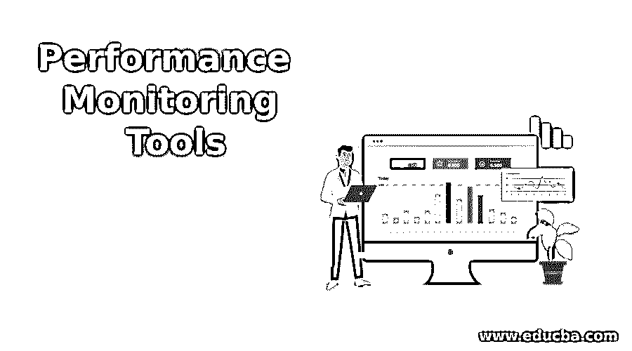

# 性能监控工具

> 原文：<https://www.educba.com/performance-monitoring-tools/>

## 性能监控工具介绍

在现代世界中，应用程序和服务器的性能管理是强制性的，以便在业务环境中提供持久的生产力。因此，这个工具检查所有服务和应用程序的状态。如果应用程序中出现任何问题或错误，它会立即通知用户，以防止任何重大损失。它让客户找到并定义与应用程序性能相关的问题。可以根据各种类别(如响应时间、加载时间、应用程序的运行时间)对其进行跟踪和监控。技术的使用变得越来越分散和复杂。有必要查看应用程序的性能，以便为最终用户提供巨大的满足感。它包括一个事务的 web 请求、内存使用、CPU 进程、应用程序中的错误。顶级性能工具将在下一篇文章中讨论。

### 十大性能监控工具

下面列出了在性能监控中占有一席之地的重要工具。这些工具成为监视和跟踪用户的软件应用的重要工具。

<small>网页开发、编程语言、软件测试&其他</small>

#### 1.特蕾西

它是监控 web 应用程序的主要工具，并通过更好的最终用户体验为应用程序提供了强大的推动力。该工具具有成本效益，并具有各种各样的功能，如监控 SaaS 应用程序、Web 应用程序和修复最终用户出现的问题。它支持。NET、PHP、Python、Java 和 Ruby。它扩大了代码级性能监控的过程，并通过电话和邮件支持在线服务。

#### 2.新遗迹

它是商业领域的顶尖产品之一，在应用程序性能管理领域有着很高的需求。现在，它更新了移动应用程序、基础设施监控、浏览器性能和其他高级功能。它支持 Java、.NET、Python、Ruby 和 PHP，还执行跨应用程序跟踪和代码级诊断。它还可以跟踪 SQL 中每个语句的状态。

#### 3.应用动力学

AppDynamics 被广泛使用，因为它既有内部部署，又有用于大型企业和监控性能的 SaaS。它为 AppDynamics 强制的应用程序的工作提供了清晰的可见性。它跟踪应用程序的性能，这些性能推动影响业务运营的应用程序的工作。编程语言是 PHP，Python，。NET，Node.js，Java。它必须跟踪端到端的事务，并提供代码级的可见性。它提供了警报通知和动态基线。

#### 4.Stackify 回描

它是应用程序性能监控中的一个负担得起的工具，旨在支持开发人员在 QA 中优化应用程序性能，以便在详细代码级别的帮助下追溯应用程序中的问题。对于长期开发人员来说，使用这些工具会非常舒服。支持的编程语言有 Java、.它基于 SaaS，具有错误集成和日志管理功能。它针对开发团队进行了优化，易于安装和使用。

#### 5.侦察

它提供了最好的 APM，并且是在 Ruby on Rails 上编写的。它需要扩展 DevTrace 和服务器监控，并提供一个完整的解决方案。它在 Ruby on Rails 上有语言版本，可以检测内存泄漏。它分析了数据库查询的缓慢过程，提供了 GitHub 集成，并自动化了对填充的依赖。

#### 6.河床钢铁中心

在 APM 中提供解决方案是另一项业务，需要获取相同的结果并提供单一的解决方案。该门户需要获得一个完整的视图，并支持其他产品。部署中的问题和干扰利用了所有可用的产品。它在端到端事务分析中提供了广泛的支持。警报通知、拉取报告、SLA 配置。用户、其应用程序、交易、位置和业务部门的跟踪性能。

#### 7.戴尔 Foglight

它提供了用户在监控中检查数据库和应用程序之间的映射连接状态的经验。它为 APM 需求制定了基准，但它提供了一个令人困惑的环境，并显示了应用程序监控和日常使用的列表。它还监控用户体验并记录交易。它提供了有吸引力的 SLA 仪表板，并在漏斗分析中提供了与页面内容信息相关的多步交易。

#### 8 .想法精确

它是作为 SQL 监控中的深层功能开发的，在利用数据库结构方面没有区别，该数据库结构经过精确扩展，提供了正确的 APM 解决方案。它以其直观的仪表板而闻名，并能够使用仪表板快速了解情况，并且立即可用。它支持 Java。NET，并建议任何纠正措施。它提供简要的历史分析，并提供端到端的事务，将问题部分与生产服务器分开。它提供数据库的相关事务和上下文信息。它是可扩展的，并支持关键业务环境中的多平台。

#### 9.纳斯特尔

该工具为 APM 发现和分析提供了另一个最佳答案。它基于中间件事务工具，APM 供应商专注于中间件业务事务。很难找到精确和合适的代码级性能检查和测试，并以更好的可见性提供最佳的应用程序性能。它提供亚秒级的实时分析和监控。它有仪表板和预建的处理规则。它为高级规则和应用程序分析提供了复杂的事件处理。

#### 10.小型放大镜

这是一个有效、简单的设置和强大的功能。它侧重于 It 管理员和企业，并让解决方案跟踪事件性能和其他指标，以找出影响软件的问题原因。它还提供了在应用程序中使用的可视化视图和有待解决的见解。它可以运行一个系统，这个系统可以将所有东西安装到用户身上，并且可以很容易地简化。它可以提供即时设置，并使组事件能够发现瓶颈。

### 推荐文章

这是性能监控工具指南。在这里，我们还将讨论简介和 10 大性能监控工具。您也可以看看以下文章，了解更多信息–

1.  [Web 测试工具](https://www.educba.com/web-testing-tools/)
2.  [网络安全工具](https://www.educba.com/cyber-security-tools/)
3.  [计算机化 ETL 工具](https://www.educba.com/informatica-etl-tools/)
4.  [云监控工具](https://www.educba.com/cloud-monitoring-tools/)

