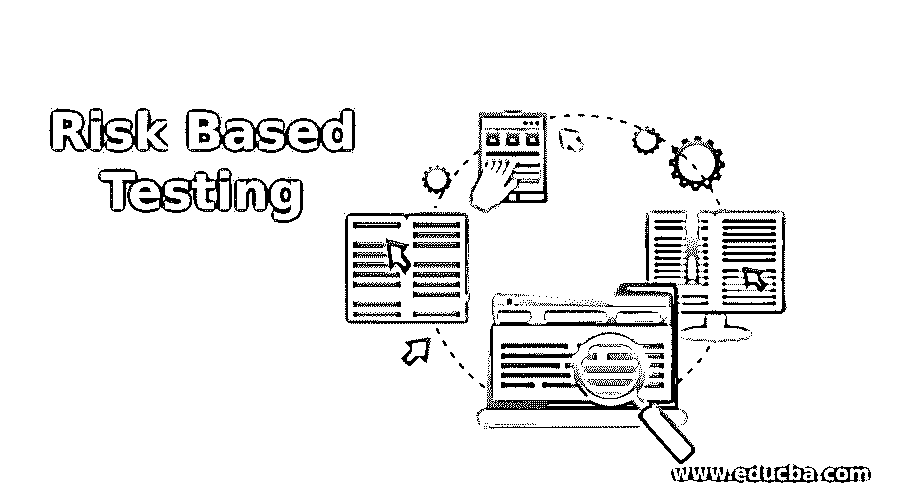

# 基于风险的测试

> 原文：<https://www.educba.com/risk-based-testing/>

## 基于风险的测试简介

基于风险的测试是在完全依赖于风险因素的项目上进行的。基于风险的测试使用户在执行时强调并优先考虑工作。风险被定义为意外结果发生的几率。结果会产生巨大的影响，只留下最小的时间来恢复风险。因此，测试包括提供巨大影响和失败机会的功能。本文探讨了基于风险的测试的功能、应用、优势和操作。

### 基于风险的测试概念

它的概念是安排测试的努力，以减少系统实现的风险产品的结果水平。

<small>网页开发、编程语言、软件测试&其他</small>

基于风险的测试在项目的早期就开始了，以检测影响服务器质量和生产率的风险。它给出了规格、计划、执行和准备。基于风险的测试包括应变和缓解。它提供了许多机会来最小化高影响缺陷，并检测变通办法来限制影响的严重性。它涉及检测和消除关键区域中高影响缺陷的校准指标。基于风险的测试包括通过执行非测试功能来选择合适的测试活动以在软件上执行测试，从而发现主动消除和减少影响的机会。

基于风险的测试的重点是部署一个不能完全实现的无风险项目。但是测试是在风险管理的完美标准下进行的，以获得稳定服务器的项目结果，包括质量、标准指标、计划的作业和可承受的预算。

### 基于风险的测试是如何工作的？

基于风险的测试的工作解释如下，分析并记录需求。对其进行审查，以消除错误、放错的数据和歧义。签署是降低风险的重要步骤，以避免将延迟的变更注入到项目中。一旦文件形成，对要求的任何变更都应包括变更控制和频繁批准的过程。

这是通过评估每个要求的多重影响的相似性来完成的，这些要求描述了所承担项目的进度、预算、重点和资源，并确保其可靠性、性能、安全性和复杂性。定期更新、跟踪和监控已知和计算风险的概率。这可以通过构建风险评估矩阵来实现。利用风险登记簿详细说明已识别风险的计数。设施的优先级取决于等级。进行基于风险的质量评估是为了计算数据的质量。应在实施、监控和缓解阶段计划中等和关键活动。低风险分析应纳入观察列表。测试用例以及高风险对象的设计和计划也应该预先定义。

在不同的业务场景中，应该使用多种测试设计方法来构建具有等价分离的决策表。测试数据、测试平台和测试条件应该由测试团队准备和评审。在这里，同行评审也是识别缺陷和降低风险的一个强制性步骤。对结果进行模拟运行和质量检查。测试用例的优先级是预定的。测试团队管理每个风险对象之间的可追溯性，并开发所有相关的文档。

对于基于风险的测试的每个级别，都要分析组件、集成和验收测试。整个系统旨在执行其适当的功能和应用。它是利用功能的可视性、使用频率以及合理的故障成本来计算的。退出标准的计算，该计算经过全面测试，并考虑了其突出的剩余风险。它生成结果报告和指标分析。最终风险和新风险取决于关键风险元素、指标和更新。一致性计划作为最高可能风险的后备标准和应急计划。预定义缺陷的分析是缺陷分析和预防的主要标准。回归和重新测试用于移除和验证错误，并用预先计算的度量的替代物来修复它们。进行可行的基于风险的自动化测试，分析剩余风险的计算、控制和监控。完成标准的退出适用于不同的风险阶段。然后概述风险评估，并等待客户反馈来解决缺点。

### 基于风险的测试的重要性

基于风险的测试提供了足够的时间来测试所有合适的标准。它在项目部署结束时进行。测量被校准以对抗风险原因。它提高了客户满意度，因为它涉及标准的进度跟踪和良好的报告分析。潜在问题在早期阶段被捕获，用于克服缺点。在项目的整个生命周期中，持续的监控和评估使得项目更加协调和优化。它解决并致力于完成项目目标的问题。

### 优势

它提高了生产率、市场机会、准时交付、服务绩效和成本降低。它给出了测试电导的清晰细节。测试的分配取决于风险评估，风险评估提供了一种有效且高效的方法来降低基于每个更新版本的残余风险。测试结果的校准使完美的管理能够在测试执行时找到剩余水平，以进行更新并做出明智的决定。优化的基于风险的测试用于测试风险计算技术

基于风险的测试用于使项目最优化，并有助于获得完整的生产力，这反过来增加了系统的结果、功效和效率。基于风险的测试的应用是可靠和广泛的，并在计划方法中保留所有预定义的可能风险并防止其再次发生。

### 推荐文章

这是一个基于风险的测试指南。在这里，我们还将讨论简介以及基于风险的测试的工作原理及其优势。您也可以看看以下文章，了解更多信息–

1.  [渗透测试服务](https://www.educba.com/penetration-testing-services/)
2.  [灰箱测试](https://www.educba.com/grey-box-testing/)
3.  [阴性测试](https://www.educba.com/negative-testing/)
4.  [硒负荷测试](https://www.educba.com/selenium-load-testing/)

