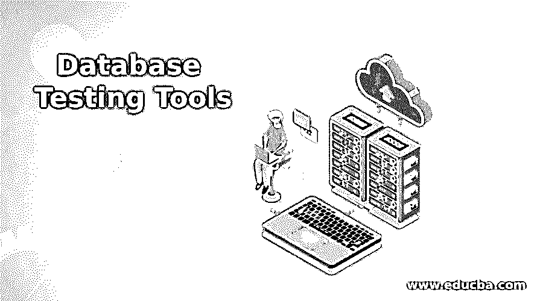

# 数据库测试工具

> 原文：<https://www.educba.com/database-testing-tools/>

## 什么是数据库测试工具？

如果一个人不知道另一种语言的字母表，学习阅读这种语言的书是徒劳的。因此，首先我们将简要了解数据库，然后查看不同类别的数据库，以便更清楚地了解数据库中存在哪些要测试的类别，以及这些类别中需要注意的一些故障点。如果我们想通俗地理解数据库，数据库是数据的支持基础。它本质上意味着数据库是以结构化格式存储在计算机系统中的信息的集合。但实际上，数据库中不仅仅是数据存储。数据库也支持数据操作。不严格地说，在我们的行业中，数据库被称为 DBMS(数据库管理系统)。

### 数据库何时需要测试？

现在，重要的一点是数据库需要测试的地方。下面是执行数据库测试时需要记住的几点。在开发测试数据库的计划时，甚至可以将它们视为一个失败点。

<small>网页开发、编程语言、软件测试&其他</small>

#### 数据映射

有几个数据在 UI 和 DB 之间来回传输的例子。这要求它们之间正确字段的映射高度一致。本质上，人们把需求作为需求文档的一部分列出来。如果数据的映射是正确的，测试计划还应该考虑这样一个事实，即在应用程序上执行操作时，称为 CRUD(创建、检索、更新和删除)的操作是否被成功调用，以及所执行的操作是否正确。

#### 数据库的交易验证

在跨数据库的所有事务中，需要坚持原子性、一致性、隔离性和持久性(ACID)属性。这是为了确保即使事务的一部分失败，整个事务也失败(原子性)，任何事务都导致 DB 的有效状态(一致性)，事务的并行处理或时序处理应该无关紧要(隔离)，一旦事务完成，任何外部源都不能更改数据(持久性)。

#### 数据的完整性

数据应根据交易后的最新更新进行更新。就完整性而言，需要确保数据是所有表单和屏幕上的最新数据。在这方面，主要看 CRUD 操作，以及是否所有选项都在执行其指定的任务。例如，如果用户发起 remove 动作，则需要在 DB 上执行“**Delete”**操作。

#### 商业规则合并

随着数据库变得越来越复杂，关系触发器、存储过程需要升级到更复杂的。因此，在当前的场景中，需要适当的 SQL 查询来验证数据库中的业务规则。

### 数据库测试工具解释

既然我们对为什么需要测试数据库有了更清楚的了解，那么知道测试什么是第二重要的。因此，同样的，我们已经分解了这一部分，以纳入必要的“测试什么”和测试我们的数据库所需的相应工具。

#### 1.数据安全

随着当前市场中网络犯罪的不断增长，这种测试在数据库测试所需的类别列表中名列前茅。这和人们在家里放多把锁防止入室盗窃很像。企业数据也是如此。人们需要确保这些数据不会落入坏人之手，因此需要设置多个锁来保护它们。许多数据安全测试工具都测试过这种锁的耐用性，但是 IBM Optim Data Privacy 是广泛使用的测试工具之一，与 Protegrity Data Security 竞争激烈

#### 2.负载测试

随着应用程序流行后用户群的增长，测试数据库处理高负载处理的能力变得势在必行。在这种类型的测试中，我们需要识别任何 DB 响应时间长从而导致性能差的故障点。在这个过程中，我们模拟来自用户的负载，并测试 DB 处理高负载的持久性。一些广泛使用的测试工具有:Web Performance，Rad View，Mercury。

#### 3.测试数据生成器工具

在测试数据库的效用时，同样重要的是创建合理的数据并复制生产中的数据，以便测试数据库在生产中的行为。有各种各样的工具用于这些，但一些流行的是:DataProf，Redgate SQL 数据生成器，数据工厂，DTM 数据生成器，涡轮数据。

#### 4.测试数据管理工具

该测试旨在检查和测试使用数据库开发的软件的质量。通过将测试数据从实际数据中分离出来以测试功能，并对敏感数据使用屏蔽来实现此操作。并且当产生数据的子集时，比较实际数据和基线数据，以检查软件或应用的准确性。使用最广泛的工具是 IBM Optim 测试数据管理，但是也有其他工具来完成像 DataProf 和 Informatica 这样的任务。

#### 5.单元测试工具

这种类型测试的主要目的是测试出使用数据库编程的最小的、原子级的特性。为了测试这个特性，我们准备测试数据库对象的每一个部分是否都像预期的那样工作。为了实现这个目标，最广泛使用的工具有:SQLUnit、TSQLUnit、DBFit、DBUnit

### 结论

最后，我们想强调的是，数据库测试是验证在后台使用数据库的应用程序可用性的一个重要步骤。人们需要将数据库测试纳入所有软件开发生命周期规划中，上面列出的一些自动化工具可以出色地测试出所有数据库的通用功能。尽管可以完全忽略测试数据库复杂功能所需的手工测试。

### 推荐文章

这是一个数据库测试工具指南。这里我们讨论数据库测试工具和各种数据库测试工具的介绍及其要点。您也可以浏览我们的其他相关文章，了解更多信息——

1.  [蝗虫负载测试](https://www.educba.com/locust-load-testing/)
2.  [移动自动化测试](https://www.educba.com/mobile-automation-testing/)
3.  [基于风险的测试](https://www.educba.com/risk-based-testing/)
4.  [吉拉测试工具](https://www.educba.com/jira-testing-tool/)

