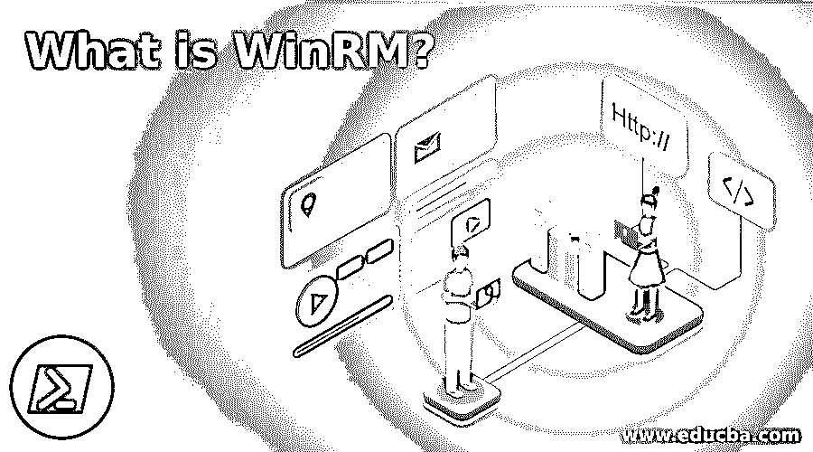

# 什么是 WinRM？

> 原文：<https://www.educba.com/what-is-winrm/>

## WinRM 简介

Windows 远程管理是由微软基于 windows 的管理协议启动的。所有的硬件和操作系统在 WinRM 的帮助下，在一个基于安全和简单的对象协议(SOAP)的交互式和可互操作的环境中协同工作。这基本上是为了管理系统中的 windows 设备和服务器而开发的。WinRM 的一个主要用途是，它可以用于将远程服务器相互连接或连接到其他设备，并在其中运行命令。所有的 windows 操作系统都有 WinRM。

### 什么是 WinRM？

我们可能都在我们的系统中看到过 Windows 远程管理的符号，并想知道它到底是做什么的，以及它在我们的系统中是如何工作的。WinRM 可以从它的名字中得到，因为它表示管理系统中链接到 Windows 的设备和服务器。但是，这是 WinRM 唯一做的工作吗？WinRM 内置于远程管理协议中，并且也使用 SOAP 协议，因此该应用程序的界面可以与使用 Windows 的远程服务器和设备进行交互。此外，它还可以与设备中的 Windows 应用程序和操作系统进行交互。

<small>网页开发、编程语言、软件测试&其他</small>

内置的命令行工具有助于通过系统中的任何通道或端口与主机通信。此外，通信通过工作站、服务器或任何使用 WinRM 的操作系统进行。如果远程系统或服务器的网络是可访问的，WinRM 可用于运行命令和控制设备。使用 WinRM 可以监控、管理甚至配置所有服务器。这在某种程度上是好的，如果系统面临问题，我们不需要去客户端。我们可以在设备中使用 WinRM 来控制和配置系统。它预装在以前版本的 Windows 中，无需任何配置设置即可轻松工作。

但在像 Windows 10 这样的新版本中，它必须安装和配置才能使用。有一些工具可以在系统中配置应用程序。有一个与 WinRM 连接的进程称为 WinRS，它是与远程 Shell 相关的 WinRM 的一部分。这有助于运行命令和进程来配置 WinRM。

### WinRM 的重要性

*   其重要性在于，它可以控制其电源范围内的一系列设备，无论是远程设备还是本地设备。此外，管理工作站和与物理系统相关的硬件使 WinRM 本身变得很重要。
*   需要注意的重要一点是，必须使用系统中定义明确的端口正确设置配置。这使得系统能够启动和停止任何进程，了解系统状态，并在用户需要时维护系统。不仅安装软件，而且卸载它们也可以由 WinRM 工具。使用 cmd 中运行的“winRMquickconfig”命令可以轻松完成配置。
*   如果配置和端口管理正确，任何命令都可以在 WinRM 的帮助下完成。为了使用 WinRM，有许多其他的进程，但是使用内置进程总是好的，因为它总是不那么麻烦。虽然初始配置需要时间，但有了它可以节省其他长时间的过程。WQL 查询用于系统内部的配置，尽管安装 WinRM 不需要相同的知识。
*   系统中提供的安全性是默认过程，因为它不向曾经进行的网络通信发送实际凭证。此外，我们可以使用 HTTPS 和 WinRM 以安全的方式对服务器进行身份验证。如果使用 SSL/TLS 证书来确保同样的安全性，则提供了额外的安全性，因此攻击者不能使用或复制系统中使用的凭证。
*   WinRM 中使用了几个组件，如脚本、cmd、插件、服务和管理协议。如前所述，WinRS 还被用作系统中的 powers hell，以确保与设备相关的所有服务器和工具正常工作。其中使用了智能平台接口，有助于在远程服务器的帮助下管理硬件。如果操作系统不在工作状态或者在远程状态下持续工作，IP 接口是有用的。

### 优势

以下是 WinRM 的优点:

*   WinRM 的主要优势是它的端口。WinRM 中使用的端口非常重要，因为在通信网络中，相同的端口用于安全性。因此，WinRM 的安全性不会受到任何损害。WinRM 中使用了为防火墙打开的端口。
*   此外，它使数据库完成所有与系统相关的任务，并完成所有服务器的管理任务。因此，了解数据库在各方面都运行良好是很重要的。WinRM 与 WinRS 一起执行系统中与远程管理和管理服务器相关的所有任务。它们是一枚硬币的两面。
*   由于系统中使用的端口，网络通信很容易完成。单个端口可用于安全连接和远程连接。使用单个端口，可以完成 WinRM 的整个工作以及网络管理。
*   外壳脚本可以直接从 WinRM 解决方案中获得，而不必探索外壳。该脚本有助于管理系统，如果需要，还有助于管理系统中的其他设备或应用程序。
*   一些虚拟机可以与它一起使用，而无需在系统中安装它们。

### 推荐文章

这是一个什么是 WinRM 的指南？这里我们分别讨论介绍 WinRM 的重要性和优点。您也可以看看以下文章，了解更多信息–

1.  [可翻译版本](https://www.educba.com/ansible-versions/)
2.  [Java WindowListener](https://www.educba.com/java-windowlistener/)
3.  [JavaScript 窗口事件](https://www.educba.com/javascript-window-events/)
4.  [Windows 网络命令](https://www.educba.com/windows-networking-commands/)

