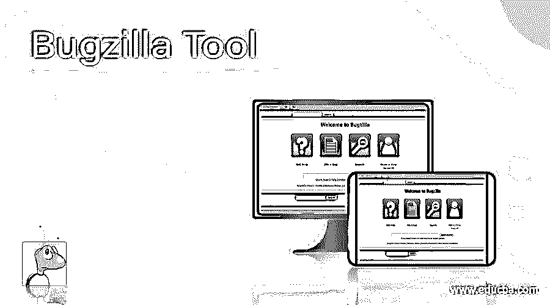

# Bugzilla 工具

> 原文：<https://www.educba.com/bugzilla-tool/>

## Bugzilla 是什么？

Bugzilla 是一个用于 bug 和问题监控的开源平台，帮助开发人员跟踪他们产品的未解决问题。该工具是免费提供的。它是用 Perl 开发的，使用一个叫做 MYSQL 的数据库。Bugzilla 是一个 bug 监控工具，也是一个测试管理工具。Bugzilla 为配置管理和复制问题提供了一个优秀的解决方案，并且易于使用。通过创建记录的工作流程和清晰的优秀成果评审，it 可以提高效率和透明度。

下面列出了 Bugzilla 的一些最重要的特性:

<small>网页开发、编程语言、软件测试&其他</small>

1.  Bugzilla 工具具有高级搜索功能
2.  每当 bug 的状态改变时，Bugzilla 支持用户可配置的电子邮件提醒。
3.  它显示了错误更新的完整历史。
4.  Bugzilla 提供了一个图形化的表示以及 bug 间的依赖跟踪。
5.  Bugzilla 帮助用户链接和管理支持 Bug 的文件。
6.  Bugzilla 有一个内置的、基于产品的、独立的身份验证和安全系统，这就是它更安全的原因。
7.  Bugzilla 有一个安全审计，运行在 Perl 的污点模式下。
8.  它支持可靠和健壮的 RDBMS(理性数据库管理系统)
9.  支持 Web、XML、电子邮件和控制台界面。
10.  Bugzilla 提供了各种各样的用户偏好和可定制的特性和功能。
11.  它支持用户的本地化图形用户界面。
12.  广泛的可配置性，因为它可以通过其他测试管理软件进行配置，以获得更好的用户体验。
13.  Bugzilla 在各个版本之间有一个简单的更新路线。

### Bugzilla 工具的特性

以下是 Bugzilla 的一些详细特性

**1。Bugzilla 有两种搜索类型:**

它有一个易于使用的类似谷歌的 bug 扫描，它还可以扫描 bug 的全文。这提供了一个高级搜索系统，用户可以生成任何形式的搜索，比如基于时间的搜索。

**2。用户偏好控制的电子邮件提醒**

如果 Bugzilla 中实现了任何更改，您将会收到一封电子邮件，并收到关于哪个 bug 完全由用户首选项控制的更新。

**3。不同格式的 Bug 列表**

用户检查错误时的报告和图表，各种格式的错误列表，如 iCalendar、Atom 等。已显示。在 Bugzilla 中使用时间跟踪功能时，使用 iCalendor 格式。在 Bugzilla 中，有更多的可用格式，包括包含所有 bug 信息的可打印格式，用于在电子表格中导入 bug 列表的 CSV 格式。

**4。通过电子邮件整理报告**

Bugzilla 有能力让用户或团队按照你提到的时间表来决定搜索结果。

**5。重复 Bug 的自动检测**

当用户提交一个新的 bug 时，以及当用户键入一个 bug 摘要时，系统扫描特定的 bug。如果系统检测到几个 bug，很容易将其中一个 bug 添加到 CC 列表中，而不是构建另一个 bug。

**6。通过电子邮件**提交或修改 bug

要创建新的 bug 或修改当前的 bug，用户可以向 Bugzilla 发送电子邮件，也可以附加 Bug 文件。

**7。时间跟踪能力**

Bugzilla 也支持时间跟踪功能。用户可以决定修补一个 bug 需要多长时间，这样你也可以监控用户在这个 bug 上花费的时间。还可以设置解决 bug 的截止日期。

**8。请求系统**

请求系统是一种要求其他有 bug 的用户做某事的方式。用户可以批准请求，也可以拒绝请求，响应将由 Bugzilla 监控。

**9。移动安装中的 bugs】**

Bugzilla 能够将 bug 从 Bugzilla 的一个安装传递到另一个安装。在 Bugzilla 中，一个 bug 也可以在多个版本之间传播。

10。监控其他用户

Bugzilla 帮助用户监控其他用户的活动。用户仍然会收到来自 Bugzilla 的电子邮件。当某个开发人员退出时，这个特性很重要，所以其他开发人员需要处理这个 bug。

**11。图表和报告**

高级报告框架。如果用户想知道 bug 数据库是什么样子，那么用户可以构建两个 X 轴和 Y 轴区域。用户可以通过使用搜索标准来限制 bug 的详细信息。这些报告也可以导出为 CSV 格式。

### 结论–Bugzilla 工具

在本文中，我们已经了解了什么是 Bugzilla 及其特性。我希望这篇文章对你有所帮助。

### 推荐文章

这是一个 Bugzilla 工具的指南。这里我们讨论什么是 Bugzilla，Bugzilla 的版本和特性。您也可以浏览我们推荐的其他文章，了解更多信息——

1.  [安装 Bugzilla](https://www.educba.com/install-bugzilla/)
2.  [JIRA Bug 生命周期](https://www.educba.com/jira-bug-life-cycle/)
3.  [什么是测试环境？](https://www.educba.com/what-is-test-environment/)
4.  [缺陷跟踪工具](https://www.educba.com/defect-tracking-tools/)

