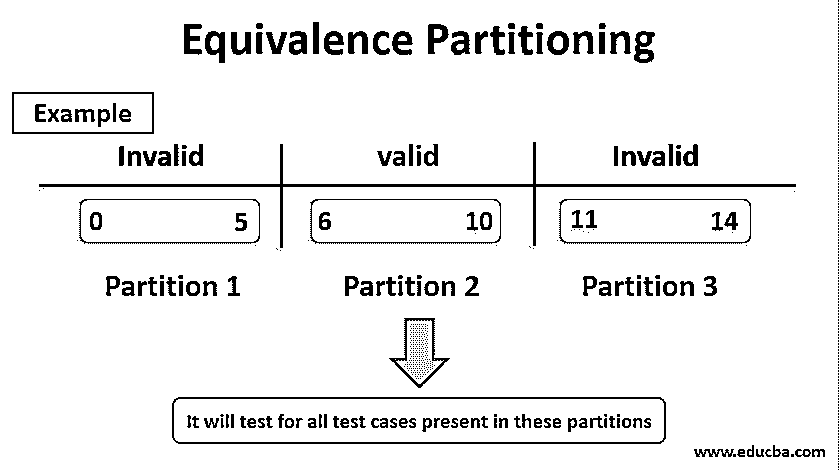

# 等价划分

> 原文：<https://www.educba.com/equivalence-partitioning/>

## 等价划分简介

等价划分是一种黑盒测试设计技术，其中测试用例被设计成执行来自等价划分的代表。它可以应用于任何级别的软件测试，旨在将一组测试条件划分为可以被视为相同的组或集合，即系统应该等效地处理它们。等价划分也称为等价类。

### 等价划分是如何工作的？

这个测试只涉及到对创建的每个分区的一个条件的测试。这样做的原因是，我们认为软件应该对一个分区中的所有条件一视同仁。这是因为我们有一个假设，如果一个条件适用于该分区，那么它也适用于其他条件。这让我们在测试中节省了精力。如果一个特定的条件不起作用，那么可以断定其他条件也不起作用，并且没有必要在该分区中测试其他条件。可以为有效数据(即可以接受的值)和无效数据(意味着要拒绝的值)创建所创建的分区。在分区中选择一个有代表性的值，它涵盖了同一分区中可以考虑的所有项目。选择一组数据作为输入条件。程序执行的结果可以归类为整个分区的一组等价数据。

<small>网页开发、编程语言、软件测试&其他</small>

### 等价划分的例子

让我们看几个例子，让我们了解等价划分是如何工作的。

#### 示例#1

*   通过使用等价划分，输入框接受从 A 到 Z 的字母的测试用例。

测试用例应该拥有这个分区的所有有效输入。我们的意思是从 A 到 z 之间选择任何字母。如果从这 26 个字母中选择任何其他字母，输出将会给出相同的结果。因此，我们可以得出结论，一个输入足以测试这一条件。

*   除了这些字母以外的输入数据被视为无效输入。这些输入可以是数值或特殊字符。

这样，您就可以对所有可能的测试用例进行分类和隔离，这些测试用例可以分为三类。除了从任何类中选择的值之外，测试用例中的值应该给出相同的结果。从每个输入类中选择一个代表，帮助我们设计测试用例。测试用例值以这样的方式选择，即最大数量的值应该被测试，并且对于出现在类中的所有[测试用例应该接收相同的结果，这可以是有效值或无效值。](https://www.educba.com/test-cases-vs-test-scenario/)

#### 实施例 2

文本字段仅支持数字字符，其长度应为 6 到 10 个字符。对于这种情况，可以创建三个分区或类。出现数值的第一个分区的长度在 6 到 10 之间。这是一个有效的条件。第二个分区，其中存在数值，但它们的长度为 0 到 5。这是一个无效的条件。第三分区具有长度从 11 到 14 的数值。这也是一个无效条件。在评估这些分区时，我们可以从这些分区中的每一个中提取案例，并测试这些分区中存在的所有测试案例。如果我们从每个分区中检查一个条件，那么每个分区的所有案例都将被测试。

#### 实施例 3

与前面的例子类似，我们也可以检查数据的小数位数。我们可以假设我们考虑的不是零个小数位就是两个以上的小数位。当要为这个应用程序设计测试用例时，应该确保覆盖所有三个分区。无效分区应该至少测试一次。我们可以选择按卢比的金额计算利息。10.00 卢比。50.00 卢比 280 卢比。1354.00.如果没有特别提到这些，则有可能由于多次测试而漏掉其中一个。划分也可以应用于输出。

### 等效测试的重要性

以下是等效性测试的要点:

*   等价测试是准备测试用例的有效方法之一。它是一种黑盒测试，主要集中于测试软件的功能。进行等价测试减少了测试用例的数量。此外，它不会损害软件的测试覆盖率。
*   由于创建了分区，质量没有受到影响，工作量也减少了。这一点很重要，因为它节省了时间，并且可以毫不费力地处理为分区或类创建的通用测试用例。这对于拥有大量测试用例的测试用例来说是很重要的，并且测试这些测试用例是很累人的。
*   它还确保了需要维护和注意的测试覆盖率。一旦为有效和无效的输入创建了测试用例，就可以对它们进行测试，并且分区会有相似的结果。

### 结论

等价划分是一种为了有效测试而对数据进行划分和分割的方法。被划分的集合被称为分区或类。划分数据使测试变得容易，也减少了测试用例的数量。这种方法增加了测试的整体覆盖范围，并确保黑盒测试以一种轻松有效的方式完成。因此等价划分是快速的，如果一个划分中的一个条件通过，那么该条件的所有条件都将通过。类似地，如果一个条件失败，那么整个分区都会失败。这种技术可以用在所有级别的测试中，并且可以确保通过将大量的测试用例分成块来覆盖它们。

### 推荐文章

这是等价划分的指南。这里我们讨论等价划分的介绍，它是如何工作的，有它的例子和重要性。您也可以浏览我们的其他相关文章，了解更多信息——

1.  [阴性测试](https://www.educba.com/negative-testing/)
2.  什么是自动化测试？
3.  [硒负荷测试](https://www.educba.com/selenium-load-testing/)
4.  [基于风险的测试](https://www.educba.com/risk-based-testing/)

