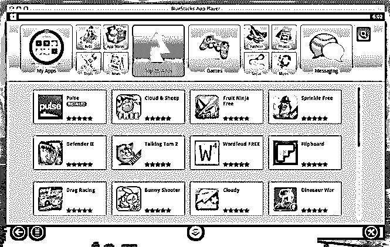
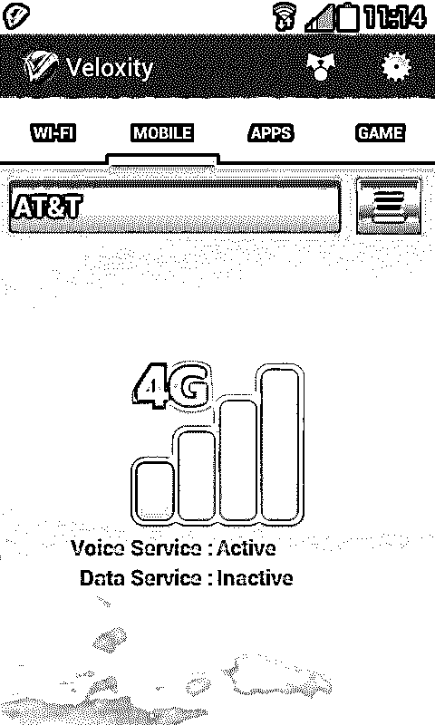

# 移动应用的测试

> 原文：<https://www.educba.com/testing-of-mobile-application/>

## 移动应用测试简介

手机十多年前就已经上市，现在已经开启了市场新时代的曙光。此前，面向移动用户的应用很少。在过去的十年里，智能手机和平板电脑的销量有所增长，人们开始在生活中的每一个小用途上使用它们。因此，需要开发移动应用程序来使我们的生活更加方便。现在为了让所有的移动应用公司留在市场上，他们开始了移动应用的开发，并开始在市场上发布。现在，为了给我们最好的体验和完美的移动应用程序的工作，测试移动应用程序的需求是必要的。

<small>网页开发、编程语言、软件测试&其他</small>

这既费时又费钱，但在这方面花费资源是值得的，因为它能给你的消费者带来积极的体验。众所周知，对于任何行业来说,“顾客就是上帝”,如果你能让你的顾客满意，他们总是会回来找你，并向其他人推荐产品，有一句传统的谚语说，口碑比其他任何东西都更能促进业务增长。因此，您需要确保无论何时客户第一次使用该应用程序，从打开应用程序到关闭应用程序，他们都应该有很好的体验。万一你找不到缺陷，那么你的客户必须找到缺陷，他们不想感觉像一个“实验室小白鼠”，他们必须做你的工作，将来再也不会回来找你，这对你来说是一个业务损失。

移动应用程序的开发需要投入大量的精力来设计和构建应用程序，但是为了给人留下难忘的体验，主要的工作是测试移动应用程序，他们必须测试应用程序，并确保在应用程序发布时，他们对您的产品给出了最好的评价。所以在一天结束的时候，如果你能让你的顾客开心，你就会感到满意。

 

它本身带来了很多挑战，因为有很多不同的场景需要考虑，你需要做出选择，以便选择你要考虑的测试技术组合，因为没有这样的移动应用测试技术可以给你 100%的准确性。

原因是每一个移动应用程序的测试都有它自己的优点和缺点，你可能会发现没有什么能满足你的需求。因此，我们需要遵循混合测试技术的方法，以便提供最接近您所期望的结果，同时牢记成本、质量和市场趋势。

在本文中，您将了解不同类型的混合和匹配移动测试技术和策略，您可以考虑为您的应用程序提供最佳的输出结果。

### 移动应用测试——本地应用

大多数人把移动应用的测试误认为是原生应用。通常人们从各自的[应用商店](https://www.educba.com/free-designing-an-app-in-ios-online-course/ "Free Designing an App in iOS online course")下载应用程序，这为用户提供了使用应用程序的独特体验，并最大限度地发挥了[设备和操作系统](https://www.educba.com/android-operating-system/ "Structure of an Android Operating System")的能力。通常，应用程序下载由某个监控下载的网守应用程序控制，该应用程序也有可能向客户收费。原生应用程序为用户提供了丰富的体验，但是它们给那些去测试它的人的生活增加了许多复杂性。

 

本地应用驻留在操作系统的硬件中。所以，作为一名测试人员，你需要在不同的物理硬件上测试不同平台的操作系统。您还必须对您应该支持的旧版本设备进行向后兼容性检查。此外，您需要对应用程序负责，以防用户将更新的操作系统有重大补丁更新，因为这对他们的硬件至关重要。

### 网络应用

全世界的用户都将使用移动网络应用程序。因此，当我们开发这样的移动应用程序测试时，会涉及到很多复杂的问题。你需要做一个应用，应该是全世界通用的，很少有地方风味的。甚至不同操作系统问题的挑战也不存在，但你必须应对全球动态挑战。

当您测试本机和 web 应用程序时，您遇到的常见挑战是了解每个挑战的性质，并通过考虑不同的移动应用程序技术选项来探索可用的选项以降低风险。为了选择正确的解决方案，您需要全面了解适合您的移动应用程序开发的移动应用程序技术的优点和缺点，以产生适当的结果。

### 不同类型的物理设备

测试人员面临的最大挑战是在市场上的各种设备上测试移动应用程序或网站。在这些不同版本的操作系统之上，这一切的排列组合会让你抓狂。你仍然可以牺牲设备/操作系统的组合，但是当你减少设备的数量时，你也在冒你开发的移动应用可能不适合某些客户的风险。为了处理设备挑战，有三个选项可用:

#### 真实设备

处理移动应用程序开发的第一种类型是制作真实的设备。它具有目标客户中存在的真实硬件、固件和客户端操作系统组合中存在的所有限制和挑战的优势。然而，如果在真实的物理设备上执行，它会变得昂贵，这取决于您想要如何做。真正的设备买起来很贵，很多都是运营商补贴的价格。你也许能够说服制造商或网络运营商借给你一个测试设备，但是，你必须站在不同制造商和网络运营商的长队中来借给你测试移动应用设备。最后，如果数据收集和复制不是以一致的方式完成的，那么用真实设备测试移动应用程序可能是杂乱无章和劳动密集型的。

 

#### 模拟器

处理移动应用程序开发的第二种类型是模拟器。这些非常容易管理。在这里，您可以通过加载设备配置文件在不同的物理设备之间进行切换，并且可以对移动应用程序进行测试。模拟器运行在 PC 和强大的服务器上，它们被设计用来记住移动应用程序的测试。因此，您将拥有一个全功能设备的优势，该设备用于捕获详细的诊断信息，作为在不同级别持续保持客户端和服务器之间通信的协议。

现在，当您遇到任何应用程序故障时，您可以轻松地隔离它并轻松地进行整改。使用仿真器是一种具有成本效益的解决方案，因为它在单个平台上工作，并且移动应用可以根据市场频繁地更新设备配置文件，并执行移动应用的测试。

使用仿真器的缺点是我们不会遇到真实设备可能产生的挑战。例如，模拟器使用的 PC 处理速度比真实设备高很多倍，因此我们将无法测试应用程序是否因为处理速度而滞后。假设我们必须检查应用程序是否在拥挤的地方发挥了最大性能，我们不能携带电脑，我们需要物理设备。这些是我们将面临的一些挑战。

#### 以上两者的结合(真实设备+仿真器)

这是处理移动应用程序开发的第三种类型，包括两者的结合。为了最小化真实设备和仿真器的限制，我们可以使用这种结合了两者的技术。

在初始阶段，您可以使用模拟器来执行移动应用程序的测试，找到它们的错误并纠正它们，然后重新检查。一旦应用程序在模拟器上运行良好，您就可以在实际设备中使用该应用程序来检查特定的功能和一些实时场景，以确定应用程序是否按照要求执行并提供实际结果。

### 网络

这是移动应用程序的第四种开发类型。对任何手机来说，最大的挑战是网络。世界上有数百个移动网络，每个网络都使用不同的技术进行通信，如 CDMA、GSM、LTE 等。每个网络都有其不同的协议集，移动网络使用这些协议集到网络应用程序使用的 TCP/IP 协议。每个网络运营商都安装了系统，这些系统的行为取决于您使用哪个供应商来执行所需的隧道。最后，大多数运营商已经安装了他们的代理来控制你何时、如何连接到一个特定的网站。当网络中启用了 web 代理时，会限制移动应用程序测试和服务器之间的信息流。有一些代理将可以通过电话访问的网站限制为只有那些被批准并且技术上称为“围墙花园”的网站，或者它也可以限制网站上对您可见的数据量。

现在，还有一些取决于本地化的问题。您必须连接到目标网络才能执行移动应用程序的测试，但是对于其他地方的人来说，可能无法访问。外汇:WhatsApp 语音通话在阿联酋被禁，在印度有效。因此，为了测试几个应用程序，要么你需要前往那个地方，要么你需要有人在那个地方工作，以确保它是否正常工作，这是昂贵的，而且实际上不可能每次都这样。

 

### 网络旁路

这是通过网络旁路处理移动应用程序开发的第五种类型。这里我们直接连接到网络协议的 TCP/IP，不考虑 GPRS 隧道。由于大多数真实设备无法做到这一点，我们需要一个设备模拟器，它使用特定的网络代理连接到运营商网络。使用这种方法的优点是我们使用仿真器，其中我们将有完整功能的设备配置文件来执行任务，但唯一的缺点是，如果移动应用程序由于任何原因失败，您无法使用真实设备进行测试。

### 真实网络

这是第六种通过使用真实网络来处理移动应用程序的[开发。在真实的网络中，我们可以使用各种方法。其中之一是一个真实的设备连接到目标网络来执行移动应用程序的测试，但每次这个选项都不可行。所以我们可以在云端使用真实的设备。该装置包括一个安装在遥控盒上的真实设备，带有一个遥控装置和一个遥控天线。这里，遥控单元连接到设备的屏幕，键盘控制单元管理击键和图像收集。由于它连接到互联网，这使得用户可以在 PC 上看到设备上发生的事情。缺点是为不同的可用物理设备购买远程设备的成本很高，但最好的是你可以租用它，对移动应用程序进行测试，然后归还。](https://www.educba.com/mobile-application-software/)

### 移动应用的脚本测试

这是第七种类型，你可以通过脚本来开发移动应用程序。从技术上来说，我们可以把编写脚本称为你在执行时面临的最后一个挑战。让我们看看我们可以应用什么策略和技术来克服这个挑战。现在，对于任何类型的应用程序，我们都必须为它的执行编写脚本。可以通过在电子表格或 word 文档中编写脚本来手动执行脚本，然后手动运行脚本来决定测试用例是通过还是失败，或者您可以使用自动化过程来执行脚本，其中脚本是在自动化工具中编写的，当您运行该工具时，它将执行测试用例，并记录可在以后分析的结果。

现在，主要的问题是，由于存在如此多的物理设备，我们需要为它们分别编写脚本。Forex:为 windows 手机编写的脚本可能无法在 android 手机上运行。幸运的是，最真实的设备自动化[软件提供了在设备的文本、图像或对象层操作](https://www.educba.com/software-tester-work/ "Know What Software Tester Career is All About")的高级脚本。但是，您需要决定是为设备使用自动化还是手动脚本。因为，如果为了一个目的而使用自动化来运行脚本一次，那么它就没有任何意义，因为自动化过程是昂贵的，并且它用在你必须多次运行脚本来执行移动应用的回归测试的地方。

### 推荐文章

这是测试移动应用程序的指南；这里，我们讨论了本地应用程序和 Web 应用程序以及不同类型的物理设备。您也可以看看以下文章，了解更多信息–

1.  [手机应用开发](https://www.educba.com/mobile-app-development-training-and-certification/)
2.  [移动计算应用服务](https://www.educba.com/mobile-computing-applications-and-services/)
3.  [移动应用测试基础知识](https://www.educba.com/mobile-application-testing-basics/)
4.  [手机应用分析工具](https://www.educba.com/mobile-app-analytics-tools/)

