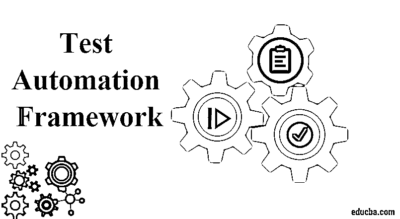
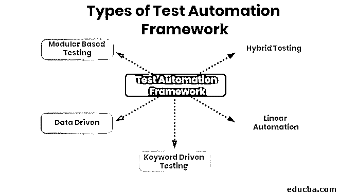

# 测试自动化框架

> 原文：<https://www.educba.com/test-automation-framework/>

## 什么是测试自动化框架？

测试自动化框架是各种工具的集合，用于为测试专业人员设置开发测试用例的规则和指南。这些规则可以是编码标准、处理测试数据、存储测试结果以及其他资源。测试框架有助于开发测试脚本并记录它们。有不同类型的自动化框架可以用来测试基于不同平台的应用程序。移动、桌面和基于网络的应用正在不同的操作系统上接受测试，如 Windows、Mac OS 等。

测试自动化框架用于执行测试用例，并确定需要与用户需求或输出相匹配的输出。测试框架应用程序总是独立的，并且非常容易扩展、维护和使用。这有助于减少反复测试同一事物的努力和时间。它还描述了应用程序的哪个部分正在被实现。它有助于在早期发现问题，并且易于尽早解决。测试框架主要负责定义表达期望的格式、执行测试和报告结果。

<small>网页开发、编程语言、软件测试&其他</small>

### 测试自动化框架的好处

测试自动化框架有很多好处，包括效率、速度和测试准确性的提高。

*   这也降低了成本和风险。
*   它提高了测试效率。
*   它降低了维护成本。
*   它最大化了应用程序的测试覆盖率和功能。
*   它还定义了代码的可重用性。
*   它还有助于避免用于跨平台自动化的测试用例的重复。
*   测试框架用于自动化独立应用程序的测试。
*   它帮助团队组织测试套件，并帮助提高测试效率。

### 测试自动化框架的优点和缺点

下面给出了提到的优点和缺点:

#### 优势:

*   省了很多时间和精力。
*   这是快速测试事物的最快方法。
*   它易于维护，伸缩也很容易。
*   可以容易地执行多个数据集。
*   它有助于避免硬代码数据。
*   测试脚本可以独立于测试中的平台和应用程序来构建。
*   该框架有助于更轻松地编写脚本。
*   它提供了高度的代码可重用性。

#### 缺点:

*   使用特定框架开发的脚本不能被其他框架重用。
*   应用程序的维护需要大量的返工，有时模块是不可伸缩的。
*   有时，数据仍然被硬编码在测试脚本中，因此只有特定的数据被用于测试应用程序，我们不能使用该脚本的多个数据集来测试应用程序。
*   为了在自动化框架中测试应用程序，测试人员需要了解编写测试脚本的编程知识。
*   测试脚本需要更多的时间来开发，有时会超过截止日期。
*   框架的初始设置成本非常高，因为它既耗时又复杂。
*   个人也应该对框架有很好的了解。
*   有时候，数据和复杂性使得自动化测试不利于测试人员。

### 测试自动化框架的类型

下面提到并描述了常见的框架类型:

#### 1.基于模块的测试框架

它主要建立在抽象的概念上。这种独立脚本的创建将测试中的应用程序模块表示为独立的单元、功能和部分。它的好处是只为特定的模块改变脚本。没有必要改变其他模块。创建测试用例花费的精力更少，因为它也可以被其他模块重用。

#### 2.数据驱动框架

它允许设置数据，将输入和预期输出结果存储在单独的文件或其他数据源中，如 CSV 文件、电子表格等。它帮助单个脚本用多个数据集执行所有的测试用例。可以快速测试多种场景，并且随着多种数据而变化。它更快地执行测试；它需要更少的代码来生成测试用例。

#### 3.关键词驱动测试框架

它是一个框架，利用数据表和关键字对测试中的应用程序执行操作。测试数据和指令用于开发测试脚本，这些指令被称为关键字。这是广泛的数据驱动测试。关键字被重用为多个测试用例。

#### 4.线性自动化框架

它被用作记录和回放框架。在这种情况下，脚本开发人员不需要为函数和方法按顺序编写代码。它记录导航过程，并使用该脚本来测试该功能。

#### 5.混合测试框架

它是模块化、数据驱动和关键字驱动的测试框架的结合。它帮助数据驱动的脚本利用库。它集成了所有其他框架的优点。

### 结论

测试自动化框架是组织中广泛使用的工具之一，用于测试基于不同编程语言和平台的应用程序。测试框架节省了频繁测试应用程序的大量精力和时间。为了选择测试自动化框架，个人必须注意某些事情，比如它应该是独立于应用程序的。它必须易于扩展和维护。对于应用程序和该专业知识可用的资源来说，哪个框架实现起来最快、最容易。

上面已经提到了不同类型的框架。人们必须根据需求和客户的预算进行选择。有些是开源的，有些也是许可的。很难选择哪一个框架应该开发测试脚本，并花费较少的时间和精力来测试应用程序。但是它确保了学习，并且肯定地，它比手工测试更好，并且将测试人员从枯燥和单调的工作中解救出来。使用测试自动化框架来测试应用程序总是更好。

### 推荐文章

这是测试自动化框架的指南。在这里，我们讨论了测试自动化框架的一些类型、好处、优点和缺点。您也可以浏览我们推荐的其他文章，了解更多信息——

1.  [软件指标](https://www.educba.com/software-metrics/)
2.  [软件可靠性](https://www.educba.com/software-reliability/)
3.  [软件测试方法论](https://www.educba.com/software-testing-methodologies/)
4.  [软件维护类型](https://www.educba.com/software-maintenance-types/)

