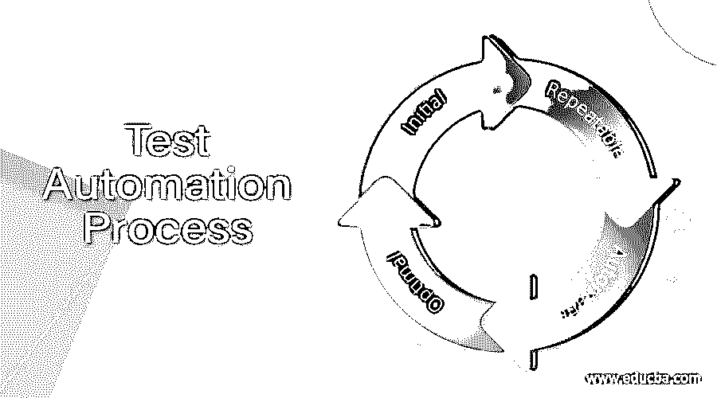

# 测试自动化过程

> 原文：<https://www.educba.com/test-automation-process/>

## 测试自动化过程简介

测试自动化过程是指通过使用明确定义的策略和系统的解决方案，使软件测试过程中的工程任务和操作自动化的活动。它减少了手动测试活动和重复的测试操作，使用系统化的解决方案来实现更好的测试覆盖率。通过在有限的时间内达到预定义的充分测试标准，提高软件测试过程的质量和有效性。在面向企业的测试自动化中，重点是自动化面向企业的测试过程，以便可以重用它来测试组织中不同的产品线和项目。在面向产品的测试自动化中，重点是在一个特定的软件产品线上，这样它可以被用于测试它相关的测试活动。在面向项目的测试自动化中，重点是一个特定的项目及其相应的测试过程。

### 测试自动化过程

测试自动化总共包括 5 个步骤——计划测试自动化、设计测试自动化、测试工具开发、测试工具部署，以及审查和评估。让我们详细讨论这些步骤。

<small>网页开发、编程语言、软件测试&其他</small>

步骤 1:计划测试自动化

这里的主要任务是制定计划，该计划指定了已识别的测试自动化任务、目标、需求、策略、时间表和预算。

**步骤 2:设计测试自动化**

在这一步中，我们找到了实现主要目标所需的详细的测试自动化解决方案，从而满足测试自动化过程中的给定需求。

**第三步:测试工具开发**

在这一步中，开发和测试设计的测试自动化解决方案，以确保开发的工具是可靠的，并且可以被良好的文档重用。

**步骤 4:测试工具部署**

开发的测试工具被引入并部署到项目或产品线上。该步骤还提供用户培训。

**第五步:审查和评估**

每当部署新工具时，都会进行审查，以确定是否存在任何问题或限制，并评估其提供的功能。评审结果向测试自动化小组提供反馈，以确定进一步的改进。

### 测试自动化成熟度模型

测试自动化成熟度模型有四个级别——初始、可重复、自动和最佳。下面就这些层面逐一详细讨论。

**一级:初始**

这一级别的软件自动化测试过程为工程师提供了系统的解决方案和工具来创建、更新和管理所有类型的软件测试信息，例如测试用例、测试数据、测试结果、测试过程、测试脚本和问题报告。没有系统的解决方案和工具可以支持工程师进行测试设计、测试生成和测试执行。

**第二级:可重复**

这个层次不仅为工程师提供了管理各种软件测试信息的工具，还为软件测试的执行提供了系统的解决方案。这些解决方案帮助工程师使用系统的方法来执行测试和验证测试结果。但是没有系统的解决方案和工具来支持测试工程师进行测试设计、测试覆盖度量和测试生成。

**第三级:自动**

这个层次不仅为工程师提供了测试管理和测试执行工具，还为生成软件测试提供了额外的系统化解决方案。这些解决方案帮助工程师生成黑盒或白盒软件测试。但是，没有系统的解决方案来支持测试工程师测量测试过程的测试覆盖率。

**第四级:最佳**

这个层次不仅提供了管理测试信息、执行测试和生成测试的系统解决方案，还提供了测量测试覆盖率的附加系统解决方案。达到这一水平的主要优势是帮助工程师理解测试的当前覆盖率，并识别测试覆盖率问题。

### 测试自动化过程的问题

测试自动化过程的一些问题如下

*   不切实际的目标和期望。
*   糟糕的手工软件测试。
*   组织问题。
*   软件测试自动化在软件开发生命周期中的后期介入。
*   缺乏对软件测试自动化的理解和经验。

### 用于测试自动化过程的工具

有各种各样的工具用于测试自动化。基于测试自动化过程，工具被分为如下几类:

*   测试信息管理:系统的解决方案和工具支持测试工程师创建、更新和维护测试信息，如测试代码、测试脚本、测试结果、测试数据和已识别的问题。
*   **测试执行和控制:**系统的解决方案和工具帮助工程师执行测试和验证测试结果。
*   **测试覆盖分析:**系统的解决方案和工具分析测试过程中的测试覆盖。
*   **测试生成:**系统化的解决方案和工具以自动的方式生成程序测试。
*   **软件模拟器:**开发程序是为了在测试程序中模拟系统的功能和行为。
*   **性能测试和测量:**系统的解决方案和工具支持性能测试和测量。
*   **回归测试:**测试工具支持回归测试的自动化性能。

### 结论

测试自动化过程将工程师从繁琐和重复的手动测试操作中解放出来。加快软件测试过程，从而减少软件开发生命周期中所需的软件测试成本和时间。在本文中，我们以逐步的方式讨论了测试自动化过程。希望你喜欢这篇文章。

### 推荐文章

这是一个测试自动化过程的指南。在这里，我们讨论测试自动化涉及的 5 个步骤，测试自动化成熟度模型，以及用于测试自动化过程的工具。您也可以看看以下文章，了解更多信息–

1.  [测试自动化框架](https://www.educba.com/test-automation-framework/)
2.  [自动化测试流程](https://www.educba.com/automation-testing-process/)
3.  什么是自动化测试？
4.  [自动化测试生命周期](https://www.educba.com/automation-testing-life-cycle/)

