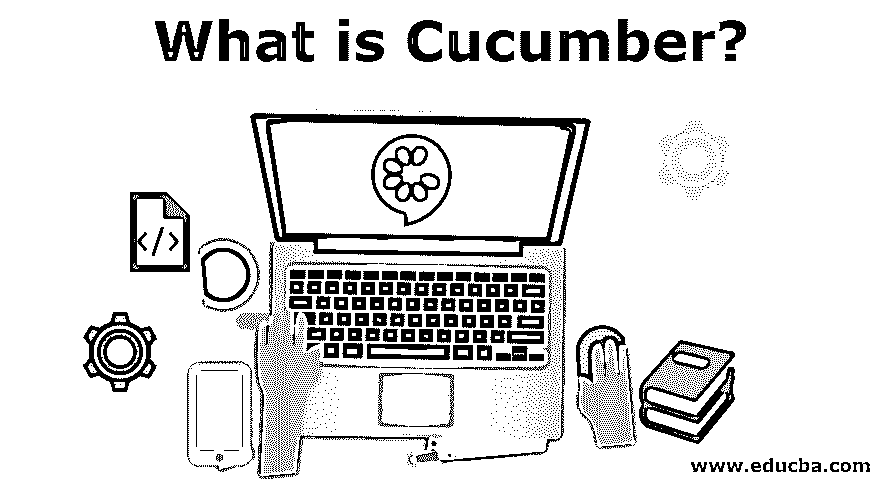

# 黄瓜是什么？

> 原文：<https://www.educba.com/what-is-cucumber/>

## 黄瓜简介

如今有许多可用的工具。Cucumber 是一个测试程序员编写的代码的工具。有很多像 cumber 这样的工具，如 JBehave、RSpec 等。这些工具有助于与客户就产品进行沟通。这些工具用简单的语言在给定的场景中测试其他软件。这些工具非常容易学习。如果你是测试出身，想知道这个工具到底是如何工作的，那么你来对地方了。每个公司都试图维持与客户的关系。像 cucumber 这样的工具帮助他们维持这种信任。

每个公司都必须根据客户满意度做出正确的决策。每件产品都必须符合顾客的计划。在 cucumber 中实现我们的工作是为了在不同场景的帮助下更容易更清楚地解释我们的规范。

<small>网页开发、编程语言、软件测试&其他</small>

### 黄瓜是什么？

现在，让我们从黄瓜到底是什么开始。;黄瓜是你吃的沙拉中的水果。显然不是。Cucumber 是一个[自动化测试框架](https://www.educba.com/automation-testing-interview-questions/)。cucumber 工具基于 BDD 方法，即行为驱动方法。简而言之，它描述了系统的整体行为。这主要是以客户为中心的。

### 黄瓜工具怎么用？

小黄瓜是黄瓜使用的语言。这很容易学。这一过程有助于我们以良好的格式向客户展示我们的工作。小黄瓜是非技术语言。每一种语言都有其适合的标准。小黄瓜也有一些规则。小黄瓜是用于开发黄瓜测试用例的语言。在编写 cucumber 的代码时，该语言有一些要使用的关键字。

#### 黄瓜编码的关键词

以下是关键词:

*   特征
*   规则(小黄瓜版本 6)
*   示例(或场景)
*   给定，当，然后，和，但是(步骤)
*   背景
*   场景大纲(或场景模板)
*   例子

**1)特性:**这部分代码只是简单地告诉高层场景，比如这里将要发生什么。这个关键字用在代码的开头，后面跟一个冒号(:)。您可以根据需要使其更具描述性。一般来说，关键字下的数据会被黄瓜忽略。

**2)规律:**这也是关键词之一。该关键字是可选的。顾名思义，它为不同场景的实现设定了规则。我们可以说这提供了一些关于特性的额外想法。

**3)例子(或场景):**例子是可执行代码。它用例子解释了代码，这可能会给我们一个基于场景的规范。这个例子也是一个测试。这可能具有所有可执行过程或步骤的列表。

**4)给定，When，Then，And，But(步骤):**测试中的主要步骤是给定，When，Then，And，or But。这些步骤是一个接一个地执行的，不允许你描述每一个步骤。

**例子:**

假设篮子里有芒果

然后篮子里有芒果。

**5)背景:**

假设您有一组必须反复检查的场景。这种重复的任务可以在给定的关键字中进行分组。你可能会说这种情况以前也处理过；请按照步骤操作。一个特征有一个背景是一个好习惯。应该清楚明白

**6)** **场景大纲(或场景模板):**

背景一样。假设我们有一个场景。这种情况又出现了。我们可以使用现有场景的大纲。场景大纲和场景模板是相同的。

这个 example 关键字已经在上面解释过了，但是在这里我们再次认识到，场景中必须包含这个例子。

### 黄瓜有什么用？

让我用一些例子告诉你。假设你有一个项目，客户想知道你必须交付的所有特性是什么。当涉及到最终用户或客户时，你不能解释你的测试用例的所有技术细节。在这里，黄瓜进入了画面。该工具有助于描述不同条件下的所有场景。这比向客户提供他们不理解的技术细节要好得多。

### 黄瓜如何让工作变得如此简单？

它是一个开源工具。许多公司都在使用这个工具来提高他们的生产力。该工具可用于当今任何可用的堆栈。该工具用于以人类可读的格式测试代码的功能。

### 你能用黄瓜做什么？

假设我们有一些密码，这是约翰回家的可能性。如果约翰坐飞机短途旅行，费用会很高；如果他坐火车来，由于距离较短，既便宜又可靠。

**例子:**

#评论

@标签

特写:约翰将乘火车回家，太好了。

就距离而言，火车回家是好的。

坐火车回家的场景不错。

鉴于约翰必须回家。

当他准时到达车站时

然后他会在今天回家。

通过上面的例子，我们正在陈述乘火车准时到达的可能性结果只有今天到家。

### 为什么我们需要黄瓜？

通过让客户参与产品开发过程，总是有可能提高客户的信任度。Cucumber 让我们能够用简单易懂的语言向最终用户或客户解释关键的技术代码规范。它专注于行为驱动的开发测试。

### 优势

1.  它支持所有语言。
2.  它用简单的语言将客户与技术规范联系起来。
3.  我们可以重用黄瓜工具中编写的代码。
4.  插件非常快。
5.  我们不需要任何编程语言来编写黄瓜脚本。

### 结论

Cucumber 是一个用来自动化测试用例的测试工具。我们可以将它与 selenium 这样的工具集成在一起。为了用 cucumber 编写测试代码，开发人员和测试人员走到一起，共同创建基于场景的规范来应对客户。

### 推荐文章

这是一本关于什么是黄瓜的指南。在这里，我们讨论如何使用黄瓜工具的例子和优势。您也可以看看以下文章，了解更多信息–

1.  [黄瓜面试问题](https://www.educba.com/cucumber-interview-questions/)
2.  [硒 vs 黄瓜](https://www.educba.com/selenium-vs-cucumber/)
3.  [安装硒 IDE](https://www.educba.com/install-selenium-ide/)
4.  [什么是 Appium？](https://www.educba.com/what-is-appium/)

