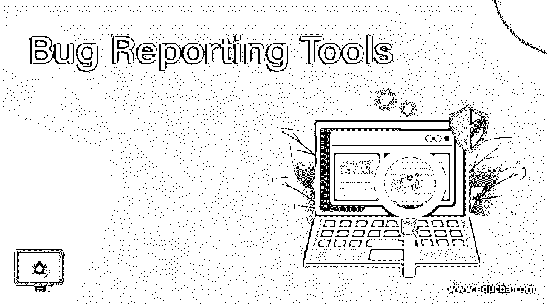
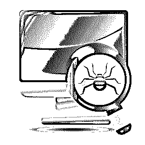

# 15 个最受欢迎的错误报告工具(跟踪软件)

> 原文：<https://www.educba.com/15-best-bug-reporting-tools/>

## 为什么要使用 bug 跟踪工具？

**Bug 报告工具—**在软件开发生命周期中跟踪和发现 Bug 是最重要的一步。没有这一步，一个软件是不完整的。跟踪、管理和解决各种 bug[对于构建一个完美的 app](https://www.educba.com/how-to-build-a-mobile-app-using-phonegap/ "How to Build a Mobile App Using Phonegap") 来说是一件大事。市场上有许多错误跟踪系统。仍然选择一个正确的错误报告软件不是一件容易的工作。你应该根据你的项目需求考虑很多事情。也有一些错误跟踪系统，它不仅跟踪错误，而且管理整个软件，还做各种其他任务。

使用缺陷报告工具有很多原因。原因如下

<small>网页开发、编程语言、软件测试&其他</small>

*   尽早发现问题
*   查找应用程序中的所有问题
*   第一次尝试就交付合适的应用
*   分清问题的轻重缓急，然后努力解决
*   交付合适的应用并让客户满意

### 缺陷跟踪流程

错误报告工具工作流程按以下顺序进行

*   捕获–捕获错误和问题
*   记录–记录问题，以便团队对问题做出决定
*   责任——找出问题的责任人。这将有助于前进
*   优先化——团队将对问题进行优先化处理并着手解决
*   解决–找到问题的解决方案
*   审查–再次进行交叉检查，以最终确定问题是否得到正确解决

### bug 跟踪软件的基本要素

有几个功能是任何 bug 跟踪系统都必须具备的

*   记录设备
*   分配
*   工作流程
*   历史
*   报告
*   存储和检索

### 你在寻找最好的 bug 跟踪系统吗？

在这篇文章中，我们将让你很容易地选择一个适合你需要的 bug 追踪器。下面列出了最好的错误报告工具及其特性。

#### 1.bugzilla-**Bug 报告工具**

Bug 报告工具 [Bugzilla](https://www.bugzilla.org/ "Bugzilla ") 是有助于软件开发管理的高级服务器软件之一。Bug 报告工具 Bugzilla 是由 Mozilla 基金会开发的开源软件，它是管理软件开发过程的强大工具。它允许更有效地跟踪缺陷和错误。Bugzilla 有丰富的特性，如高级搜索工具、各种格式的 bug 列表、报告生成、通过邮件提交 bug、自动检测重复 bug 等。

**特性:**

Bug 报告工具 Bugzilla 因为其丰富的特性在短时间内达到了很高的水平

*   优化了数据库结构，提高了可扩展性和性能
*   高度安全
*   高级查询工具
*   电子邮件通知功能，允许用户将电子邮件 id 添加到他们的个人资料中
*   最佳许可系统

Bug 报告工具 Bugzilla 提高了产品的质量，从而提高了客户满意度。这个 bug 跟踪软件被许多顶级公司使用，如脸书、Mozilla、Apache、NASA、RedHat 等。

#### 2.red mine-**错误报告工具**

Redmine 是一款免费的 bug 跟踪工具，也是开源的、最常用的基于 web 的软件管理工具。它是使用支持跨平台和多数据库的 Ruby On Rails 框架编写的。它与源代码管理(SCM)系统集成在一起。

**特性:**

这个 bug 跟踪工具的主要特性包括

*   灵活的缺陷跟踪系统
*   基于角色的访问控制
*   同时处理多个项目
*   [甘特图](https://www.educba.com/gantt-chart-for-a-project/ "How to Create Effective Gantt Charts?")和日历提供了项目的图示
*   文件和文档管理
*   电子邮件通知
*   多种语言
*   具有多个数据库的多个平台
*   创建任务和子任务，对项目中的问题进行分类

所有的功能只有注册用户才能使用。网站上有一个 Redmine 的错误报告工具在线演示。

#### 3.TRAC—**错误报告工具**

Trac 是一个基于网络的免费 bug 跟踪工具，也是一个用 Python 编写的开源软件。Trac 由 Edgewall Software 开发，作为 Wiki 的高级版本，用于[软件开发项目](https://www.educba.com/mobile-app-development-software/ "Top Mobile App Development Software")的 bug 和问题跟踪系统。它是如此简单和易于使用。它为软件管理提供了一种简约的方法。它支持多种平台，如错误报告工具 Linux、 [Unix](https://www.educba.com/software-development/courses/linux-training-certification/ "Complete UNIX & Linux OS Fundamentals Training") 、Mac OS X 和 [Windows](https://www.educba.com/windows-10-desktop-mode/ "Things to Know About Windows 10") 。Trac 中的问题或错误称为票证。Trac 中标签管理系统也用作缺陷管理。

**特性:**

*   便捷的报告系统
*   问题描述中的维基标记
*   时间线历史
*   路线图和里程碑
*   多插件
*   创建链接
*   bug、文件和维基页面之间的无缝集成

#### 4.螳螂-错误报告工具

Mantis 是一个著名的基于开源网络的 bug 跟踪系统。这是用 PHP 框架编写的，可以与 MS SQL、MY SQL、PostgreSQL 等多种数据库一起使用。螳螂是一个非常简单易用的工具。螳螂是你的软件开发管理所需要的。它有很多好的特点。螳螂也有一个移动版本和它的网络应用。这个软件最适合任何中小型公司。螳螂遵循如下所述的多层次结构

项目+子项目+类别 Bugs

**特性:**

*   更便宜的软件
*   可定制的问题页面
*   生成带有图形和图表的报告
*   高级搜索和过滤选项
*   易于安装
*   更改问题的历史记录
*   无限数量的用户
*   时间跟踪
*   处理多个项目
*   自定义字段
*   源代码集成
*   RSS 源
*   路线图
*   电子邮件通知
*   多 DBMS 支持
*   对移动设备的帮助和支持
*   聊天选项

#### 5.JIRA—**错误报告工具**

错误报告工具 JIRA 主要是一个事件管理工具，但最常用的是作为一个错误跟踪工具。这是一个著名的 J2EE 错误跟踪工具和软件管理工具。它提供了一种跟踪和管理问题的简单方法。Bug 报告工具 JIRA 有很多高级特性，其中一个特别的特性是它与代码开发环境的简单集成。

**特性:**

*   支持许多加载项
*   维护记录
*   报表生成
*   出色的工作流程
*   移动集成
*   与代码开发环境轻松集成
*   支持敏捷项目
*   帮助台

#### 6.请求跟踪器—**错误报告工具**

请求跟踪器也称为 RT，是一个企业级软件，帮助一组人有效地管理任务和问题。该工具还用作服务台系统、[项目管理系统](https://www.educba.com/project-management-key-skills/ "10 Must have Project Management Skills and Techniques")、NOC 票务、 [CRM 和软件开发](https://www.educba.com/customer-relationship-management-tools/ "Top Customer Relationship Management - CRM Software")。这个工具实际上通过其功能和特性连接了组织中的不同部门。

**特性:**

*   移动优化界面
*   仪表盘
*   电子邮件集成
*   命令行
*   提供关系图
*   富文本编辑
*   轻松定制主题
*   轻松打造品牌

#### 7.Bug 精灵—**Bug 报告工具**

这是一个优秀的项目管理和问题跟踪工具。这个系统是用 PHP 框架编写的，它是一个更友好的工具，易于使用。它还涉及缺陷管理系统。Bug Genie 可以在多个平台上工作，并且有多个数据库。[它还包含多种语言系统](https://www.educba.com/courses/all/programming-languages/ "100+ Programming Languages")。Bug Genie 不是一个免费的 Bug 报告工具。但是这个工具可以免费试用。

**特性:**

*   与许多 SCM 系统集成
*   问题跟踪机制
*   集成维基
*   易于安装
*   用户报告
*   支持多种语言

#### 8.电子追踪–**错误报告工具**

eTraxis 是另一个强大的基于 web 的跟踪工具，可以用来跟踪 bug，还可以做更多的事情。该系统在 PHP 框架下开发，支持多个数据库，如 My SQL、MS SQL、Oracle 等。该软件的重要吸引力在于它为用户提供的灵活性。用户可以定制跟踪工具的工作流程。这些自定义的工作流被称为模板，使用起来更加方便。这个系统可以作为一个 bug 跟踪器、帮助台和 CRM 系统。这不是一个免费的错误报告工具，但用户可以使用试用版。

**特性:**

*   全面的电子邮件提醒
*   详细的历史
*   过滤和评论问题
*   支持问题中的附件
*   灵活的权限
*   处理多个项目
*   无限数量的用户
*   创建 n 个工作流，并根据他们的要求进行定制
*   与用户现有工具和工作流程轻松集成

#### 9.BugNet—**Bug 报告工具**

BugNet 是另一个开源问题管理工具，使用 ASP.NET 编写，支持多个数据库。该工具易于部署且可扩展。它拥有其他 bug 报告工具的所有主要特性，如创建项目、管理项目、检测问题并跟踪它们。

**特性:**

*   GPL 许可的基于网络的工具
*   支持多个数据库和多个项目
*   里程碑管理
*   良好的安全性
*   在线聊天
*   电子邮件提醒
*   轻松导航
*   字段的定制
*   关于这个问题的报道
*   问题捕获

#### 10.出色的错误报告工具

Exceptional 是一款优质的 bug 跟踪工具，于 2008 年推出。它将帮助您跟踪和管理 web 应用程序中的错误或问题。它提供实时报告，并提供解决问题所需的各种信息。它为跟踪和报告应用程序中的问题提供了一个稳定的平台。

**特性:**

*   支持多个数据库
*   安全数据过滤
*   通过短信、电子邮件和网络挂钩的实时通知
*   捕获自定义数据
*   历史
*   管理多个项目
*   对错误给出注释

#### 11.sifter-**Bug-报告工具**

Sifter 是另一个重要的跟踪工具，它需要很少的配置。许多顶级组织都使用这种跟踪工具。它将帮助您交付高质量的最终产品。它不需要更多的编码配置，并帮助您以一种简单的方式跟踪和管理项目。

该工具的重要功能包括:

*   这个工具有一个项目仪表盘，可以快速查看所有项目和任务。
*   这个工具的里程碑可以让你知道截止日期并跟踪项目的进展。
*   它每天早上自动提供前一天活动的每日摘要。

#### 12.Bug herd—**Bug 报告工具**

BugHerd 是开发人员最常用的最简单的 bug 跟踪工具。它有助于以简单易行的方式获取客户反馈、跟踪、管理和解决问题。没有复杂的设置。只需输入问题，该工具将在几秒钟内将其转换为包含解决问题所需的所有信息的报告。

**特性:**

*   易于使用的界面
*   直接链接
*   内嵌标签
*   浏览器扩展
*   问题的文件附件
*   可视化错误报告
*   完整选择器数据
*   自动捕获客户端
*   实时讨论

#### 13.Bug 报告工具

FogBugz 是专门用来跟踪软件开发过程中每个阶段的 bug 的。在这个工具中，错误或问题被称为“案例”。它提供了一个简单的工作流程来列出、管理和解决案例。借助该工具的高级项目管理功能，您可以获得项目的详细大纲并设置里程碑。除了 bug 跟踪，这个工具还可以用于 CRM、论坛和基于证据的调度。

**特性:**

*   允许创建维基
*   可定制的案例列表
*   源代码集成
*   自动报告案件
*   日程安排功能，如时间表图表，项目的详细图片
*   整合用户反馈
*   与用户电子邮件集成
*   对问题进行过滤和排序

#### 14.log digger-**错误报告工具**

LogDigger 附带了一套工具，可以很容易地为您的 Java 应用程序捕获应用程序的错误和 bug。这是一个用户友好的工具，将帮助您分类并获得详细的错误报告。无论你使用的是哪种 Java 框架，它都会非常适合。它有一个吸引人的用户界面，这将有助于您轻松地学习该工具。

**特性:**

*   关于报告级别日志和上下文的即时通知
*   通过 HTTP POST 构建定制模块并将其发送给 BugDigger
*   与 Java web 开发框架中的任何错误报告[工具一起工作](https://www.educba.com/java-tools/)
*   提供深入的错误知识
*   不需要外部错误记录服务器

#### 15.pivotal tracker—**错误报告工具**

Pivotal tracker 是一个基于 web 的 bug 跟踪工具，更常用于遵循敏捷方法的人。这个工具的用户界面非常友好。这个工具以连续的方式工作，将你的项目分成更小的部分，找出每个部分的复杂性，然后对其进行优先排序。

**特性:**

*   唯一的发行号
*   全面的 API 和更多附加组件
*   使用图表来表示数据
*   简单的工作流程

### 结论

上面的错误报告工具列表是最常用的错误报告工具。您可能会发现，所有缺陷报告工具的主要目标不仅仅是缺陷跟踪工具。这是因为如果不考虑项目的其他方面，bug 跟踪就不能作为一个单独的活动来完成。因此，除了其他活动之外，缺陷跟踪工具成为缺陷报告工具的一部分。还有许多其他错误报告工具可用于错误跟踪。

### 推荐文章

1.  [数据字典工具](https://www.educba.com/data-dictionary-tools/)
2.  [Ping 监控工具](https://www.educba.com/ping-monitor-tools/)
3.  [带宽监控](https://www.educba.com/bandwidth-monitoring-tools/)
4.  [性能监控工具](https://www.educba.com/performance-monitoring-tools/)

