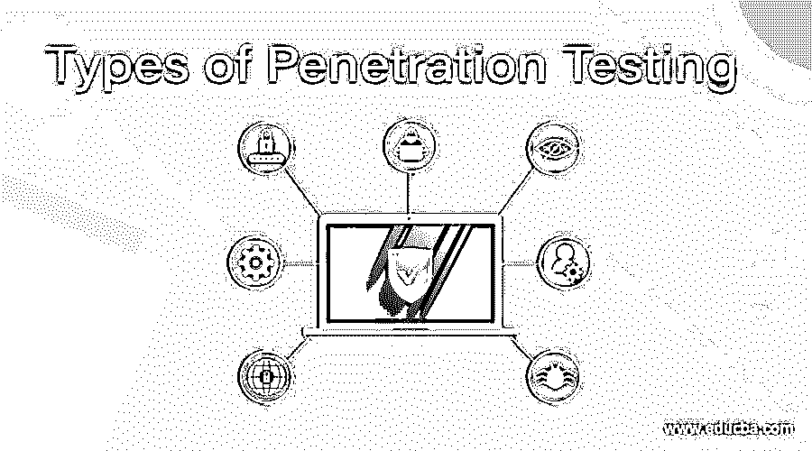

# 渗透测试的类型

> 原文：<https://www.educba.com/types-of-penetration-testing/>

## 渗透测试的类型

在当今的网络世界中，世界各地的黑客试图利用容易被发现和利用的安全漏洞来穿透网络防御，不仅在国家银行、公司品牌、政府机构中，而且在许多组织中也是如此。通过发现和利用漏洞，渗透测试以安全的方式检查公司 IT 基础设施中的任何漏洞。在软件本身中，可以在这些特定的入口点发现这些漏洞:

1.  在操作系统的后门中；
2.  软件配置管理实施不当；
3.  代码设计中的非故意错误；

渗透测试可在以下终点通过手动或自动过程进行:

<small>网页开发、编程语言、软件测试&其他</small>

1.  服务器
2.  无线网络
3.  网络端点
4.  网络安全设备，如网络入侵设备、防火墙、路由器等。
5.  移动设备

有各种类型的渗透测试，每一种都有不同的观点和目的，所以理解这些差异是很重要的，这样决定哪种类型的测试适合需求和目标才是有效的。以下是最常见的渗透测试类型，如下所示

#### 1.网络渗透测试

通常，网络测试是最常见的渗透测试过程。在渗透测试程序执行信息收集和漏洞评估后，Pentester 会进行一系列网络评估。可以进行内部和外部网络利用测试来探究组织安全性的几个方面。

网络测试包括:

1.  开放端口扫描和测试
2.  网络漏洞
3.  路由器测试
4.  DNS 足迹
5.  绕过防火墙
6.  代理服务系统
7.  SSH 攻击
8.  IDS/IPS 规避
9.  SQL Server
10.  简单邮件传输协议(SMTP)
11.  文件传输协议(FTP)

#### 2.应用渗透测试

在基于 Web 的应用程序中，会检测到安全漏洞。所有组件都经过测试，像 Silverlight、ActiveX 和 Java 小程序，还有 API。这个测试需要更多的时间，因为它比网络测试更难，所以正确和彻底地测试 Web 应用程序很重要。

利用的应用程序包括:

Web 应用程序中的语言，如 Java。NET，PHP，以及 API，连接如 Oracle，XML，MySQL，各种框架，系统如 SAP，财务系统，CRM 系统，物流，HR 系统，移动应用。

#### 3.无线网络渗透测试

它包括测试公司中使用的所有无线设备，如笔记本电脑、智能手机等。查找任何安全漏洞也要进行如下检查:

1.  无线协议(评估哪些协议在本质上被认为是“弱的”)；
2.  无线接入点(确定“流氓”接入点)；
3.  管理证书。

由于笔测试设备必须与无线网络信号相对相似，因此在大多数情况下，无线测试都是在客户端进行的。

无线网络渗透测试中利用的漏洞如下:

1.  MAC 地址欺骗
2.  无线加密协议
3.  未经授权的接入点和热点
4.  (XSS)跨站点脚本
5.  弱密码或默认密码
6.  拒绝服务(DoS)攻击
7.  无线网络流量
8.  SQL 注入
9.  Web 服务器配置错误
10.  用户敏感数据的网络服务器或网站
11.  使用恶意软件深度访问网络的 Web 服务器

#### 4.物理渗透测试

这可能不被认为是弱点，但物理安全控制可能是攻击者的入口。

渗透测试人员将尝试通过以下方式在物理渗透测试期间访问系统:

1.  RFID 和门安全系统
2.  撬锁
3.  人员或假冒供应商
4.  运动传感器

对于某种形式的社会工程，需要进行物理渗透测试。为了获得对设施的物理访问，渗透测试者可能需要欺骗或操纵工作人员。这将引导我们对下一个表单进行渗透测试。

#### 5.社会工程测试

人们会犯错，很容易被骗。通常，最薄弱的环节是员工。社会工程是一种常见的方式，威胁行为者可以渗透到您的环境中。

攻击者使用的社会工程方法类型有:

1.  网络钓鱼攻击
2.  外部供应商、同事或承包商等冒名顶替者
3.  抛名
4.  1.开车紧跟
5.  预发短信
6.  偷听
7.  翻垃圾箱

#### 6.云渗透测试

对于计算、网络和存储，公共云服务变得越来越受欢迎。企业和员工可以将备份和其他形式的数据存储在云中。对于黑客来说，这使它成为首要目标。然而，随着云部署的简化，管理云保护方面的挑战以及法律障碍也随之出现。

云服务测试包括:

1.  不常用的密码
2.  API 和应用程序访问
3.  数据库和存储访问
4.  加密
5.  虚拟机和未打补丁的操作系统
6.  SSH 和 RDP 远程管理
7.  使用不当的防火墙

### 结论

在本文中，我们看到了各种笔测试类型。执行这些不同类型的渗透测试将有助于用户识别系统安全中需要修补的漏洞。执行定期渗透测试是整个安全策略的关键。因此，您可以选择任何给定的测试在系统上执行，并增强安全性。

### 推荐文章

这是渗透测试类型的指南。在这里，我们分别讨论入门、最常见的渗透测试类型。您也可以看看以下文章，了解更多信息–

1.  [PHP 测试框架](https://www.educba.com/php-testing-framework/)
2.  [控制流测试](https://www.educba.com/control-flow-testing/)
3.  [无障碍测试](https://www.educba.com/accessibility-testing/)
4.  [用例测试](https://www.educba.com/use-case-testing/)

