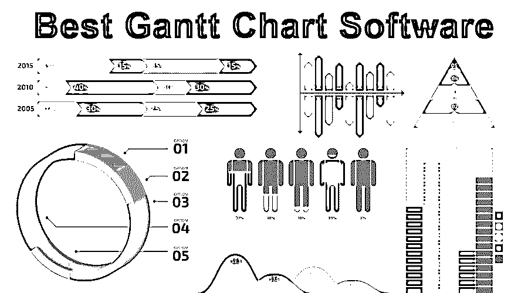

# 最佳甘特图软件

> 原文：<https://www.educba.com/best-gantt-chart-software/>

## 最佳甘特图软件概述

以下文章提供了最佳甘特图软件的概要。你听说过甘特图吗？如果没有，不要担心，我们会看到它到底是什么。如果我们仔细看这个名字，“甘特图”是的，它是一种图表。从上学开始，我们就知道不同种类的图表。现在，您对这个术语已经很熟悉了，并且了解了大部分内容。

现在，甘特图被用于项目管理。甘特图给你项目进展的准确描述。甘特图是项目经理处理项目的关键区域。甘特图允许你将一个程序分成一系列更小的图表。项目经理向人们描述这项任务。有很多软件可以帮助你。其中一些是我们今天要去看的。所有这些软件都取决于对软件的需求。每当我们需要检查软件的最佳特性、可用性、价格和适用性时。

<small>项目进度与管理，项目管理软件&其他</small>

### 甘特图软件列表

让我们看看下面的软件列表:

**1。简单项目:**这是一款基于桌面的[项目管理软件](https://www.educba.com/project-management-tools-software/)。顾名思义，一个简单的项目提供了一种处理项目的简单方法。如果你想克服基于 excel 的枯燥工作，那么这个简单的项目适合你。使用这个应用程序，您可以轻松地进行交流。你可以加快你的工作。它的行为是同步的，所以所有的工作都可以在一个地方进行监控。

**主要特性:**

*   简单项目有助于在时间线上轻松地可视化项目任务。
*   它有助于使用拖放方法规划任务。
*   它很容易维护任务和子任务之间的关系。
*   要创建新任务，使用甘特图创建里程碑很容易。
*   所有的基线都是用甘特图创建的。

**2。工作区:**用甘特图查看当前数据非常快。使用甘特图快速查看项目状态。必要时可以很容易地回到列表视图。这也有助于跟踪我们每个人的工作和责任。它的仪表板为我们提供了由哪个人执行什么活动的总体描述。

**3。Ganttpro:** 这个项目管理应用程序是基于云的。这是给予 14 天的免费试用，以使用和体验工作流程。使用甘特图有助于管理您的工作。这个软件是非常互动的，有助于同时管理多个项目。

**4。团队甘特图:**这个软件也是一个基于云的平台，可以用甘特图轻松处理项目。有了这个软件，你可以轻松地进行更多的协作工作。它有一个任务调度选项。管理工作负载很容易。它也适用于报告。

**5。Celoxis:** 这个软件比其他软件领先一步。这简化了处理问题的方式。这款软件性价比高，全合一。该软件管理超过 240 万个项目。

**6。项目洞察:**这个软件适合所有团队规模。本软件是一款基于 web 的企业级项目管理软件。所有的步骤都很简单。一个人只要访问它的网站就可以掌握它。他们提供了一个非常容易获得的基于幻灯片的快速教程。

7 .**。ProjectLibre:** 这是开源的项目管理软件之一。ProjectLibre 是一个企业云，它可以打开现有的 MS Project 文件，并让您能够只在浏览器中随时随地进行管理。

**8。Rational Plan:** 这个项目管理软件遵循 PMBOK 指南。

*   管理我们的项目和共享资源很容易
*   这有助于将资源和财务置于项目的控制之下。
*   这有助于让你注意到项目的关键问题。
*   跟踪项目在完成、时间和成本方面的进展。

**9。有了这个软件，你可以根据项目要求管理你的任务。这给了你一个量身定做的方法来解决你所有的问题。它的交互式聊天可以帮助你按照你的要求得到准确的指导。**

10。Team Headquarters:Team Headquarters 服务台和项目管理完全集成，易于使用，有助于服务台快速响应 UX。

**11。Smartsheet:** 这改变了做生意的根本方式。这个智能表分成几块。

**12。Hansoft:** Hansoft 是一个企业敏捷规划工具。这为项目、计划和投资组合级别的决策提供了一个单一的平台。

13。Merlin Project 4:Merlin Project 是原生为 macOS 和 iOS 编写的项目管理解决方案。

**14。Tom's Planner:** Tom's Planner 是一款基于网络的项目规划软件，提供真正易于使用的甘特图软件。

15。SmartDraw: 只有 SmartDraw 可以让你在项目甘特图和思维导图的两种不同视图之间切换。

16。OmniPlan: 在项目管理的各个方面都很有帮助。该软件有多种语言版本，如德语、英语、西班牙语、法语、荷兰语、意大利语、巴西语等。它真正减少了项目管理背后的痛苦。

**17。盒子里的项目**:它是你的项目和投资组合支持办公室，提供者。该软件没有版本。它有助于管理任务。它还提供 Saas 解决方案、内部解决方案和个人解决方案。你可以去它的官方网站免费试用。

18。Todo.vu: 许多国家试图用 Kitovu 轻松地组织他们的工作。你的成就是什么？你的努力，你队友的努力等等。如果我们不把工作组织好，所有这些问题都很难回答。归根结底，这都是时间的问题。Todo.vu 帮助非技术人员做得更好

### 结论

这不是项目有多大的问题。它是关于如何有效管理最小的项目。市场上有 n 种甘特图软件。如果你正在寻找一份管理方面的工作，那么这些软件知识可以帮助你。

### 推荐文章

这是最佳甘特图软件的指南。这里我们讨论什么是甘特图？以及附有适当解释的甘特图软件列表。您也可以浏览我们推荐的其他文章，了解更多信息——

1.  [项目管理中的甘特图](https://www.educba.com/gantt-chart-in-project-management/)
2.  [建设项目管理软件](https://www.educba.com/software-for-construction-project-management/)
3.  [项目甘特图](https://www.educba.com/gantt-chart-for-a-project/)
4.  [项目管理团队合作](https://www.educba.com/project-management-teamwork/)

