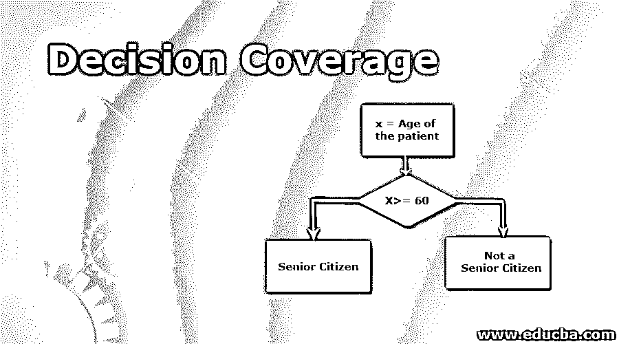
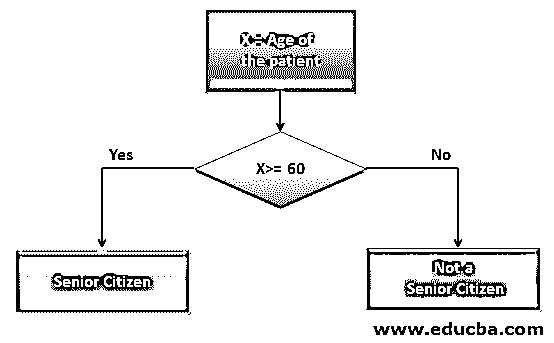

# 决策覆盖

> 原文：<https://www.educba.com/decision-coverage/>

## 决策覆盖率介绍

决策覆盖是一种常用的代码测试方法，用于验证程序中各种决策树的局限性。决策树通常源自程序中的条件语句、循环语句和布尔表达式或值。在这种情况下，测试过程是通过验证所有可能的执行流程，通过所述条件和循环语句来执行的。因此，这个过程被称为“决策覆盖”测试。换句话说，决策覆盖测试是证明模块化代码包含潜在功能端点的必要条件。

### 决策覆盖测试是如何执行的？

决策覆盖测试应该在程序的每一行执行，并识别代码中可能的决策流。众所周知，代码测试是应用程序开发和程序构建过程中的一个重要步骤。跳过这一步会在相应模块中的程序效率上造成一个大漏洞。决策覆盖测试中发现的任何失败或缺陷都会对应用程序的性能产生很大的影响。

<small>网页开发、编程语言、软件测试&其他</small>

*   决策覆盖测试的第一步是扫描程序的端到端操作，并在整个代码中定位决策指示器。这里的决策只不过是给出一个以上结果的代码，可以有两个或更多可能的路径供执行流通过，并且可以在代码执行过程结束时产生一个或多个产品。
*   前面的步骤包括组装逻辑决策流程图的过程，并列出应用程序代码中灌输的各种决策的结果。它很可能有不止一个结论，因为一个一致的代码执行流不需要涉及任何逻辑决策。
*   决策覆盖测试过程的最后一步是评估在该测试过程的前面步骤中收集和设计的逻辑决策指示。各种逻辑中的端点都要经过必要的确认和验证方法。如果获得的最终结果与计划的结果相匹配，则测试过程被认为是通过的，这应该与客户以功能规范文档的形式给出的数据成正比。

#### 如何计算决策覆盖率？

对应用程序代码实施决策覆盖测试的目的是验证每一个可能的逻辑和功能流程，并确保程序是无懈可击的。此外，该过程用于确认程序中执行的操作是否按预期运行。下面的公式给出了决策覆盖评估的数值，

决策覆盖率% =((实施的决策产品数量)/(决策产品总数)* 100) %，

其中，决策的总数将是程序中确定的逻辑决策的计数，从这些决策中实现的决策的数量将给出决策覆盖百分比值。

### 决策覆盖的实现示例

以下是决策覆盖范围的示例:

#### 示例#1

下面的示例代码显示“if”条件给出了多个决策

**代码:**

`Read X
Read ‘Answer1’
IF X = ‘Answer1’ THEN
Print "X is the correct Answer"
ENDIF
If X != ‘Answer1’ THEN
Print "Your Answer is wrong"
ENDIF`

上面的代码显示了一个自动问答模拟器可以验证接受评估过程的人所提供的答案。它将变量 X 分配给候选人给出的每个答案。然后，通过将答案与系统中预加载的答案密钥进行匹配来进行验证。如果匹配无误，将显示消息“<answer>是正确答案”。如果结果不匹配，将显示消息“您的答案是错误的”。因此，这段代码由两个可能的逻辑决策组成，测试这段代码的范围可以称为决策覆盖测试。</answer>

#### 实施例 2

下面的示例代码显示了用于验证患者年龄并确定该人是否为老年人的流程图，

在这个例子中(图 01)，变量 X 被分配给患者的年龄。此处的决策框用于评估年龄是否大于或等于数字“60”。如果年龄小于规定值，即 60 岁，则患者不被标记为老年公民。并且，如果条件被满足并且被发现是真实的，那么患者可以被标记为老年公民。根据模块化功能执行这种评估的过程，没有任何泄漏，可以被定义为决策覆盖验证的实践。

### 决策覆盖的优点和缺点

以下是决策覆盖操作的优点和缺点:

**优点:**

1.  它是通过测试操作是否满足客户、顾客或商业专业人员所陈述的要求来评估完整代码和程序中逻辑单元的性能的过程。
2.  这种代码覆盖测试方法被用作维护程序质量和逻辑决策的辅助手段。
3.  它扮演着支持代理的角色，负责检查应用程序中没有未完成或过时的代码或功能。

**缺点:**

1.  这种方法与保持测试执行时间表相关，因为除了常规的单元测试和代码覆盖测试之外，它还需要特别注意，并且它需要开发团队的额外努力以及测试专业人员的帮助。
2.  这种方法在软件专业人员中并不熟练，因为它没有多次得到管理层的批准。

### 结论

决策覆盖评估是一种至关重要的测试覆盖方法，因为这种代码覆盖方法比其他覆盖测试方法更胜一筹。它能更好地理解隐藏在程序下的操作与客户期望的功能的对比。因为它可以包括布尔操作，所以它通常比分支覆盖过程更受欢迎。

### 推荐文章

这是决策覆盖的指南。在这里，我们讨论介绍和如何计算决策覆盖以及优点和缺点。您也可以浏览我们推荐的文章，了解更多信息——

1.  [程序员 vs 软件工程](https://www.educba.com/programmers-vs-software-engineering/)
2.  [软件设计原理](https://www.educba.com/software-design-principles/)
3.  [报表覆盖范围](https://www.educba.com/statement-coverage/)
4.  [分行覆盖范围](https://www.educba.com/branch-coverage/)

