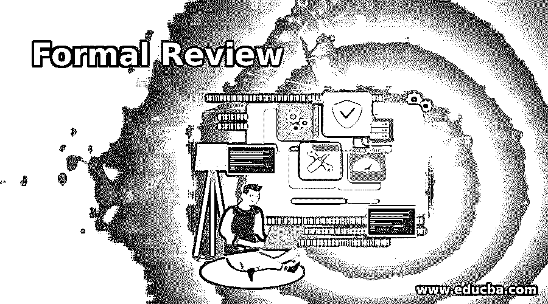
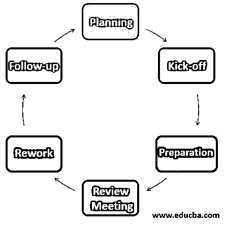

# 正式审查

> 原文：<https://www.educba.com/formal-review/>

## 什么是形式审查？

软件测试中的正式评审是以文档化的过程和需求为特征的评审。检查是记录最多、最正式的评审技术。过程的正式性与一些因素有关，例如软件开发过程的成熟度，任何法律或法规要求，或者审计跟踪的需要。正式评审遵循由六个主要阶段组成的正式流程——规划阶段、启动阶段、准备阶段、评审会议阶段、返工阶段和跟进阶段。在本文中，我们将详细了解这些阶段。

### 正式审查过程

正式审查流程按如下步骤进行:

<small>网页开发、编程语言、软件测试&其他</small>

#### 1.规划

对于一个特定的评审，评审过程从评审请求开始，其中作者请求一个版主评审特定的产品或软件。主持人负责审查的日程安排，即日期、时间、工作等。主持人执行进入检查并定义退出标准。执行输入检查以确保审阅者的时间不会浪费在未准备好供审阅的文档上。一旦特定文档的条目检查通过，文档的版主和作者就决定文档的哪一部分需要审阅。正式的审查小组由 4-5 名成员组成。版主给每个成员分配不同的角色/任务。以便每个评审者可以在检查期间关注特定类型的缺陷。这个过程不仅节省了时间，而且减少了不同评审者发现相同缺陷的机会。

#### 2.开球

正式评审流程的下一阶段是可选的启动会议。这一阶段的主要目标是让每个人对正在审阅的文档有相同的看法，并投入时间进行检查。在此会议中，评审者将收到对评审目标及其文档的简短介绍。角色分配、要检查的页面、检查率以及其他需要在评审中执行的事项都将在此会议中讨论。在启动会议期间，还会共享评审文档、源文件和其他相关文档的分发。强烈建议召开启动会议，因为它能激励评审人员。

#### 3.准备

在这一阶段，使用相关的文档、规则、清单和程序，每个团队成员单独处理这些文档。这些团队成员根据他们对文档的理解和角色，分别识别 bug、注释和问题。所有这些问题都记录在日志表格中。拼写错误也会被记录下来，但不会在会议中讨论。在会议结束时，所有这些带注释的文档都交给了项目的作者。检查率是这一阶段成功的关键因素。检查率是每小时检查的页数。最佳检查率是多种因素综合作用的结果，包括文档类型、相关文档数量、复杂性和审核者的经验。通常检查速度在每小时 5 到 10 页的范围内。在准备阶段，团队成员不应超过他们被要求使用的检查率。可以通过收集数据和衡量审核过程来设置检查率和文档大小的标准。

#### 4.评审会

在评审会议阶段，讨论所有问题。团队成员转发他们的评论和问题。项目主持人负责处理这些问题，并确保所有讨论的项目在会议结束时有一个结果，或者在会议期间讨论无法解决时被定义为行动点。会议结束时，团队成员根据退出标准对文档做出决定。如果每页发现的缺陷数量超过一定水平，则必须再次审查文档。如果一个项目处于压力之下，那么主持人有时会被迫跳过评审，带着一个容易出现缺陷的文档退出。

#### 5.修订

在返工阶段，根据在准备和评审会议阶段确定的缺陷进行讨论。作者将根据这些缺陷尝试改进文档并返工。请注意，并不是每个缺陷都会导致返工。检查缺陷并决定是否需要返工是作者的责任。在某些情况下，这一决定是在审查会议上做出的。如果由于某种原因没有对某个问题采取任何措施，那么至少应该向报告，这表明作者已经考虑了这个问题。在后续阶段，文档中所做的更改很容易被发现，因此作者必须指出哪里做了更改。

#### 6.后续行动

在后续阶段，项目主持人负责确保对所有记录的缺陷、过程改进和变更请求采取令人满意的行动。尽管主持人也检查以确保项目的作者已经对所有的缺陷采取了适当的行动。主持人不一定需要详细检查所有的返工或修正。如果决定所有团队成员都将检查文档并更新文档，那么版主只负责团队中的角色分配并从他们那里收集反馈。为了控制评审过程，主持人收集过程每个阶段的所有度量。例如，发现的缺陷数量每页发现的缺陷数量、花费在文档上的时间、花费在纠正每页缺陷上的时间等。版主有责任确保所有细节都是正确的，并为将来的分析做好准备。

### 推荐文章

这是一个正式审查的指南。在这里，我们还将讨论介绍和正式评审流程以及 6 个步骤。您也可以看看以下文章，了解更多信息–

1.  [静态测试技术](https://www.educba.com/static-testing-techniques/)
2.  [静态测试](https://www.educba.com/static-testing/)
3.  [外壳脚本睡眠](https://www.educba.com/shell-script-sleep/)
4.  [软件测试的级别](https://www.educba.com/levels-of-software-testing/)

