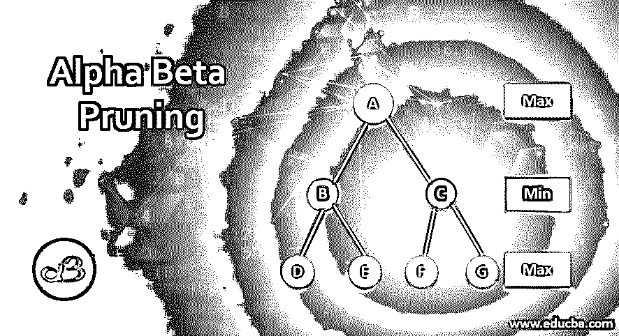
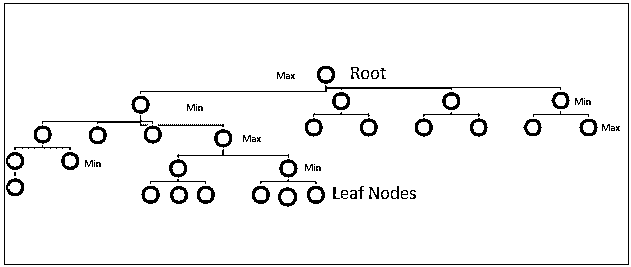

# 阿尔法贝塔剪枝

> 原文：<https://www.educba.com/alpha-beta-pruning/>

## 阿尔法-贝塔剪枝的定义

Alpha-beta (AB)剪枝是 Minimax 算法的临时版本。这种剪枝算法采用的搜索优化技术减少了搜索范围，并大大减少了计算时间。

极大极小算法详尽地检查搜索树中的所有节点的最大化转弯和最小化转弯，并决定最佳可能路线，而 AB 剪枝跳过搜索树中产生无意义值的一些分支，并渗透到树中的任何级别。

<small>网页开发、编程语言、软件测试&其他</small>

AB 剪枝处理称为α和β的两个参数，在搜索操作的每一步分别分配给最大化者和最小化者，因此得名 AB 剪枝。

### 什么是阿尔法贝塔剪枝？

让我们详细研究一下 AB 修剪技术。

#### 1.对抗性搜索

通常，任何搜索策略都与单个实体相关联，并且该策略的结果将是最佳动作序列。可能存在这样的情况，其中不止一个实体将参与搜索空间，具有对抗的意图，并且它们将为了达到它们的目的/目标而相互竞争。每个实体的搜索策略将取决于对手的移动以及它在他们追求达到最终目标的过程中可能带来的影响。

在这种搜索策略中，一个以上具有竞争意图的利益相关者在搜索空间中为达到他们的目标而斗争，这种策略被称为对抗性搜索，它主要在类似游戏的情况下被采用。这一概念用于人工智能、博弈论、决策理论、统计学和哲学领域，也应用于存在许多不确定性的商业场景中的决策。

玩家采取的策略根据游戏的情况而不同，每一个都会遵循不同的方向。一个玩家会占据上风，试图最大化收益(Maximizer)，对手会试图控制伤害，最小化损失(Minimizer)。

#### 2.极大极小算法

如上所述，极大极小算法是建立在最小化和最大化概念之上的，但是它并不那么高效和直观。它从头到尾遍历游戏层次结构中的所有节点，并在到达最终游戏路径之前探索所有可能性。

#### 3.对 Minimax 的改进

AB 剪枝算法建立在极大极小的基础上，并临时增加了搜索优化功能。它减少了在游戏层次中搜索的节点数量，节省了时间和资源。对于最大化器，它计算最小增益的最大值，并存储在一个名为α的参数中；对于最小化器，它计算最大损耗的最小值，并存储在一个名为β的参数中。存储在 Alpha 和 Beta 中的值决定了搜索操作的执行方式。

在 AB 算法中，要检查的节点的深度是指数级的，并且它不能被减少，但是要检查的节点的数量可以通过消除对结果没有贡献任何值的节点而显著减少，并且这个消除过程被称为修剪。

### 阿尔法-贝塔剪枝的功能

让我们检查两个玩家参与具有 5 级节点的搜索(或游戏)的情况。

*   最顶层将是根，并且只有一个。
*   终端级别(第 5 级级)包含叶节点，它在所有叶中都有值。
*   每一关都有最大化者或者最小化者的回合，并且交替变化。
*   每个节点通过分支连接到下一级的另一个节点。
*   搜索操作的顺序是从上到下，从左节点到右节点。
*   最大化器的值在参数α中，最小化器的值在β中。
*   α的初始值将是最低的-∞(-无穷大)，而β的初始值将是最高的+∞(+无穷大)。
*   搜索从根的α和β的初始值开始。
*   按照步骤 5 中所述的搜索顺序，将值传播到下一层(左或右)的下一个节点(如果为空)。
*   如果树的级别是最小转弯，则β值与下一个较低级别中的节点的值进行比较，并且β值随着所有值中的最小值而改变。
*   如果树的级别是最大转弯，则将 Alpha 值与下一个较低级别中的节点的值进行比较，并使用所有值中的最高值来改变 Alpha 值。
*   如果 Alpha 的值大于或等于 Beta 的值，下面的分支将被删除，并且不会被进一步探索。这样，搜索操作的数量将大大减少。
*   重复上述 4 个步骤(步骤 9 到 12 ),直到探索了除了被修剪之外的所有级别的所有节点，并且为最大化器和最小化器选择了最佳值，并且结果被存储在α和β参数中。
*   在迭代结束和搜索完成时，Alpha 将包含最大值的最高可能分数，Beta 将包含最小值的最低可能分数。

**搜索树层次结构**

**

** 

### 阿尔法贝塔剪枝的关键点

*   Alpha 和 Beta 的值将向前传递到下面的节点(子节点)。
*   在树的向后移动中，只有节点值将被传递到上面的节点，而不是从上到下的 Alpha 和 Beta 值
*   仅在为分配的树级别中更新 Alpha 值
*   仅 Beta 值将在分配给的树级别中更新
*   检查节点的顺序(搜索移动)对于最大化修剪和节省时间和精力非常重要。从最左边的节点开始向右移动总是最理想的。
*   达到良好排序的最佳方式是从最浅的节点开始，首先检查最佳节点，以提高

### 推荐文章

这是一个阿尔法贝塔修剪指南。在这里，我们还将讨论 alpha beta 修剪的定义和工作方式以及特性。您也可以看看以下文章，了解更多信息–

1.  [阿尔法和贝塔测试](https://www.educba.com/alpha-and-beta-testing/)
2.  [阿尔法测试](https://www.educba.com/alpha-testing/)
3.  [阿尔法测试 vs 贝塔测试](https://www.educba.com/alpha-testing-vs-beta-testing/)
4.  [Beta 测试](https://www.educba.com/beta-testing/)

