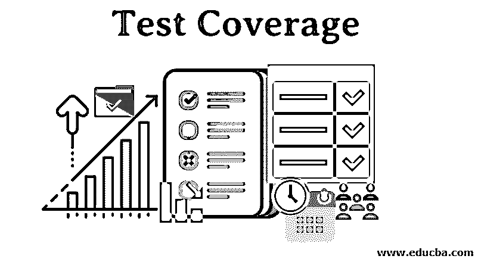
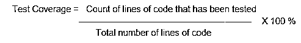

# 测试覆盖率

> 原文：<https://www.educba.com/test-coverage/>

## 测试覆盖率介绍

最新的收敛以某种特定的方式度量由一组测试执行的测试量，即以某种其他方式导出，例如，使用基于规范的技术。每当我们可以计算事物，并判断这些事物是否已经被一些测试测试过，我们就可以测量覆盖率。这个测试覆盖的主要目标是陈述应用程序的书面编码已经被测试到的水平。

### 什么是测试覆盖率？

*   它可以被定义为在软件测试中应用的方法学，以测量覆盖测试的一部分。顾名思义，它显示了通过手工或者自动化测试覆盖的测试的百分比。引入这种方法的原因是为了改进测试的方式。对于有很多东西要测试的应用程序，这种方法可以确保所有的应用程序区域都被成功测试。它主要只关注软件开发生命周期的测试阶段。
*   它也可以被定义为已经被覆盖的测试量和还没有被覆盖的部分的百分比。它将未完成和已完成的工作以数字的形式表示出来，这样开发和测试团队应该清楚在截止日期之前必须完成的工作。为了计算测试覆盖率的百分比，有一个特殊的公式，我们将在后面的章节中介绍。总的来说，这是提高测试工作效率的方法，并且使得整个团队在测试阶段监控进度变得容易。

### 测试覆盖率是如何执行的？

为了计算测试覆盖率或者已经覆盖的测试量的百分比，我们应该有基本的数据或者细节，这取决于我们将获得准确的测试覆盖率。第一件事是你应该了解你应该检查的代码的完整代码量，第二件事是你应该有到目前为止已经测试过的代码行数。必须使用这两种信息来执行计算，以计算测试覆盖率。

<small>网页开发、编程语言、软件测试&其他</small>

下面是计算测试覆盖率的公式:

假设需要测试的代码的总行数是 1000，而目前测试的行数是 150。因此，可以通过使用上述公式中的值来计算测试覆盖率。

**测试覆盖率= (150/1000) * 100% = 15%**

在上面给出的例子中，测试覆盖率是 15%,这意味着 15%的测试已经完成，剩下的 85%的测试还没有完成。

### 测试覆盖率如何让工作变得如此简单？

测试人员考虑测试覆盖的价值，以检查他们是否在截止日期前完成测试任务。他们可以相应地调整他们的速度，以便在预期的时间内完成测试。这给了测试人员跟踪他们工作的优势。此外，通过使用这种方法，与其他团队或领导分享测试工作的进展变得非常容易。与其向任何一方解释各种测试及其进展，不如使用数字数据更新它们，这太容易了，这也是这种方法学发展背后的主要原因。它使得软件开发生命周期的测试阶段非常方便。它让每个成员都非常清楚在特定的时间间隔内要完成多少测试才能达到测试目标。

### 优势

由于测试人员喜欢的几个特性，测试覆盖方法使得执行测试变得非常方便。

#### 1.监测进展

它可以用来跟踪测试团队在指定的时间表之前完成分配给他们的任务的进度。此外，它让测试人员了解他们朝着目标前进的步伐。

#### 2.会议截止日期

通过关注使用测试覆盖率计算的百分比，人们可以调整他们在时间线之前准备好交付物的工作速度，这将最终帮助他们保持他们的工作是最新的，并帮助他们避免赶上最后期限。

#### 3.共享工作状态

在整个开发周期中，需要不断地与相关的涉众共享工作状态报告。通过投入使用，可以在测试覆盖计算之后使用百分比结果来交付简明的信息。

#### 4.改进测试方法

保持团队对时间和工作进度比率的更新是非常有帮助的，这样他们就可以尝试不同的工作方法，如果需要有效和高效地完成工作的话，这最终会导致测试人员的测试方法得到改进。

### 结论

它被认为是计算已经完成或尚未完成的测试工作量的最佳方法。通过让测试人员知道事情是如何流动的，这让他们的工作变得简单了一些。测试人员也可以用它来为在给定的时间交付分配给他们的任务做计划。它是现代软件开发方式中引入的现代方法之一。

### 推荐文章

这是测试覆盖率的指南。这里我们分别讨论测试覆盖的基本概念、工作原理、性能和优点。您也可以浏览我们推荐的其他文章，了解更多信息——

1.  [白盒测试](https://www.educba.com/white-box-testing/)
2.  [软件测试的类型](https://www.educba.com/types-of-software-testing/)
3.  [安全测试工具](https://www.educba.com/security-testing-tools/)
4.  [功能测试工具](https://www.educba.com/functional-testing-tools/)

