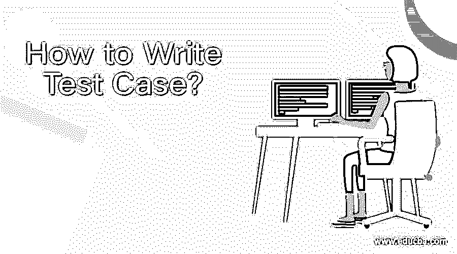
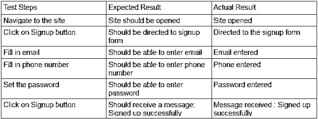

# 测试用例怎么写？

> 原文：<https://www.educba.com/how-to-write-test-case/>

## 如何编写测试用例概述？

考虑一个场景，您被要求编写测试应用程序的测试用例。你能开始吗？你可能听说过诸如测试用例、测试脚本、测试计划等术语。这些术语听起来可能会让你感到困惑，因为它们听起来非常相似，但它们的含义是不同的。清楚地理解这些软件术语非常重要，这样你才能区分它们。为了更有效地进行测试，你必须从理解什么是测试用例开始，以及如何以一种覆盖给定需求的方式编写它们。

记住，一个好的测试人员是一个注重细节的人。除了关注细节和规范，一个好的测试人员应该能够有效地编写测试用例。编写测试用例不是一件容易的事情，因为它需要天赋、经验和良好的业务理解。编写质量测试用例所需的关键技能之一是得体的写作技能。好的测试用例是带着定义应用程序“是什么”和“如何”的目标编写的。一些测试人员可能认为编写测试用例是一项枯燥的任务，但是测试用例的质量将决定你的软件质量，从而决定公司团队的价值、生产力和成功。

<small>网页开发、编程语言、软件测试&其他</small>

### 编写测试用例

我们可以将测试用例定义为一组输入和输出条件或变量，它们将帮助测试人员确定 AUT(被测应用程序)是否满足软件需求说明书或需求文档中指定的需求。它基本上是一个文档，包含诸如测试的前提条件、用于测试的测试数据、测试 id、测试描述、测试的后置条件以及执行测试的步骤等信息。它还包含有关观察结果的详细信息，即实际结果和符合要求的结果，即预期结果。

所有这些细节都是为特定的测试场景指定的，以便测试是否符合需求文档。然后，根据实际结果和预期结果之间的比较，测试用例被标记为通过和失败。一个通过的测试用例有一个实际的结果，就像需求中提到的预期结果一样。另一方面，失败的测试用例没有与预期输出相匹配的实际输出，因此它被标记为失败。

测试用例是一个单一且可执行的场景。它由测试用例中明确指定的“要遵循的步骤”所指导的测试人员携带。因此，一个测试用例可以被认为是一系列按步骤提供的指令，以按照需求验证和确认软件行为。

**测试用例参数有:**

*   测试用例 Id
*   测试用例名称
*   测试用例描述
*   测试数据
*   前提
*   测试步骤
*   预期结果
*   实际效果
*   后置条件
*   测试用例环境

测试用例确实会影响测试阶段，所以应该确保在测试阶段真正开始之前就已经写好了。测试用例的编写和测试的过程一样重要和不可避免。

### 测试用例的步骤

编写一个好的测试用例的步骤是:

*   一个好的测试用例有一个测试 id 和一个强测试名，确保被测试模块的清晰性。以测试注册页面为例。在这种情况下，使用标题中包含“注册页面”的标题。
*   一个好的测试用例对要执行的测试有一个结构良好、强大、简洁和清晰的描述。有时，这个部分可能包括先决条件、测试环境的信息和其他类似的因素。
*   一个好的测试用例提到了正确执行给定测试所需的假设或任何先决条件。这可能包含任何需求，例如访问应用程序中正在测试的模块所需的任何访问权限。
*   提及用于测试的测试数据的测试用例被认为是好的测试用例。
*   测试用例中的步骤应该简洁、简单和清晰。此外，确保这些步骤不会引起误解，这样在测试完成时就不会浪费时间。
*   应该清楚地提到每一步的预期和实际结果。这些对测试人员非常有帮助，因为使用这些，测试人员可以清楚地识别出应用程序在失败时失败的步骤。
*   最后但同样重要的是，确保测试用例是可重用的

示例[测试用例，用于测试](https://www.educba.com/what-is-test-case/)用户是否能够注册到包含电子邮件、电话号码、设置密码的应用程序中。

*   **测试用例名称:**注册页面认证
*   **描述:**新用户应该能够在应用程序中成功注册。
*   **前提条件**:用户应该是新用户。

### 提示和技巧

在编写测试用例时，您应该记住以下几点:

*   确保测试用例[提供良好的测试覆盖](https://www.educba.com/test-coverage/)，即测试中不会遗漏任何关键功能
*   确保负面测试用例或负面测试场景也被记录和测试。

### **结论——如何编写测试用例？**

测试用例是强大的，并且对未来的员工有益，向他们提供关于系统及其功能的真相。

### 推荐文章

这已经是如何编写测试用例的指南了？这里我们已经讨论了简介，编写测试用例，编写一个好的测试用例的步骤，参数，以及一些提示和技巧。您也可以浏览我们推荐的其他文章，了解更多信息——

1.  [W](https://www.educba.com/what-is-software-testing/)T2】什么是软件测试？
2.  [黑盒测试](https://www.educba.com/black-box-testing/)
3.  [软件工程师职业](https://www.educba.com/careers-as-a-software-engineer/)
4.  [测试计划模板](https://www.educba.com/test-plan-template/)

