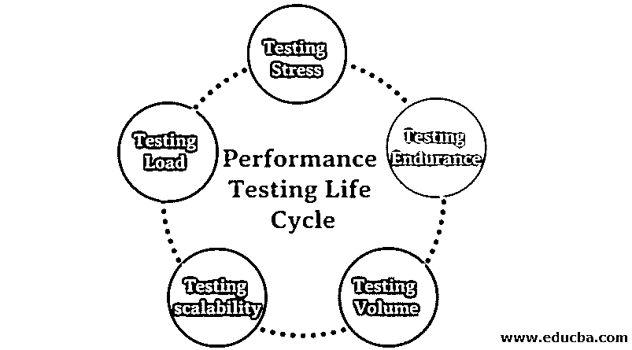

# 性能测试生命周期

> 原文：<https://www.educba.com/performance-testing-life-cycle/>

## 性能测试生命周期概述

性能测试是一种用于评估非功能性易错场景的测试，如应用程序的效率、应用程序在特定条件下的行为、流经应用程序数据库/接口的数据量等。对于性能测试，生命周期从分析非功能区域、所需的测试策略、测试流程设计和测试结果分析开始。各种类型的性能测试包括负载测试、压力测试、耐用性测试和容量测试。

### 性能测试生命周期的要求是什么？

性能测试并不那么重要，可能全球只有极小一部分人使用该技术并满足当前硬件和软件的需求。现在，情况变了。应用能不能管理 X 用户量，是一个初创企业开始或推出网站或手机 app 时的答案？请求是否是反应性的？即使是最终客户也希望得到快速响应。日复一日，设计师不得不考虑进行更多调整的实现，以便能够快速响应地管理大量客户。那么，如何衡量实施的效率呢？结果的衡量标准是什么？哪些零件以及在什么基础上应该参与性能测试？开发了一种方法来回答所有这些问题，分为性能测试的几个阶段。目标是建立一个平稳的、渠道化的方法来实现性能测试目标。

<small>网页开发、编程语言、软件测试&其他</small>

### 性能测试的类型

各种性能测试类型包括:

#### 1.测试负载

它监视应用程序在预期用户负载下的执行能力。目的是在应用程序上线之前发现性能差距。

#### 2.测试压力

这包括在极端工作负载下测试高流量或数据处理应用程序。目的是确定请求的出发点。

#### 3.测试耐力

该软件旨在确保可以长期处理预期的负载。

#### 4.测试体积

大量欠量测试。数据存储在数据库中，软件系统的整体行为受到监控。目的是验证[软件应用程序](https://www.educba.com/what-is-application-software-its-types/)在不同卷中的性能。

#### 5.测试可扩展性

可伸缩性测试旨在评估软件应用程序在支持更高用户负载方面的效率。它有助于为您的软件规划额外的功能。如果您想要在您的服务器上进行这些测试，您现在将需要与您的测试计划兼容的各种工具。让我们看看一些重要的性能测试工具。

### 何时是开始性能测试生命周期的最佳时机？

性能测试与[生命周期软件开发](https://www.educba.com/what-is-sdlc/)一起开始。NFR 的获取与系统规格要求(SRS)并行进行。让我们看看性能测试生命周期的各个阶段。

#### 1.教育和分析非功能性需求

PTLC 的开始和最关键的阶段是对非功能需求的理解。

**任务**

1.  AUT 架构理解
2.  识别和理解危急情况
3.  界面细节理解
4.  模式增长

#### 2.性能测试的策略

这个阶段确定了如何进行关键场景的性能测试。在此阶段，应解决以下问题。为和软件设置环境。

**性能测试策略的激活:**

1.  准备并审查测试策略。
2.  范围和范围外定义。

#### 3.测试设计性能

这个阶段包括在特定的环境中使用确定的测试工具生成脚本。所有对脚本和单元的改进都应该被测试。

**测试设计性能的活动**

1.  在设计测试性能中，我们测试脚本
2.  度量和事务的设计

#### 4.性能测试结果分析

这个阶段涉及到测试工程师，他们根据定义的工作负载创建场景，并用并发用户加载系统。

**性能测试结果分析活动**

1.  场景是设计好的
2.  执行监控

### 性能测试生命周期的好处

*   **验证特性**:性能测试验证软件的基本特性。基本软件特性的性能测量使公司领导能够决定关于软件配置的重要事情。
*   **测量速度，精确而稳定:**这使您能够在压力下监控软件的关键部分。这为如何管理软件的可伸缩性提供了重要的数据。
*   **让您的客户满意:**对应用程序的测量使您能够监控客户的反应。好处是在你的客户之前，你可以识别关键问题**。**
*   **识别差异:**通过度量效率，为开发人员在上线前提供缓冲。一旦发布**，任何问题都可能被放大。**
*   **负载能力和优化:**测量你公司的产量可以帮助你的组织处理数量，这样你的软件就可以处理高用户浓度**。**

既然您已经理解了性能测试的好处。

### 结论

在软件工程中，任何软件产品商业化之前都需要进行性能测试。它保证客户满意，保护投资者免受产品故障的影响。因此，在本文中，我们已经看到了性能测试生命周期的各个阶段。我希望这篇文章对你有所帮助。

### 推荐文章

这是性能测试生命周期的指南。在这里，我们讨论性能测试生命周期的介绍和不同类型的性能测试以及好处。您也可以浏览我们推荐的其他文章，了解更多信息——

1.  [软件测试的级别](https://www.educba.com/levels-of-software-testing/)
2.  [手动测试](https://www.educba.com/manual-testing/)
3.  [安全测试](https://www.educba.com/security-testing/)
4.  [软件测试生命周期](https://www.educba.com/software-testing-life-cycle/)

