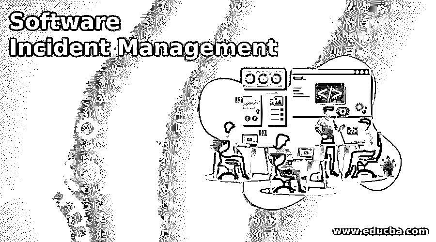

# 软件事件管理

> 原文：<https://www.educba.com/software-incident-management/>

## 软件事件管理简介

软件事件管理可以定义为在生命周期的不同阶段处理事件的过程。此管理流程的主要元素是事件，即用户观察到的差异，并通知相关团队/个人在固定时间段内解决该问题。这个过程可以由工作流中的任何人来提示，例如用户、客户、最终用户、技术团队成员，有时甚至是供应商。事件经常被误认为是服务请求，在服务请求中，服务请求经过请求履行，而事件则使用事件管理生命周期来处理。

### 事件管理在软件中是如何工作的？

一个典型的软件事件管理始于一个人或一个团队，他们使用软件并发现软件系统中的不当行为。有时，在遗留系统甚至是与主软件单元集成的第三方系统中可能会观察到问题。任何与软件系统成功运行相关的问题都可以归类为事故。软件用户将有权提出事件，通常使用软件事件管理工具。

<small>网页开发、编程语言、软件测试&其他</small>

如果这是一个正在进行的开发过程，那么这些事件将被导向创建该功能的个人/团队。如果软件启动并运行，那么事件被分配给维护软件运行没有任何故障的团队。所有创建的事件都要经过一组明确的管理生命周期阶段，才能得到处理和解决。与任何其他管理流程一样，事件管理流程也由多个生命周期阶段组成，这些阶段对于一个完美的事件处理流程至关重要，以确保软件产品的质量。

### 软件事件管理生命周期

软件事件管理生命周期在处理流程的八个不同阶段中执行，根据事件管理过程使用的工具，这些阶段可能有不同的名称。在最新的技术进步的事件管理工具中，通过合并一个或两个阶段，并通过自动执行一些功能(如将事件分配给团队或分配优先级),使事情变得更容易。

以下是常见的事故管理生命周期阶段，

*   创造
*   将…进行分类
*   优先考虑
*   分配
*   定义任务
*   时间限制/升级
*   解决
*   关闭

#### 1.创造

当用户发现软件产品和/或连接到所述软件的集成系统出现故障时，用户可以创建事件。用户可以来自内部团队、维护协调员、最终用户、客户，甚至是供应商。对这些事件进行检查，以便知道如果在将来某个时间点发现同样的问题，在哪里以及如何解决。传统上，用户必须登录事件管理工具来为相关的软件专业团队创建事件。然而，不断发展的技术世界提供了更简单的方式来创建事件，例如通过电话、电子邮件、SMS、聊天机器人或使用软件专用网页上的查询表单，以单点登录或自助服务门户的形式。

#### 2.将…进行分类

然后，根据问题类型对成功创建的事件进行分类，然后发送给相应技术专业领域的子分类。事故可能属于的各种类别的几个例子是 CPU 存储器不足、IC 芯片故障、网络连接故障、时间流逝、屏幕不活动、窗口响应、数据库连接故障等。

#### 3.优先考虑

可以根据故障可能导致的功能性后果、事件解决的紧急程度、相关系统的数量等来分配事件的优先级。这是通过根据优先级矩阵评估事件的属性来实现的。以下是确定事件优先级的常用级别，

*   批评的
*   高的
*   中等
*   低的

#### 4.分配

根据为事件设置的类别和优先级，执行为个人或团队分配事件的下一步。在事故管理过程中，指定的人员或团队将从现在起承担全部责任，直到事故得到解决。

#### 5.任务内容

任务定义是由事件被分配到的人员创建的，它由有效解决事件所需执行的步骤和各种活动组成。在此阶段，任务可以由一个或多个活动组成，简单的解决方案可能只需要一个活动，而复杂的问题自然会有多个活动。

#### 6.时间限制/升级

在分配和任务定义之后，被分配的人员负责定义特定的服务级别协议或 SLA，该协议将指明达成事件解决方案的固定时限。如果事件不符合时间限制或 SLA，则从此处开始处理升级。升级可以定义为通过管理树在技术上或层级上将问题提升到下一个级别的过程。

#### 7.解决

事件管理流程的下一个阶段是解决作为事件记录的问题。它可以由指定的人员或团队通过跟踪任务在定义的 SLA 内解决。如果在 SLA 内未能解决，则上报并通过适当的替代路径传递。当问题不再出现在软件应用程序中时，可以说事件已解决，这可能是修复问题或事件过时的结果。

#### 8.关闭

解决方案完成后，将重新检查或测试问题，之后可以关闭事件。

### 结论

软件事件管理是用于记录在完整模块或完整软件上检测到的不同差异的过程。它也可以定义为管理软件应用程序中发生的意外中断的技术，这反过来会影响关键功能，从而影响软件产品的质量。

### 推荐文章

这是软件事件管理指南。在这里，我们讨论软件事件管理的介绍，它是如何与生命周期一起工作的。您也可以浏览我们的其他相关文章，了解更多信息——

1.  [软件指标](https://www.educba.com/software-metrics/)
2.  [软件设计原理](https://www.educba.com/software-design-principles/)
3.  [软件设计](https://www.educba.com/software-design/)
4.  [虚拟软件](https://www.educba.com/virtualization-softwares/)

