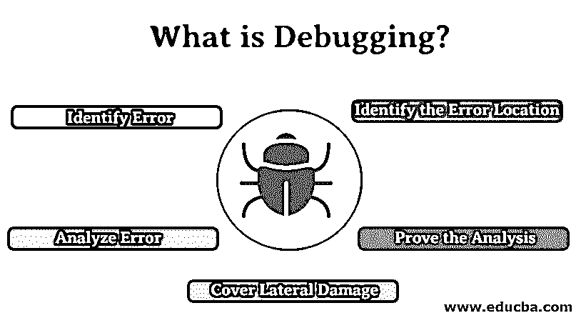

# 什么是调试？

> 原文：<https://www.educba.com/what-is-debugging/>

## 调试简介

调试是发现软件或应用程序中的错误并修复它们的过程。任何正在开发的软件程序或产品都要经历不同的步骤——在不同的环境中进行测试、故障排除和维护。这些软件程序或产品包含一些错误或缺陷。这些 bug 需要从软件中去除，才能开发出无 bug 的软件。调试只不过是一个过程，许多软件测试人员用它来找到那些错误并修复它们。调试是指发现错误，分析并修复它们。当软件由于一些错误或者软件执行了不需要的事情而失败时，这个过程发生。调试看起来很简单，但这是一项复杂的任务，因为在调试的每个阶段都需要修复所有错误。

### 为什么我们需要调试？

任何开发的软件在发布或进入市场之前都需要没有错误。由于市场竞争激烈，每个组织都想处于领先地位。如果你的软件没有错误，并且客户对你的软件满意，这是有可能的。如果客户在使用软件时没有发现任何错误，他或她会很高兴。为了让客户满意，软件需要没有错误，并通过使用调试过程来解决。这就是为什么每个组织在将它们发布到市场之前都必须进行调试的原因。

<small>网页开发、编程语言、软件测试&其他</small>

### 调试过程

下面是调试过程中涉及的阶段列表

#### 1.识别错误

在早期识别错误可以节省大量时间。如果我们在识别错误时犯了错误，就会导致大量的时间浪费。很难发现客户站点出现错误或缺陷。识别正确的错误对于节省时间和避免用户站点的错误非常重要。

#### 2.确定错误位置

识别错误后，我们需要识别代码中发生错误的确切位置。确定导致错误的确切位置有助于更快地解决问题。

#### 3.分析错误

在这一阶段，你必须使用适当的方法来分析错误。这将帮助你理解这个问题。这一阶段非常关键，因为解决一个错误可能会导致另一个错误。

#### 4.证明分析

一旦识别出的错误被分析出来，你就必须关注软件的其他错误。这个过程包括测试自动化，您需要通过测试框架编写测试用例。

#### 5.覆盖横向损坏

在这一阶段，[你必须对你修改的所有代码进行单元测试](https://www.educba.com/unit-testing/)。如果所有的测试用例都通过了测试，那么你可以进入下一个阶段，否则你必须解决没有通过测试的测试用例。
修复和验证:这是调试过程的最后阶段，你需要修复所有的错误并测试所有的测试脚本。

### 调试的优势

下面是调试优势的列表

*   **节省时间:**在初始阶段进行调试节省了软件开发人员的[时间](https://www.educba.com/career-as-a-software-developers/)，因为他们可以避免在软件开发中使用复杂的代码。它不仅节省了软件开发人员的时间，也节省了他们的精力。
*   **报告错误:**一旦出现错误，立即给出错误报告。这允许在早期阶段检测错误，并使[软件开发过程](https://www.educba.com/what-is-software-development/)没有压力。
*   **简单的解释:**通过提供更多关于数据结构的信息来提供简单的解释
    发布无错误软件:通过发现软件中的错误，它允许开发人员在发布之前修复它们，并向客户提供无错误的软件。

### 各种调试工具

为了识别和修复错误，已经使用了各种工具，调试工具是用于测试和调试其他软件程序的软件程序。市场上有许多开源调试工具，如 DBX、GDB 等。

下面列出了一些调试工具。
1。GDB(GNU 调试器)
2。LLDB
3。雷达 2
4。微软 visual studio 调试器
5。Valgrind
6。WinDBg
7。火狐 JavaScript 调试器
8。Eclipse 调试器
9。Arm DTT (Allinea DDT)
10。WDW (OpenWatcom 调试器)

### 调试策略

下面是不同的策略如下:

#### 1.学习策略

在[发现软件](https://www.educba.com/what-is-a-bug-in-software-testing/)或产品中的错误之前，非常仔细地了解该软件或产品是非常重要的。因为没有任何知识，你就找不到错误。如果你非常了解这个系统，并且知道它是如何工作的，那么只有你才能发现这个软件中的错误。

#### 2.经验

以前的经验可以帮助您找到类似类型的错误以及解决错误的方法。如何快速找到公共汽车取决于每个专家的经验。

#### 3.正向分析

程序的前向分析包括使用打印语句或不同点的断点跟踪程序的前向。它更关心获得错误输出的位置。

#### 4.逆向分析

程序的向后分析包括从错误发生的位置向后跟踪程序，以识别错误代码的区域。

### 结论

在本文中，我们已经了解了什么是调试，调试的过程以及调试的需求和优点。在这里，我们还讨论了各种调试工具和执行调试的策略。我希望这篇文章对你有所帮助。

### 推荐文章

这是什么是调试的指南？在这里，我们讨论了调试的过程、工具和策略以及优点。您也可以浏览我们推荐的其他文章，了解更多信息——

1.  [Python 的优势](https://www.educba.com/advantages-of-python/)
2.  [最佳 Java IDE](https://www.educba.com/best-java-ide/)
3.  [角度选择](https://www.educba.com/angularjs-alternatives/)
4.  [JavaScript 调试器](https://www.educba.com/javascript-debugger/)

