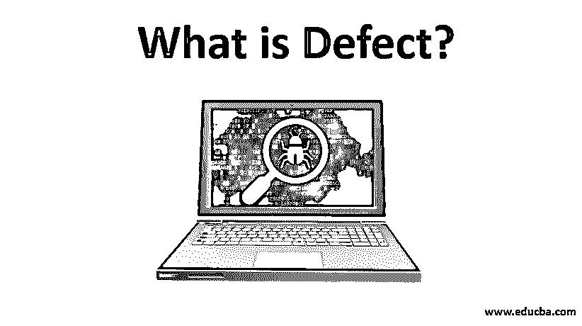

# 什么是缺陷？

> 原文：<https://www.educba.com/what-is-defect/>

## 缺陷介绍

一般来说，缺陷是指任何中断一个项目或产品正常预期行为的故障。在软件开发中，缺陷是应用程序的功能或实质属性上的错误，被视为偏离了客户提供的需求规范。缺陷有专门的管理过程和生命周期。重要的是，在将产品交付给客户之前，所有的缺陷都得到处理，从而维护客户关系。

### 什么是缺陷管理过程？

这个过程包括检测和修复它们。

<small>网页开发、编程语言、软件测试&其他</small>

1.  预防
2.  交付基线
3.  发现
4.  解决
5.  流程改进

让我们详细介绍一下这个过程。

#### 1.预防

要消除所有的缺陷，最好的办法就是阻止它们的到来。这有助于省钱，非常划算。为了达到这个阶段，在测试的早期阶段发现所有的缺陷是非常重要的。这里的主要目标是最小化缺陷的影响。这可以通过以下步骤完成:

*   **识别关键风险:**必须预先识别系统中的关键区域，以便在进行测试时影响较小或根本没有影响。
*   **预期影响的估计:**一旦确定了风险，就应该对如果风险实际转移到生产中会产生的财务影响进行估计。
*   **最小化预期影响:**通过此分析将发现一系列风险。最大的风险是有害的，这些风险应该被最小化或消除。不能完全去除的会降低该缺陷发生的概率。

#### 2.交付基线

基线是指达到预定义的里程碑的时间。当到达该步骤时，确保产品从一个阶段移动到另一个阶段。随着产品不断从一个阶段转移到另一个阶段，所有现存的缺陷也会随着产品的进展而前进。里程碑有一个截止日期，如果在截止日期之前[bug 被修复](https://www.educba.com/what-is-a-bug-in-software-testing/),那么它就不是缺陷。一旦编码和单元测试完成，那么代码就被称为是基线化的，并且[转移到系统测试](https://www.educba.com/system-testing/)。一旦在系统测试中发现问题，缺陷就会被提出。基线化的可交付成果是所有可交付成果被最终确定，并且所有可能的缺陷被修复的成果。

#### 3.发现

缺陷据说是在引起大家注意的时候发现的。分析后的开发团队被开发团队接受并加以修正。这里需要在它们成为拦截器之前进行检查。一旦测试团队发现缺陷，通知开发团队并确保缺陷被承认是测试人员的[责任。一旦收到确认，他们就可以进一步验证缺陷，并提供修复方法。](https://www.educba.com/software-tester-work/)

#### 4.解决

一旦报告了 bug，开发团队必须着手解决它。他们必须分析并优先修复发现的缺陷。如果影响较大，可以设置缺陷的优先级。具有较高优先级的缺陷首先被解决，具有较低优先级的缺陷稍后被解决。开发人员必须修复它，然后将修复情况通知测试人员。当这个活动被执行时，他们可以理解缺陷的原因。所有产生的缺陷必须被系统地分类。关键的问题必须立即解决。具有高优先级的缺陷也必须被修复，因为它们影响产品的主要功能。它应该具有与其要求的最小偏差。这种类型必须是中等的。可能具有较小影响缺陷应该被标记为低。

#### 5.流程改进

所有的缺陷都应该被修复。虽然他们可能有自己的优先事项，但应该确保所有事项都得到解决，而不管优先事项是什么。为了改进过程，重要的是所有的缺陷都被认为是关键的。最小的缺陷有助于提高质量和防止缺陷的发生。在这一切之后，另一个管理报告也是重要的一部分。所有单个缺陷都必须报告，所有相关信息都应提交给高级管理层。这也提供了对流程中可以改进的地方的洞察。

### 优势

下面给出了一些优点。

*   它的管理确保了被发现的错误确实得到了修复。在开发人员和测试人员的共同努力下，这有助于跟踪它直到结束。
*   一旦它们被修复，就可以确保系统中的所有缺陷都被消除。它确保交付高质量的产品。这样既省时又省钱。效率和经济性都保持得很好。
*   投资回报可以通过降低开发成本来提高。这意味着通过对问题进行优先排序，可以很容易地识别重复性问题。团队的生产力因此而提高。
*   问题一旦解决，就可以帮助确定模式或理解 bug 的趋势。他们对未来更有关联。可以尽早发现并解决常见问题。
*   由于测试人员和开发人员可以一起工作来解决发现的问题，沟通的差距可以减少。

### 结论

整个过程有助于解决缺陷并交付高质量的产品。永远不能保证不会发现错误，但是这个过程有助于简化整个过程并减少缺陷的数量。通过遵循整个流程，可以确保产品进入生产阶段时不会出现瓶颈。因此，节省了资金并交付了高质量的产品。

### 推荐文章

这是什么是缺陷的指南。在这里，我们将详细讨论基本概念、5 大流程以及优势。您也可以浏览我们推荐的其他文章，了解更多信息——

1.  [什么是遗传算法？](https://www.educba.com/what-is-genetic-algorithm/)
2.  [什么是谷歌云平台](https://www.educba.com/what-is-google-cloud-platform/)
3.  什么是功能测试？
4.  [人工测试面试问题](https://www.educba.com/manual-testing-interview-question/)

