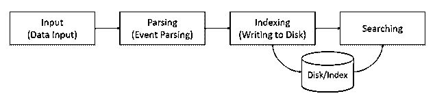

# Splunk 是免费的吗

> 原文：<https://www.educba.com/splunk-free/>

## Splunk 简介

Splunk 是一个软件平台，可帮助组织搜索、监控、可视化和分析从网站、服务器、移动应用程序、传感器、网络等产生的 gigs 大数据。它可以可视化您的实时环境，识别数据模式，并可以帮助您获得商业智能。最重要的是，它是一个高度可扩展的解决方案。

要将数据可视化到 Splunk 中，首先要接收数据。Splunk 免费版调用相关程序处理各种日志数据格式，如 Apache log、Tomcat log、db2 log 等。

<small>网页开发、编程语言、软件测试&其他</small>

将数据引入 Splunk 后，它会将数据集转换为一系列事件。 [Splunk 以处理时间](https://www.educba.com/what-is-splunk/)系列数据非常出色而闻名。

### Splunk 免费版包含以下组件:

1.  **搜索头:**有助于通过 GUI 进行搜索
2.  **步进器:**步进机器数据
3.  **转发器:**将日志转发给索引器

Splunk 转发有两种类型:

**a .通用转发器(UF)** :这是一个 Splunk 代理，通常安装在非 Splunk 系统上，用于本地收集数据。但是，它不能索引/解析数据。

**b .重量级货代(HWF):** 这是 Splunk 的一个示例实例，具有更多功能。

它可以在本地收集数据，转发数据并建立索引。简而言之，解析也完成了。

4.  **部署服务器**:这有助于 Splunk 在分布式环境中使用。

Splunk 整体可以大致分为 3 个阶段:

*   数据输入
*   数据存储
*   数据搜索

**1。数据输入:**当数据从数据源进入 Splunk 时，它将数据分成 64K 的块，并将每个块注释为元数据键。元数据关键字是主机名、源数据类型&的组合。

**数据存储:**数据存储包括数据解析&索引。

当数据被检查、分析并转换成相关信息时，这个过程被称为数据解析。Splunk 以同样的方式获取数据，并将其分解为数据流，进而分解为单个事件。

只有在解析之后才会进行索引，这意味着 Splunk 免费版会将解析的事件写入磁盘索引。索引为数据访问和搜索提供了便利。

Splunk 免费版能够索引各种数据，例如:

*   配置文件
*   日志文件
*   信息
*   剧本
*   警报
*   票

**3。数据搜索:**从海量数据中搜索是任何工具/应用的核心功能。Splunk 提供了大量的命令、功能和参数，使您能够对搜索进行过滤、修改、分组和重新排序。

Splunk 免费版能够很好地搜索单行或多行事件。

### Splunk 许可证的类型

1.  企业许可证
2.  货运代理许可证
3.  测试版许可证
4.  免费许可证
5.  搜索头许可证(用于分布式搜索)
6.  集群成员的许可证(用于索引复制)

Splunk 免费版缺少:身份验证、预定搜索、分布式搜索、转发到非 Splunk、部署管理

Splunk 根据可搜索存储库中实时数据的相关性，以美观的可视化形式生成图表、报告、仪表板和警报。

### Splunk 的详细用法

1.  **主动活动监控** : Splunk 免费版有助于监控和跟踪用户活动&特权帐户。这可以帮助组织以[实时方式](https://www.educba.com/real-time-analytics/)识别可疑活动/威胁。
2.  **安全&欺诈**:Splunk 更容易检测和调查恶意软件或其他可疑活动。除了检测，它还拍摄特定于仪表板并与报告相关的补救活动。这是通过从虚拟化层捕获精细的性能和事件数据，并将它们与其他实体(如数据存储)相关联来实现的。

例如:

*   发送到非公司域的大量电子邮件就是一个例子
*   过度使用端口
*   用户从非公司网站上传网页

**1。监控系统** : Splunk 免费版可帮助您识别关键系统何时可能停机。这是通过分析系统之间发送的日志来完成的。

**2。检测渗漏**:它有助于隔离需要更多关注的事件和日志。

**3。容量监控和规划**:在 Splunk 的帮助下，您可以全面了解环境并识别未充分利用/过度利用的资源。您可以看到资源使用的趋势，并可以预测资源的使用情况。还可以为巨大的流量管理规划资源的实时重新分配。

**4。库存监控** : Splunk 免费版可帮助您跟踪环境中的所有配置项目，如主机、虚拟机、数据存储和网络。

**5。变更跟踪** : Splunk 帮助跟踪拓扑、网络、资源等方面的变更。您可以比较各种指标来了解问题，从而做出基于事实的决策。

### Splunk 免费版与 Spark 的比较

*   Splunk 是专有的，而 Spark 是开源工具。
*   Splunk 用于收集机器生成的数据并将其可视化。Spark 是大数据的内存处理。
*   Splunk 在流模式下使用，而 Spark 既适用于流模式(例如任何应用程序的实时流)，也适用于批处理模式。

很多时候，当人们将 Splunk 视为可视化工具时，会将 Splunk 与 Tableau 进行比较。了解两者的区别有助于您决定哪一种最适合组织的各种情况。

### Splunk 免费版与 Tableau 的比较

*   Splunk 是端到端解决方案。从数据的收集到数据(结构化、非结构化或半结构化数据)的索引和可视化，它执行所有。然而，Tableau 只是一个可视化工具。
*   Splunk 主要用于机器生成的数据集，如自动柜员机、数据中心、IT 性能、移动设备等。

Splunk 的竞争对手有 IBM LogAnalysis、Micro Focus ArcSight、LogRhythm。

### 结论

Splunk 是一款非常智能、动态和多功能的工具。收集企业的统计数据可以帮助你以一种非常有效的方式重塑企业。

### 推荐文章

这是免费 Splunk 的指南。这里，我们讨论了 Splunk 免费版的基本概念和 Splunk 示例。你也可以看看下面的文章:

1.  [SQL 是微软吗？](https://www.educba.com/is-sql-microsoft/)
2.  [大数据是数据库吗？](https://www.educba.com/is-big-data-a-database/)
3.  卡桑德拉是 NoSQL 吗？
4.  [Splunk 的用途](https://www.educba.com/uses-of-splunk/)

