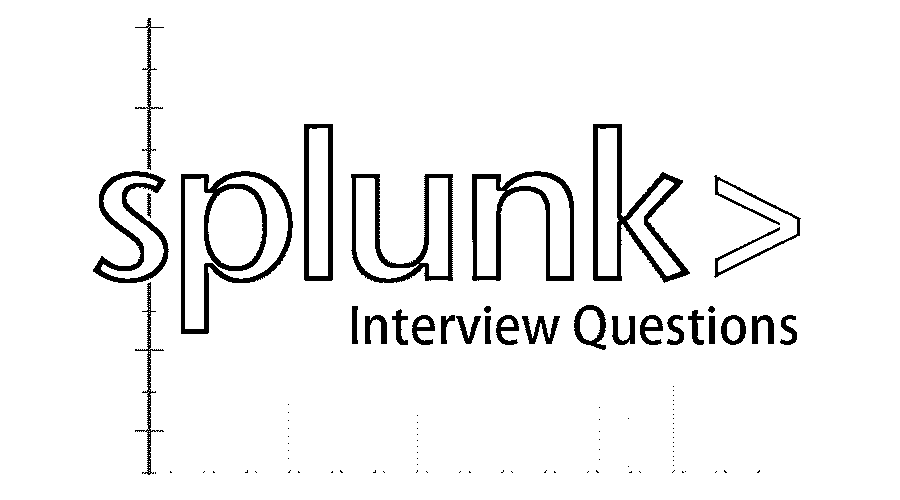
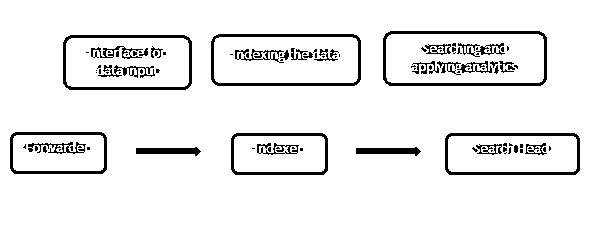
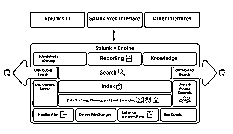

# Splunk 面试问题

> 原文：<https://www.educba.com/splunk-interview-questions/>

## Splunk 访谈问答–简介

So you have finally found your dream job in Splunk but are wondering how to crack the Splunk Interview and what could be the probable Splunk Interview Questions for 2022\. Every interview is different and the scope of a job is different too. Keeping this in mind we have designed the most common Splunk Interview Questions and Answers for 2022 to help you get success in your interview.

以下是最有用的 Splunk 面试问答。这些顶级问题分为以下两部分:

### 第 1 部分–Splunk 面试问题(基础)

这第一部分包括基本的面试问题和答案。

<small>网页开发、编程语言、软件测试&其他</small>

#### 1.Splunk 是什么？为什么 Splunk 用于分析机器数据？

**回答:**
目前最常用的分析工具之一是微软的 Excel，它的缺点是 Excel 最多只能加载 1048576 行，而且机器数据通常非常庞大。Splunk 在处理机器生成的数据(大数据)方面非常方便，来自服务器、设备或网络的数据可以轻松加载到 Splunk 中，并可以进行分析以检查任何威胁可见性、合规性、安全性等。它还可以用于应用程序监控。

#### 2.解释 Splunk 的工作原理？

**答案:**
这是在面试中常见的 Splunk 面试问题。使用转发器将数据加载到 Splunk 中，转发器充当 Splunk 环境与外部世界之间的接口，然后将数据转发到索引器，数据存储在本地或云上。索引器将机器数据编入索引，并将其存储在服务器中。搜索头是 Splunk 提供的用于搜索和分析(搜索、可视化、分析和执行各种其他功能)数据的 GUI。
部署服务器管理 Splunk 环境中的所有 Splunk 组件，如索引器、转发器和搜索头。

#### 3.Splunk 常用的端口号是什么？

**回答** :
运行服务的常用端口号(默认情况下)有:

| 服务 | 通道数 |
| 管理/ REST API | Eight thousand and eighty-nine |
| 搜索头/步进器 | Eight thousand |
| 搜索头 | 8065, 8191 |
| 索引器集群对等节点/搜索头集群成员 | Nine thousand eight hundred and eighty-seven |
| 分度器 | Nine thousand nine hundred and ninety-seven |
| 索引器/转发器 | Five hundred and fourteen |

让我们进入下一个 Splunk 面试问题。

#### 4.为什么只使用 Splunk？

**回答:**
Splunk 有许多替代产品，给它带来了很多竞争，其中一些如下:

**·ELK/Logstash(开源)**
Elasticsearch 用于搜索，类似于 Splunk 中的搜索头，Log stash 用于数据收集，类似于 Splunk 中使用的转发器，Kibana 用于数据可视化(Splunk 中的搜索头也是如此)

**【gray log(开源商业版)**
Graylog 是另一个工具，去年发布了 1.0 版。与 ELK stack 类似，Graylog 也有不同的组件，它使用 Elasticsearch 作为其核心组件，但数据存储在 Mongo DB 中，并使用 Apache Kafka。它有两个版本，一个是免费提供的核心版，另一个是带有存档等功能的企业版。

**·Sumo Logic(云服务)**
因此，Splunk 的最大优势在于，Splunk 是内置数据收集器、存储和分析工具的单一产品包。Splunk 也是可扩展的，并为其企业版提供支持/专业帮助。

#### 5.简单解释一下 Splunk 架构？

**回答:**
下图给出了 Splunk 架构及其组件的简要概述。

### 第 2 部分–Splunk 面试问题(高级)

现在让我们来看看高级面试问题。

#### 6.Splunk 架构的组件有哪些？

**回答:**
Splunk 架构中有四个组件。它们是:

*   **步进器:**步进机器数据
*   **转发器:**将日志转发到索引
*   **搜索头:**提供用于搜索的 GUI
*   **部署服务器:**管理分布式环境中的 Splunk 组件(索引器、转发器和搜索头)

#### 7.举几个知识对象的用例？

**回答** :
这是在面试中经常被问到的 Splunk 面试问题。知识对象可以用于许多领域。几个例子是:

*   **应用程序监控:**这可用于实时监控应用程序，并配置警报，在应用程序崩溃时通知管理员/用户。
*   **物理安全:**在发生洪水/火山爆发等事件时，如果您的组织正在处理任何此类数据，这些数据可用于获取洞察力。
*   **网络安全:**您可以通过将未知设备的 IP 列入黑名单来创建一个安全的环境，从而减少任何组织中的数据泄露。
*   **员工管理:**员工流失是任何组织都面临的挑战之一，在通知期内，可以跟踪员工的活动，以保护组织的数据，从而监控他们的活动，并限制通知期内的任何其他员工不要这样做。

#### 8.解释搜索因子(SF)和复制因子(RF)？

**回答:**
这些是 Splunk 集群技术中使用的术语。索引器群集是一组专门配置的 Splunk 企业索引器，它复制外部数据并用于灾难恢复。
就 Splunk 文档搜索而言，该因素可以描述为“索引器集群维护的可搜索数据副本的数量。搜索因子的默认值是 2 ”,而复制因子被定义为群集维护的数据副本的数量。
索引器集群具有搜索因子和复制因子，而搜索头集群只有搜索因子

#### 9.什么是 Splunk 桶？解释铲斗的生命周期？

**答:**
存储索引数据的目录称为 Splunk 存储桶，这些存储桶具有特定周期的事件。Splunk 水桶的生命周期包括四个阶段:热、温、冷、冷冻和解冻。

*   **Hot:** 这个桶包含最近索引的数据，并且是打开的以供写入。
*   **Warm:** 根据您的数据策略，数据落入热存储桶后，会移动到 Warm 存储桶
*   **Cold "**warm 之后的下一个阶段是 Cold 阶段，数据不可编辑。
*   **冻结:**默认情况下，索引器从冻结桶中删除数据，但这些数据也可以存档。
*   **解冻:**从存档文件(冻结桶)中检索信息称为解冻。

#### 10.为什么我们应该使用 Splunk Alert？设置警报时有哪些不同的选项？

**回答:**
警惕任何可能的错误的状态称为警报，在 Splunk 中，任何连接故障、安全违规或违反任何用户创建的规则都可能引发环境警报。

例如，向应用程序管理员发送通知或用户在门户中尝试三次后登录失败的报告。

设置警报时可用的不同选项有:

*   可以创建一个 webhook 来将警报写入 hipchat 或 GitHub。
*   添加结果，。csv 或 pdf 格式或与邮件正文一致，以便可以确定警报的根本原因。
*   可以从一台机器或一个 IP 创建票证并限制警报。

### 推荐文章

这是 Splunk 面试问题和答案列表的指南，以便候选人可以轻松地解决这些面试问题和答案。您也可以阅读以下文章，了解更多信息——

1.  [SAS 系统面试问题](https://www.educba.com/sas-system-interview-questions/)
2.  [Tableau 面试问题](https://www.educba.com/tableau-interview-questions/)
3.  [甲骨文面试问题](https://www.educba.com/oracle-interview-questions/)
4.  [网络安全面试问题](https://www.educba.com/network-security-interview-questions/)

