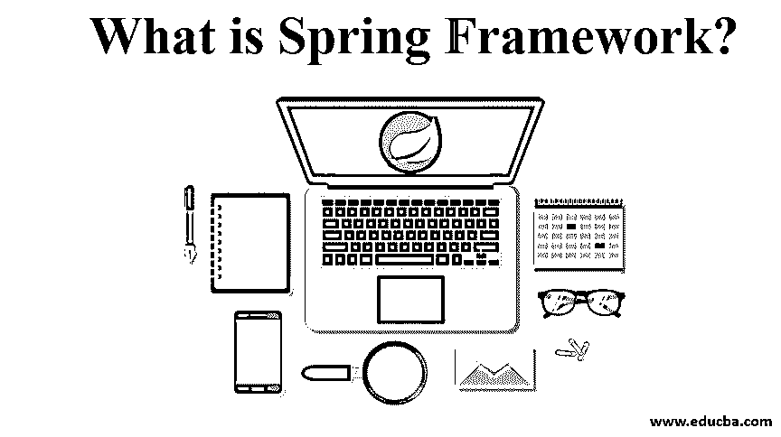

# 什么是 Spring 框架？

> 原文：<https://www.educba.com/what-is-spring-framework/>

## Spring 框架简介

Spring Framework 是一种产品开发的方法，当需求与依赖注入(DI)的需求、产品的轻量级结构、POJO 或普通的旧 java 对象、AOP 或面向方面的编程、单元测试选项、模块化开发选项等标准一起出现时。Spring 框架中有许多功能使其从其他产品开发框架中脱颖而出，如 Spring web services、Spring test content framework、JDBC 抽象层、Spring MVC 框架、一个名为 IoC container 的配置管理捆绑包、事务管理等。

### 什么是 Spring 框架？

在引入企业 Java bean(EJB)之前，开发人员必须使用 Java Beans 来创建 web 应用程序。在这样做的同时，开发者不能通过 JavaBeans 提供事务管理和安全类的服务。当引入 EJB 时，开发健壮和安全的应用程序的问题得到了解决，但在开发企业应用程序时，又产生了另一个问题，即创建本地和远程接口。因此，引入 Spring 框架是为了减轻与应用程序开发相关的复杂性。

<small>网页开发、编程语言、软件测试&其他</small>

这个框架引入了新的概念，如[面向方面编程(AOP)](https://www.educba.com/what-is-aop/) 、普通旧 Java 对象(POJO)和[依赖注入](https://www.educba.com/dependency-injection-in-spring/) (DI)，并确保正在开发的框架是轻量级的。

### Spring 框架的特性

现在让我们来看看 Spring 框架的一些特性，这些特性使它独一无二，并且有可能减轻开发人员的任务。

#### 1.IoC 容器

在运行时，需要隐式引用一个对象，任务由 IoC 容器承担。这个容器由负责配置管理的汇编代码组成。作为参考，使用的包是 org.springframework.beans 和 org.springframework.context。

#### 2.数据访问框架

这个特性使开发人员能够使用持久性 API。用于使用 JDBC 或 Hibernate 在数据库中存储持久性数据。持久性数据是这样一种数据，即使被修改，也会存储其以前的版本。连接到数据库的方式、确保连接关闭、处理异常、实现事务管理系统是该特性下的一些其他任务。

#### 3.Spring MVC 框架

这个框架特性有助于开发人员在 MVC 架构的基础上构建 web 应用程序。

#### 4.事务管理

顾名思义，这个框架有助于在不干预代码的情况下构建事务管理系统。Java 事务 API 在这个框架中提供给全局事务。

#### 5.Spring Web 服务

web 服务的端点和基于 Java 类的定义都是使用这个特性来生成和管理的。管理端点和定义是一项复杂的任务，因此 Spring Web 服务提供了一种基于层的方法来处理这项任务。

#### 6.JDBC 抽象层

这个特性帮助开发人员以一种简单有效的方式处理错误。这里的抽象层有助于减少 JDBC 编程代码。

#### 7.Spring TestContext 框架

最后但同样重要的是，这个特性为开发人员提供了 Spring 应用程序的单元和集成测试框架。作为该特性的一部分，还提供了特定的集成测试功能。

本节中讨论的特性提供了从 Spring 框架中提取的一系列好处，此外还减少了开发人员在重复编码和版本控制中的摩擦和痛苦。

### 我们为什么要使用 Spring 框架？

Spring framework 除了拥有神奇的力量之外，还带来了很多好处。

其中一些是:

*   当开发人员使用 POJOs 开发企业级应用程序时，不需要额外的 EJB 容器，只使用健壮的服务器，如 Tomcat 和其他健壮的 servlets。
*   Spring 是一个模块化的框架，尽管包的数量很多，但是人们只需要关注他们需要的那些。
*   没有重新发明轮子，而是重复使用现有技术。
*   单元测试框架的[条款有助于开发人员全面测试应用程序，而不用担心丢失任何案例。](https://www.educba.com/unit-testing/)
*   使用 Spring 将特定于技术的异常作为未检查的异常抛出。
*   Spring 的事务接口有助于将应用程序缩小到局部事务级别，甚至扩大到全局事务级别。

### Spring 框架的架构

在上图中，体系结构被描述为一个单一的结构，在接下来的几行中，我们将详细介绍体系结构图中提到的 7 个模块。

*   **Spring 核心模块:**Spring 核心模块是 Spring 框架的核心组件，提供 IoC 容器。在这个模块中，对象被表示为应用程序的组成，并且应用程序对象之间的相互依赖被移除。
*   **Spring AOP 模块:**[Spring AOP 模块类似于](https://www.educba.com/spring-aop/)面向对象编程。哎呀，概念将应用程序分解成对象的层次结构，AOP 将程序分解成方面或关注点。方面只不过是模块化关注点的技术，关注点就像跨越许多对象的事务/日志/安全。
*   ORM 模块:ORM 模块有助于从数据库中获取数据。
*   **Spring Web MVC 模块:**它帮助[的 Spring 实现 MVC 架构](https://www.educba.com/mvc-architecture/)来创建[的 Web 应用](https://www.educba.com/what-is-web-application/)，因为它分离了代码的模型和视图组件。
*   Spring Web Flow:Spring Web Flow 只是 Spring Web MVC 模块的一个扩展，它帮助定义管理不同 UI 页面之间工作流的 XML 文件或 Java 类。
*   **Spring DAO:**Spring DAO 包提供了 JDBC、Hibernate 等数据访问技术。
*   Spring Context 模块:Spring Context 模块是 BeanFactory 的接口，支持国际化、验证、事件传播和资源加载等功能

### 结论

在本文中，我们遇到了 Spring 框架的不同方面。在这个框架中开发应用程序的开发人员可以根据应用程序逻辑的要求自由使用任何模块。模块化架构有助于轻松集成其他框架。Spring Framework tool 是一个标准化工具集合的有用工具，让您的编程生活变得简单而轻松！

### 推荐文章

这是一个什么是 Spring 框架的指南？这里我们讨论 spring 框架的介绍和特性，以及 spring 框架的使用和架构。您也可以阅读以下文章，了解更多信息——

1.  [Java 框架](https://www.educba.com/frameworks-in-java/)
2.  [春云的特征](https://www.educba.com/what-is-spring-cloud/)
3.  [春云 vs Spring Boot](https://www.educba.com/spring-cloud-vs-spring-boot/)
4.  [春天的建筑](https://www.educba.com/spring-architecture/)

