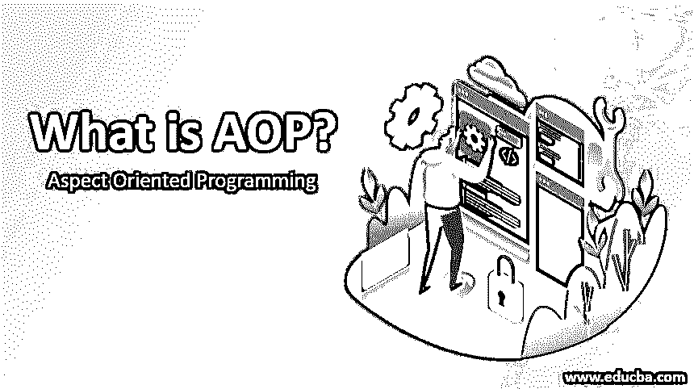

# 什么是 AOP？

> 原文：<https://www.educba.com/what-is-aop/>




## 什么是 AOP？

面向方面的编程是 AOP 的完整形式，顾名思义，我们在[编程语言中使用方面。方面的主要](https://www.educba.com/what-is-a-programming-language/)用途之一是它允许我们将代码分成不同的模块，这个过程被称为模块化。在 AOP 中，方面使我们能够实现横切关注点，如日志、事务等。

### **我们为什么需要 AOP？**

*   AOP 使面向方面的编程成为 spring 应用程序的一部分，这些方面进一步使模块化成为可能，如安全、事务、日志等，这些方面切割了多种类型的对象。它还允许我们使用一些配置在代码前后动态地添加横切关注点。它使我们的代码易于维护，删除重复的代码，并保持可读性。
*   在编写代码时，我们有一个关于 web 应用程序安全性的示例，我们有很多需要安全性的地方，即每个人都不能访问应用程序的某个部分，或者需要一些身份验证，因此，我们只需在每个方法或类上重复代码，就可以将代码编写到公共类中，并将其用于整个应用程序。
*   所以对我们来说，它将把我们的程序代码分成不同的部分，这些小部分被称为关注点，我们用它来增加模块性。

#### 要使用的示例

下面是一个简单的例子来展示 AOP(如何使用):

<small>网页开发、编程语言、软件测试&其他</small>

假设在一个类中我们有 n 个不同的方法，那么 AOP 让我们在我们的逻辑前后添加这个横切关注点。

```
class AOPDemo{
public void B1(){...}
public void B2(){...}
public void C3(){...}
public void C4(){...}
public void D5(){...}
public void D1(){...}
public void D2(){...}
public void Z1(){...}
public void Z2(){...}
public void Z3(){...}
//..  so many methods can be define here
}
```

在上面的例子中，我们有很多方法，假设我有一些场景，在这些场景中，我需要在建立数据库连接之后或者在调用方法直到 c。

*   没有 AOP: 我需要在所有方法中编写代码，这意味着重复代码来做同样的事情，但是如果将来需求发生变化，那么我需要在所有地方进行更改，这会导致维护问题。
*   使用 AOP :现在使用 AOP，我们不需要编写相同的逻辑，我们只需要创建交叉关注点，它的条目将进入 XML 文件。

### AOP 的工作

在 AOP 中我们有各种各样的术语，比如:

*   Joinpoint
*   建议
*   切入点
*   介绍
*   目标对象
*   方面
*   拦截机
*   AOP 代理
*   编织

让我们逐一讨论:

**1。Aspect:** 在这里，我们创建了一个 normal，它将实现安全、日志、事务等横切关注点，所有这些都被称为 Aspect。对于这些，我们可以使用 XML 配置或基于注释的配置。我们需要让它进入。xml 文件，如果我们使用 xl 配置，我们也可以使用基于@Aspect 注释的配置。

**2。编织:**在这个过程中，我们试图将我们的方面与我们将在接下来的要点中讨论的建议联系起来。这个过程可以在编译时、加载时或运行时完成。但是在春天，它是在运行时完成的。

**3。建议:**这告诉我们何时执行工作，或者我们可以将它定义为方面采取的行动。

在 AOP 中，我们有五种类型的建议:之前、之后、绕过、返回之后。

*   **After:** 该通知在方法完成执行时运行。它不依赖于程序的输出。我们可以使用@After 注释来定义它。
*   **Around:** 这个建议在方法执行前后运行，因为它环绕了整个代码。我们可以使用@Around 注释来定义它。因此它被认为是所有建议中最有力的建议。
*   **Before:** 该建议在方法执行之前运行。我们可以用@Before 来定义。
*   **返回后:**该建议在方法执行后运行，但方法执行应该成功，没有任何异常。因此，我们可以说它是在成功执行方法之后执行的。我们可以用@AfterReturning 来定义它。
*   **AfterThrowing:** 当一个方法抛出运行时异常时，这个通知运行。我们可以用@AfterThrowing 来定义它。

**代码:**

```
@Aspect
class LoggingDemo {
// Before Advice
@Before("execution(public void com.aspect.ImplementAspect.aspectCall())")
public void loggingAdvice1()
{
System.out.println("Demo for Before advice");
}
// AfterRunning Advice
@AfterReturning("execution(public void com.aspect.ImplementAspect.myMethod())")
public void loggingAdvice5()
{
System.out.println("Demo for AfterReturning advice");
}
// Around Advice
@Around("execution(public void com.aspect.ImplementAspect.myMethod())")
public void loggingAdvice3()
{
System.out.println("Demo for around advice");
}
// AfterThrowing Advice
@AfterThrowing("execution(" public void com.aspect.ImplementAspect.aspectCall())
")
public void
loggingAdvice4()
{
System.out.println("Demo for AfterThrowing advice");
}
// After Advice
@After("execution(public void com.aspect.ImplementAspect.aspectCall())")
public void loggingAdvice2()
{
System.out.println("Demo for After Advice.");
}
}
```

**4。在我们的代码中，我们有很多地方可以应用点来执行我们的建议，这些点基本上被称为连接点。**

**5。切入点:**它匹配连接点，因为我们不能在每个地方都应用建议。

**6。简介:**文件和方法的介绍。

7 .**。目标对象**:它是一个代理对象。

**8。拦截器:**这只能包含一条建议。

**9。AOP 代理:**它是一个 JDK 动态代理。

### AOP 的特点

AOP 提供了许多东西，例如:

*   建议之前
*   建议之后
*   围绕建议
*   返回建议后
*   抛出建议后

这可以用来提供集中的日志记录、安全性等。

### AOP 的优点和缺点

下面是 AOP 的优点和缺点:

#### 优势

*   维护
*   排除故障
*   通过横切关注点，它帮助我们提高可理解性和可维护性。
*   方面和类的重用
*   降低编码成本。
*   较短的代码

#### 不足之处

*   代码膨胀:在 AOP 中，小的源代码会导致大的对象。
*   工具链、探查器和调试器不可用。
*   运行时间开销

### 结论

AOP 基本上用于模块化，将我们的代码分成各种小代码。从而增加代码可读性、可维护性。它为我们提供了实现这一点的各种术语。这有助于我们创建集中的日志记录、安全性等。

### 推荐文章

这是一本关于什么是 AOP 的指南？这里我们讨论为什么我们需要，AOP 中的各种术语以及它们的特点和优缺点。您也可以浏览我们的其他相关文章，了解更多信息——

1.  [什么是 Spring Integration？](https://www.educba.com/what-is-spring-integration/)
2.  [Python 全局变量](https://www.educba.com/python-global-variable/)
3.  [Python 中的字符串数组](https://www.educba.com/string-array-in-python/)
4.  [春季 AOP](https://www.educba.com/spring-aop/)


