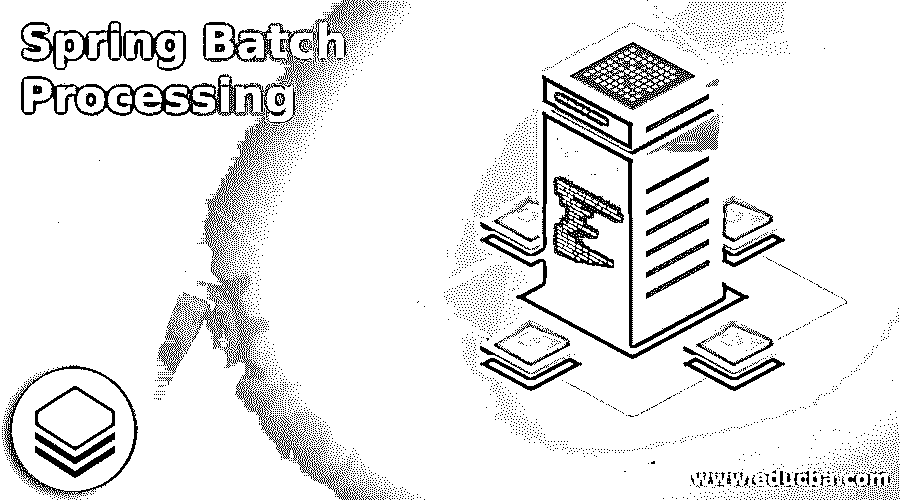
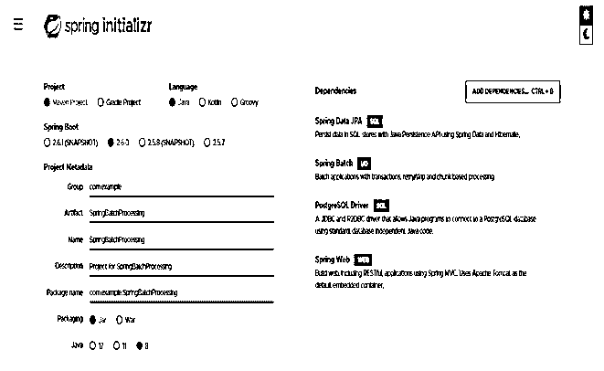
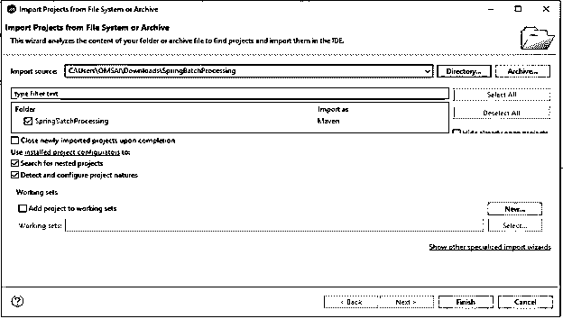
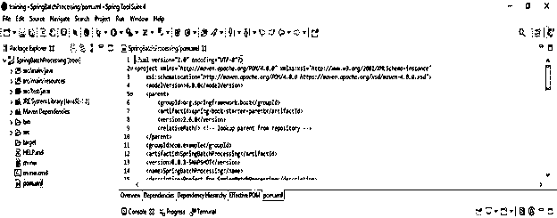
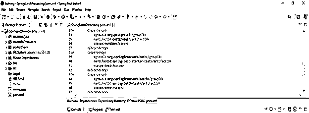
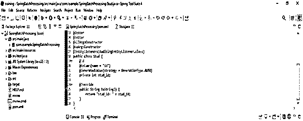
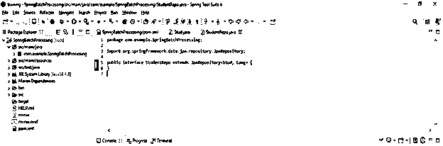
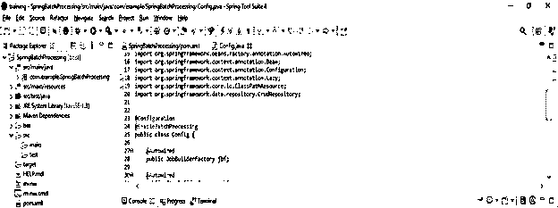
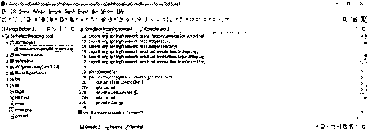
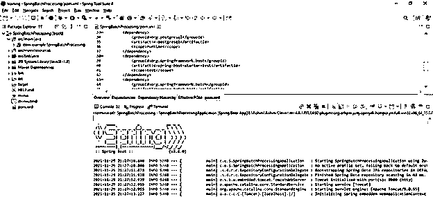

# 春季批量加工

> 原文：<https://www.educba.com/spring-batch-processing/>

## Spring 批处理简介

Spring 批处理的特点是非交互式的、经常长时间运行的后台执行，面向批量的处理在几乎每个行业和各种任务中都有使用。批处理可能是数据量大或计算量大的，可以按顺序或并行运行，并且可以使用不同的调用模型启动，比如临时、调度或按需。Spring Batch 是一个轻量级的、功能丰富的框架，它使得创建可靠的批处理应用程序变得更加容易。

### 什么是春季批量处理？

*   任何开发人员都应该熟悉批处理的基本概念。
*   它介绍了批处理中 spring Batch 的基本概念和短语。
*   由许多步骤组成的作业通常封装了一个批处理操作。ItemProcessor、ItemReader 和 ItemWriter 通常出现在每个步骤中。
*   JobLauncher 执行作业，而 JobRepository 存储有关已配置和已执行作业的元数据。
*   每个作业可以有几个 JobInstances，每个 JobInstances 都由自己的一组作业参数定义。例如，JobExecution 是作业实例的单次运行的名称。
*   每个作业都由一个或多个步骤组成，每个步骤都是批处理作业中独立的特定部分。
*   与作业类似，单步执行表示执行一个步骤的一次尝试。StepExecution 跟踪当前和退出状态、开始和完成时间，以及指向相应的 Step 和 JobExecution 实例的指针。

### Spring 批处理应用程序设置

下面的例子显示了如何设置 spring 批处理的项目。

<small>网页开发、编程语言、软件测试&其他</small>

*   使用 spring 初始化器创建 spring 批处理的项目模板
*   在下面的步骤中，我们已经提供了项目组名为 com.example，工件名为 SpringBatchProcessing，项目名为 SpringBatchProcessing，选择的 java 版本为 8。此外，我们将 spring boot 版本定义为 2.6.0，将项目定义为 maven。
*   我们在下面的项目中选择了 spring web、spring batch、spring data JPA 和 PostgreSQL 驱动依赖来实现 spring 批处理项目。

`Group – com.example
Artifact name – SpringBatchProcessing
Name – SpringBatchProcessing
Spring boot – 2.6.0
Project – Maven
Java – 8
Package name - com.example.SpringBatchProcessing
Project Description - Project for SpringBatchProcessing
Dependencies – spring web, PostgreSQL driver, spring batch, Spring data JPA.`

*   **生成项目后，提取文件，使用 spring 工具套件打开该项目—**

在这一步中使用 spring 初始化器生成项目之后，我们提取 jar 文件并使用 spring 工具套件打开项目。

*   **使用 spring 工具套件打开项目后，检查项目及其文件—**

在这一步中，我们检查所有的项目模板文件。我们还需要检查 maven 依赖项和系统库。

*   **添加依赖包—**

在这一步中，我们将在 spring batch 项目中添加 spring batch admin 依赖项。

**代码—**

`<dependency>   -- Start of dependency tag.
<groupId>org.springframework.batch</groupId>   -- Start and end of groupId tag.
<artifactId>spring-batch-test</artifactId>  -- Start and end of artifactId tag.
</dependency>    -- End of dependency tag.
<dependency>   -- Start of dependency tag.
<groupId>org.postgresql</groupId>   -- Start and end of groupId tag.
<artifactId>postgresql</artifactId>  -- Start and end of artifactId tag.
</dependency>    -- End of dependency tag.`

*   **创建数据层-**

**代码—**

`@Entity(name = "student")
@Getter
@Setter
@AllArgsConstructor
@NoArgsConstructor
@EntityListeners (AuditingEntityListener.class)
public class Stud
{@Id
@Column(name = "id")
@GeneratedValue (strategy = GenerationType.AUTO)
private int stud_id;
@Override
public String toString() {
return "stud_id: " + stud_id;
}
}`

*   **创建存储库层—**

**代码—**

`public interface StudentRepo extends JpaRepository<Stud, Long> {
}`

*   **创建处理器—**

**代码—**

`public class StudProcessor implements ItemProcessor {
private static final Logger l = (Logger) LoggerFactory.getLogger(StudProcessor.class);
public String process(final Stud st) throws Exception {
final String firstName = st.getStud_ID ().toUpperCase();
String student = null;
l.info("Convert (" + st + ") into (" + student + ")");
return student;
}
@Override
return null;
}
}`

*   **创建配置层—**

**代码—**

`@Configuration
@EnableBatchProcessing
public class Config {
@Autowired
public JobBuilderFactory jbf;
@Autowired
public StepBuilderFactory sbf;
@Bean
public FlatFileItemReader<Stud> reader() {
return new FlatFileItemReaderBuilder<Stud>()
.name("studReader")
.resource(new ClassPathResource("stud.csv"))
.delimited()
.names(new String[]{"Stud_id"})
.fieldSetMapper(new BeanWrapperFieldSetMapper<>() {{
setTargetType(Stud.class);
}})
.build();
}
@Bean
public RepositoryItemWriter<Stud> writer()
{
RepositoryItemWriter<Stud> iwriter = new RepositoryItemWriter<>();
CrudRepository<Stud, ?> studRepo = null;
iwriter.setRepository(studRepo);
iwriter.setMethodName("Save");
return iwriter;
}`

*   **创建控制器层**

**代码—**

`@RestController
@RequestMapping(path = "/batch")// Root path
public class Controller
{
@Autowired
private JobLauncher jl;
@Autowired
private Job j;
@GetMapping(path = "/start")
public ResponseEntity<String> startBatch () throws org.springframework.batch.core.repository.JobRestartException
{
JobParameters p = new JobParametersBuilder()
.addLong("started", System.currentTimeMillis()).toJobParameters();
return new ResponseEntity<>("Process of batch is started", HttpStatus.OK);
}
}`

*   **配置 application.properties 文件—**

**代码**

`server.port=8080
spring.batch.job.enabled=false`

*   运行应用程序–

### Spring 批处理框架

*   Spring Batch 是一个轻量级的、功能丰富的批处理框架，支持创建对企业系统的日常操作至关重要的可靠的批处理应用程序。
*   处理大量数据的批处理操作可以以高度可伸缩的方式利用该框架。
*   Spring Batch 基于 Spring 框架；我们应该熟悉 spring 的能力和功能。
*   Spring batch 的好处是很少依赖于项目，更容易快速启动和运行。

### 关键概念和术语

*   ExecutionContext 由 Spring Batch 保存，如果需要重新启动批处理作业，这很有用。
*   所有这些持久性都是通过 Spring Batch 中的 JobRepository 机制实现的。此外，它还为 JobLauncher、Job 和 Step 实例化提供 CRUD 操作。
*   在作业启动后，从存储库中检索 JobExecution，并且在执行过程中，StepExecution 和 JobExecution 实例会保持不变。
*   要开发一个 spring boot 处理应用程序，我们需要在 pom.xml 文件中添加 spring web、spring batch、spring data JPA 和 PostgreSQL 驱动依赖。

### 结论

任何开发人员都应该熟悉批处理的基本概念。Spring Batch 是一个轻量级的、功能丰富的批处理框架。Spring batch 的特点是非交互式的、经常长时间运行的后台执行，面向批量的应用于几乎每个行业和各种各样的任务。

### 推荐文章

这是 Spring 批处理的指南。这里我们讨论 Spring 批处理框架以及关键概念和术语。您也可以看看以下文章，了解更多信息–

1.  [Spring Boot 码头工人](https://www.educba.com/spring-boot-docker/)
2.  [Spring Boot·梅文](https://www.educba.com/spring-boot-maven/)
3.  什么是 Spring Boot？
4.  [Spring Boot 面试问题](https://www.educba.com/spring-boot-interview-questions/)

