# 春季批量分割器

> 原文：<https://www.educba.com/spring-batch-partitioner/>

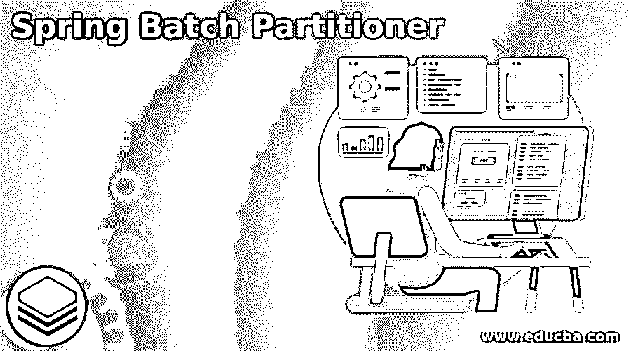

## Spring 批处理分割器简介

Spring batch partitioner 处理各种数据集，partitioner 使用几个线程。可以指定以编程方式定义的数据集范围。这取决于用例以及我们想要为分区器建立多少线程。使用的线程数量完全由需求决定。为了使并行处理成为可能，我们必须划分批处理任务的步骤。

### 什么是春批分割器？

*   Spring Batch 是开源批处理框架之一。单个线程用于执行 spring 批处理脚本。
*   但是，在某些情况下，单个线程的使用会在执行过程中消耗大量时间。
*   这可以通过使用分区步骤执行来实现，其中每个作业处理一小部分工作，并且所有作业同时运行。
*   我们将同时从大量 csv 文件向数据库传送数据。这将导致运行时间的减少和效率的提高。
*   有多种选项可用于实现带有一些并行处理的作业。在较高级别上有两种类型的并行处理:
*   多进程
*   多线程、单进程
*   当从源系统中读取数百万的数据时，我们不能依靠一个单独的线程来处理所有的数据，这可能很耗时，这时分区器就派上了用场。
*   我们希望在多个线程中读取和处理数据，以充分利用系统资源。
*   通过采用多线程执行，spring boot 批处理分割器将有助于提高 spring boot 批处理的速度。
*   spring boot batch partitioner 将使用多线程环境中的几个线程来划分和运行批处理进程。
*   分区器将加速批处理。分区器将在不同的线程中处理每个 csv 文件。
*   因为批处理作业在后台运行，不需要人工参与，所以它们的扩展稍微困难一些。
*   因此，监控用户响应请求的时间并不是一个有用的性能指标。
*   处理一个批处理作业所需的时间是有限的。批量应用通常在晚上进行，并且有固定的完成时间。缩放批处理任务的目的是满足所需的执行时间。

### Spring 批处理分割器步骤

*   分区器是中央策略接口，用于生成 ExecutionContext 实例作为分区阶段的输入参数。
*   我们正在查询数据集的最大和最小 id 值，并基于此在所有记录中构建分区。
*   我们使用 gridSize =分区器的线程数。我们可以根据自己的需求创建自己的定制价值。
*   以下是开发任何分区应用程序时使用的步骤。
*   使用 spring 初始化器创建一个项目模板。
*   创建项目后，使用 spring 工具套件打开项目模板。
*   添加 spring batch partitioner 依赖项。
*   然后创建一个分区器并定义记录的范围。
*   创建分区器后，创建批处理和处理器。
*   加载数据并运行应用程序。

### Spring 批处理分割器示例

下面的例子显示了 spring 批处理分割器如下。

<small>网页开发、编程语言、软件测试&其他</small>

*   **使用 spring 初始化器创建 spring 批处理分割器的项目模板**

在下面的步骤中，我们提供了项目组名 com.example，工件名 SpringBatchPartitioner，项目名 SpringBatchPartitioner，以及选择的 java 版本 8。此外，我们将 spring boot 版本定义为 2.6.0，将项目定义为 maven。

我们在下面的项目中选择了 spring web、spring batch 和 PostgreSQL 驱动程序依赖项来实现 spring batch partitioner 项目。

`Group – com.example            Artifact name – SpringBatchPartitioner
Name – SpringBatchPartitioner          Spring boot – 2.6.0
Project – Maven                                  Java – 8
Package name - com.example.SpringBatchPartitioner
Project Description - Project for SpringBatchPartitioner
Dependencies – spring web, PostgreSQL driver, spring batch.`

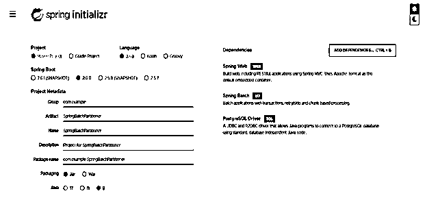

*   **生成项目后，提取文件，使用 spring 工具套件打开该项目—**

*   在这一步中使用 spring 初始化器生成项目之后，我们提取 jar 文件并使用 spring 工具套件打开项目。

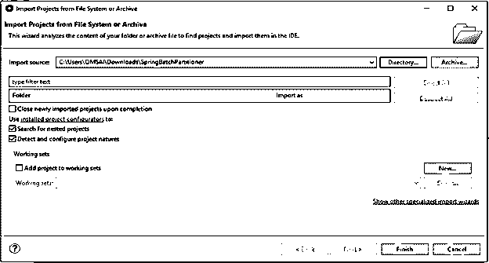

*   **使用 spring 工具套件打开项目后，检查项目及其文件—**

在这一步中，我们检查所有的项目模板文件。我们还需要检查 maven 依赖项和系统库。

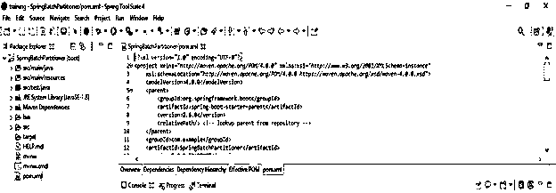

*   **添加依赖包—**

在这一步中，我们将在 spring 批处理项目中添加 partitioner 依赖项。

**代码—**

`<dependency>   -- Start of dependency tag.
<groupId>org.springframework.batch</groupId>   -- Start and end of groupId tag.
<artifactId>spring-boot-starter-batch</artifactId>  -- Start and end of artifactId tag.
</dependency>    -- End of dependency tag.
<dependency>   -- Start of dependency tag.
<groupId>org.postgresql</groupId>   -- Start and end of groupId tag.
<artifactId>postgresql</artifactId>  -- Start and end of artifactId tag.
</dependency>    -- End of dependency tag.`

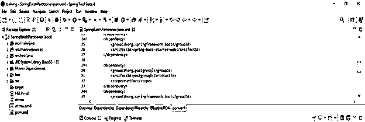

*   **创建数据库、表格并在 stud 表中添加记录—**

**代码—**

`create database springbatchpartitioner;
create table stud(user_id int);`

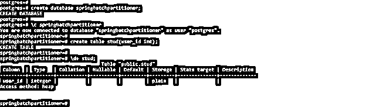

*   **配置 application.properties 文件—**

**代码—**

`spring.datasource.url=jdbc:postgresql://localhost/springbatchpartitioner
spring.datasource.driverClassName=com.postgresql.jdbc.Driver
spring.datasource.username=postgres
spring.datasource.password=postgres
spring.batch.job.enabled=false`

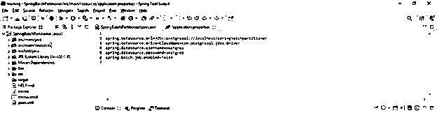

*   **创建分区器—**

**代码—**

`public class springbatchpartition implements Partitioner
{
private JdbcOperations JT;
private String t;
private String c;
public void setTable (String tab) {
this.t = tab;
}
public void setColumn (String col) {
this.c = col;
}
}`

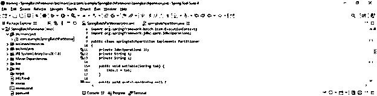

*   **配置春季批处理作业—**

**代码—**

`@Configuration
public class configure {
@Autowired
private JobBuilderFactory JBF;
@Autowired
private StepBuilderFactory SBF;
@Autowired
private DataSource DS;
@Bean
public CRP partitioner()
{
CRP CRP = new CRP();
CRP.setCol ("id");
CRP.setCol (DS);
CRP.setTab ("stud");
return CRP;
}
}`

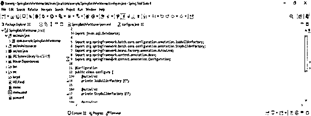

*   **创建实体和映射器类—**

**代码—**

`@Data
@AllArgsConstructor
@Builder
@NoArgsConstructor
public class Stud
{
private int user_id;
}`

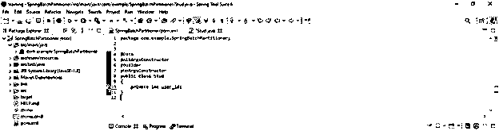

*   **创建主类—**

**代码—**

`@SpringBootApplication
@EnableBatchProcessing
public class springpartitioner implements CommandLineRunner
{
@Autowired
private JobLauncher JL;
@Autowired
private Job J;
public static void main(String[] args) {
SpringApplication.run (springpartitioner.class, args);
}`

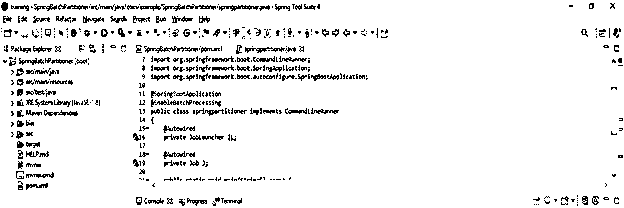

*   **运行应用程序—**

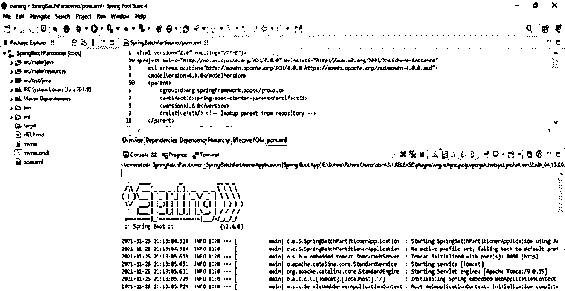

### 结论

分区器是中央策略接口，用于生成 ExecutionContext 实例作为分区阶段的输入参数。分区器处理各种数据集，分区器使用几个线程。为了使并行处理成为可能，我们必须划分批处理任务的步骤。

### 推荐文章

这是一个春季批量分区指南。这里我们讨论什么是 spring 批处理分区器，分区器的步骤以及例子和代码。您也可以看看以下文章，了解更多信息–

1.  [Spring Boot 码头工人](https://www.educba.com/spring-boot-docker/)
2.  [Spring Boot 首发母公司](https://www.educba.com/spring-boot-starter-parent/)
3.  [春批架构](https://www.educba.com/spring-batch-architecture/)
4.  Spring Boot·HTTPS

