# 春季批处理作业

> 原文：<https://www.educba.com/spring-batch-job/>

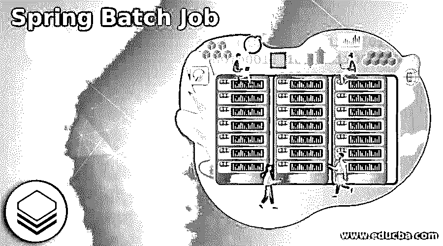

## 春季批处理作业简介

Spring batch job 只不过是以标准化的方式在 JVM 中创建批处理例程。每个步骤都可以有一个读-处理-写作业或一个单独的操作，这被称为微线程。读取-处理-写入是从源(如数据库或 CSV 文件)读取数据、处理数据并将其写入另一个源(如数据库、CSV 或 XML 文件)的过程。

### 什么是春季批量作业？

*   Tasklet 是指完成一个单一的任务或动作，比如处理后清除连接或释放资源。
*   批处理作业有一定数量的步骤。批处理作业包括用于日志记录、作业处理统计、事务管理、任务重启、跳过和资源管理的可重用功能，这些功能在处理大量记录时都很重要。
*   简单和复杂的大批量批处理流程都可以使用该框架以高度可伸缩的方式处理大量数据。
*   Spring 批处理作业将遵循经典的批处理设计，其中作业存储库负责调度和处理作业。
*   一个任务可以有多个步骤，每个步骤通常遵循相同的模式:读取输入、处理输入和写入输入。

### 如何使用批处理作业？

*   Spring batch 框架将为我们处理大部分繁重的工作。特别是当涉及到处理作业的低级持久任务时，这将由 sqlite 来处理。
*   批处理作业处理包括文件读写、数据库读写、更改数据、创建报告、导入和导出数据以及其他操作。
*   通常，这些过程必须联系在一起，或者我们设计更复杂的工作流程，在其中我们定义哪些工作步骤可以并行或按顺序完成，等等。
*   为了开发一个批处理作业，我们使用如下工具。
*   专家
*   Java 语言(一种计算机语言，尤用于创建网站)
*   春季批次
*   弹簧芯
*   弹簧工具套装
*   PostgreSQL java 驱动程序
*   我们使用 FlatFileItemReader 读取 CSV 文件，使用 CustomItemProcessor 处理数据，并使用 StaxEventItemWriter 写入 XML 文件。
*   我们希望创建的作业由这个标签定义。作业的 Id 通过 ID 属性指定。可以在一个 xml 文件中定义多个作业。
*   这个标签用于指定 spring 中批处理任务的各个步骤。
*   Spring Batch Framework 提供了两种主要的处理风格:面向小任务步骤的和面向块的阅读器。spring bean 用于读取数据。

### 创建春季批处理作业

为了创建 spring 批处理作业，我们使用的 spring batch job 的项目模板如下。

<small>网页开发、编程语言、软件测试&其他</small>

*   **创建 spring 批处理作业配置，类—**

**代码—**

`@Configuration
public class SpringBatchJob {
@Autowired
public JobBuilderFactory jbf;
@Autowired
public StepBuilderFactory sbf;
@Bean
public Job processJob() {
return jbf.get ("processJob")
.incrementer (new RunIdIncrementer()).listener(listener())
.flow(orderStep1()).end().build();
}
@Bean
public Step orderStep1() {
return null;
return sbf.get("order").<String, String> chunk(1)
.reader(new Reader()).processor(new Processor())
.writer(new Writer()).build();
}
@Bean
public JobExecutionListener listener() {
return null;
return new JobCompletionListener();
}
}`

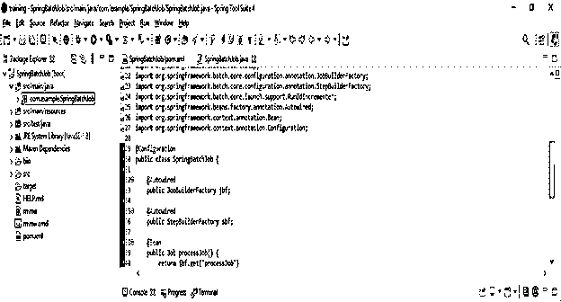

*   **定义项目处理器接口类—**

**代码—**

`Public class SpringBatch implements ItemProcessor {
public /* implement ItemProcessor interface */ String process(String data) /* string type of data */ throws Exception /* throws exception code */ {
return data.toUpperCase();
}
}`

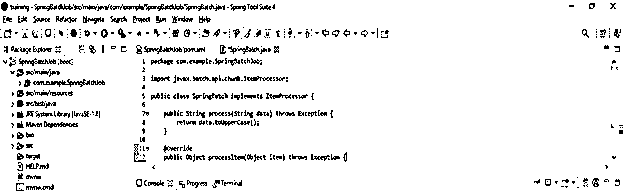

*   **创建一个类来实现 itemWriter 接口-**

**代码—**

`public class writer implements ItemWriter {
public void write(List messages) throws Exception {
for (String message : messages) {
System.out.println("data writing" + message);
}
}`

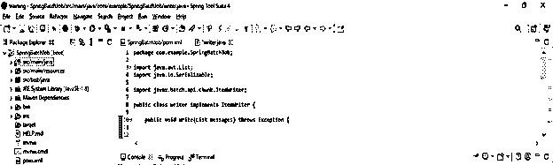

*   **定义监听器—**

**代码—**

`public class Listener extends JobExecutionListenerSupport {
public void afterJob(JobExecution jobExecution) {
if (jobExecution.getBatchStatus() == BatchStatus.COMPLETED) {
System.out.println("Spring batch job completed");
}
}
}`

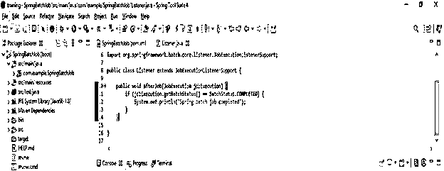

*   **配置 application.properties 文件—**

**代码—**

`spring.datasource.url=jdbc:postgresql://localhost:5432/springbatchjob
spring.jpa.properties.hibernate.hbm2ddl.auto=update
spring.batch.job.enabled=false`

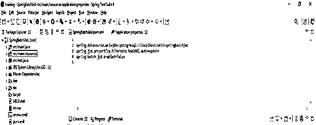

*   **运行应用程序—**

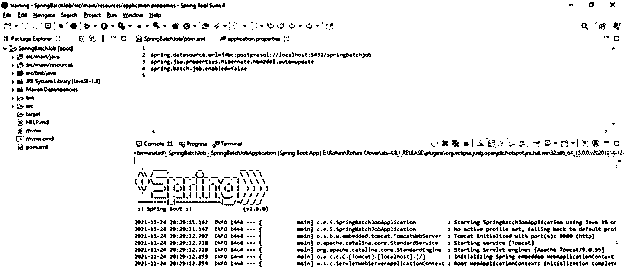

### Spring 批处理作业调度程序

*   Spring 批处理是通过将 spring 任务调度器传递给 cron 表达式来完成的。我们可以通过使用注释名@EnableScheduling 来启用调度。
*   Spring batch scheduler 是 Spring batch 中可用的框架，用于在特定时间运行调度的作业。
*   Spring Batch 是开源批处理框架之一。在任何应用程序中工作时，我们可能需要经常运行批处理作业，或者按照设定的时间表运行。

### 项目春季批处理作业

以下示例显示了设置批处理作业项目的步骤如下。

*   **使用 spring initializer 创建批处理作业的项目模板**

*   在下面的步骤中，我们已经提供了项目组名为 com.example，工件名为 SpringBatchJob，项目名为 SpringBatchJob，选择的 java 版本为 8。此外，我们将 spring boot 版本定义为 2.6.0，将项目定义为 maven。
*   我们在下面的项目中选择了 spring web、spring batch 和 PostgreSQL 驱动程序依赖项来实现批处理作业项目。

`Group – com.example                        Artifact name – SpringBatchJob
Name – SpringBatchJob          Spring boot – 2.6.0
Project – Maven                                  Java – 8
Package name - com.example.SpringBatchJob
Project Description - Project for SpringBatchJob
Dependencies – spring web, PostgreSQL driver, spring batch.`

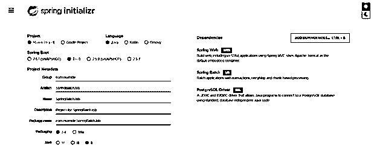

*   **生成项目后，提取文件，使用 spring 工具套件打开该项目—**

*   在这一步中使用 spring 初始化器生成项目之后，我们提取 jar 文件并使用 spring 工具套件打开项目。

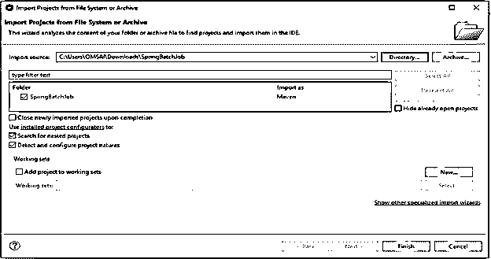

*   **使用 spring 工具套件打开项目后，检查项目及其文件—**

*   在这一步中，我们检查所有的项目模板文件。我们还需要检查 maven 依赖项和系统库。

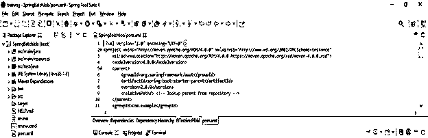

*   **添加依赖包—**

*   在这一步中，我们将在 spring batch scheduler 项目中添加 spring batch 依赖项。

**代码—**

`<dependency>   -- Start of dependency tag.
<groupId>org.springframework.boot</groupId>   -- Start and end of groupId tag.
<artifactId>spring-boot-starter</artifactId>  -- Start and end of artifactId tag.
</dependency>    -- End of dependency tag.
<dependency>   -- Start of dependency tag.
<groupId>org.postgresql</groupId>   -- Start and end of groupId tag.
<artifactId>postgresql</artifactId>  -- Start and end of artifactId tag.
</dependency>    -- End of dependency tag.`

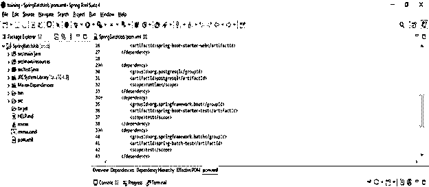

### 结论

Spring batch job 包括更高级的技术服务和功能，这些服务和功能将通过优化和分区方法实现极高容量和高性能的批处理作业。此外，批处理作业用于以标准化的方式在 JVM 中创建批处理例程。

### 推荐文章

这是春季批处理作业指南。这里我们讨论如何使用 spring 批处理作业以及批处理作业的项目模板。您也可以看看以下文章，了解更多信息–

1.  [Spring Boot·梅文](https://www.educba.com/spring-boot-maven/)
2.  Spring Boot 赛道
3.  [Spring Boot 的优势](https://www.educba.com/spring-boot-advantages/)
4.  [春季开机记录等级](https://www.educba.com/spring-boot-logging-level/)

