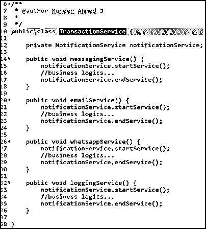
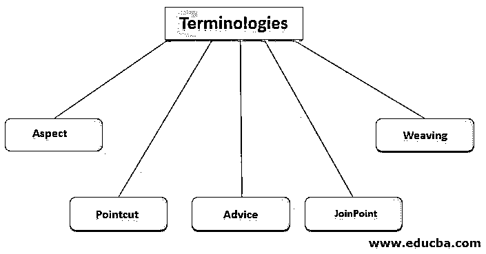
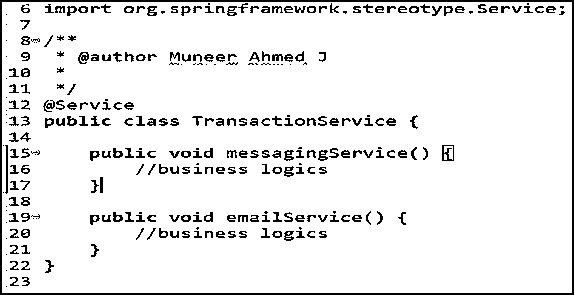
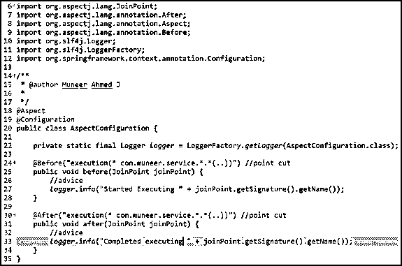
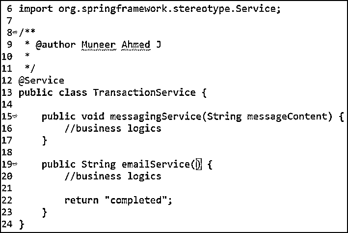
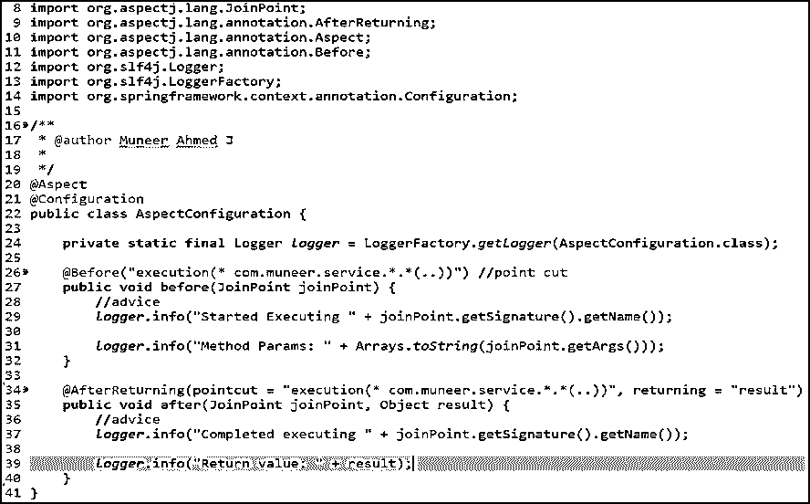
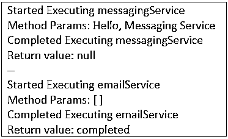

# 春季 AOP

> 原文：<https://www.educba.com/spring-aop/>


## Spring AOP 简介

AOP(面向方面编程)引入了一种可视化编程结构的新方法。像 OOP(面向对象编程)，其模块化的主要单位是类，AOP 的模块化单位是方面。Spring Framework 还通过实现 AOP 概念来提供面向方面的编程。Spring AOP 被广泛用作横切关注点的实现，例如，在一个地方定义的模块或功能，但是在整个项目的许多地方都需要。

简单地说，横切关注点是集中在项目的一个地方的东西&在多个地方使用，比如日志、认证、安全、事务管理等。

<small>网页开发、编程语言、软件测试&其他</small>

### 对 Spring AOP 的需求

为了更好地理解对 Spring AOP 的需求，让我们简单地看一下问题陈述&以及 Spring AOP 是如何解决它的。

#### 问题陈述

假设我们在一个服务层中有大约 5 个方法&当一个方法被调用以及当控件退出该方法时，我们需要执行一些通知。

为了实现这一点，我们需要在服务层的所有 5 个方法的开始和结束期间调用通知方法。

所以，这是一个冗长而重复的工作，在所有 5 个方法中一次又一次地写同样的代码。此外，在将来，如果我们想要删除其中一个方法的通知事件，我们需要再次删除代码。所以，维护也会有问题。

**代码片段**





因此，如果您注意到在 TransactionService 类中，对于每个方法，我们都从 NotificationService 调用 startService()和 endService()方法。这对开发人员来说就像是样板代码&重复的工作。此外，如果客户端要求停止调用 emailService()和 loggingService()的 NotificationService，我们需要再次从 TransactionService 类中删除代码。

#### 解决办法

在 Spring AOP 的帮助下，在每个方法开始和结束时调用 NotificationService 的方面可以集中起来，这减少了重复的工作&也很适合将来较少的维护。

因此，Spring AOP 通过使用简单的可插入 XML 配置文件或使用 Java 注释，动态地提供了一种添加横切关注点(即，在这种情况下调用通知服务)的方法。

### Spring AOP 术语

Spring AOP 的一些术语如下。




*   方面
*   切入点
*   建议
*   JoinPoint
*   编织

很难从理论上理解上述术语。因此，让我们见证一个使用 Spring AOP 的实际例子，以及术语是如何相互连接的。

**Spring AOP 代码片段**

交易服务(package: com.muneer.service)







根据上面的代码片段，需要在 TransactionService 中的每个方法的启动和完成期间实现日志管理。

如果我们需要在业务层中的每个方法的开始和结束期间编写记录器，那将是一项单调乏味的任务。因此，我们将日志活动分配给 Spring AOP 来处理。

因此，我们利用 Spring AOP 来集中日志管理。

#### 1.方面

方面只不过是关注点，或者是你试图一般地或者集中地实现的功能。

从上面的例子来看，方面是日志管理。

行业中使用的一些方面包括日志管理、事务管理、异常处理、性能指标、认证、安全性等。,

简单地说，方面就是您试图通过 Spring AOP 实现的功能。

#### 2.切入点

切入点不过是一种正则表达式，它指定了哪些方法调用需要被拦截。

在 AspectConfiguration 中第 24 & 30 行的代码片段中，

```
@Before("execution(* com.muneer.service.*.*(..))")
```

正则表达式表示所有方法(使用*。*)需要拦截。另外，@Before 指定一旦控件进入方法就需要进行日志记录，而@After 指定一旦控件退出方法就需要进行日志记录。

#### 3.建议

建议就是，当切入点被满足时，需要做什么动作。

在 AspectConfiguration 中第 27 & 33 行的代码片段中，

```
logger.info("Started Executing " + joinPoint.getSignature().getName());
```

所以这里的建议是，当遇到切入点时，开始记录信息和方法名。

#### 4.连接点

在运行时，当条件被满足时，即当切入点被满足&通知被执行时，它被称为连接点。

它不仅限于方法的执行，还包括在异常处理管理期间抛出异常时。

#### 5.编织

编织就是当遇到切入点时，相应的方法就会被执行。

从代码片段，第 24 & 25 行——当遇到切入点时，它确保执行 before()方法。这个用方法绑定切入点的过程被称为编织。

### Spring AOP 的优势

Spring AOP 的一些优点是，

*   AOP 是 Spring 框架的关键组件之一。值得注意的是，Spring IoC 容器不依赖于 AOP。因此，它为开发者提供了是否使用 AOP 的优势。
*   作为横切关注点的实现，诸如日志记录、通知管理、身份验证、安全性、事务管理等功能可以集中保存&可以在应用程序的多个地方使用。
*   由于 AOP 是使用 Java 实现的，所以不需要任何特殊的编译单元或类加载器。
*   由于横切关注点被集中，样板代码减少了。
*   开发人员维护系统变得很容易。
*   Spring AOP 提供了基于 XML 的配置以及高级 Java 注释配置。

### Spring AOP 的例子

让我们看一个带有附加特性的实时例子，比如用 Spring AOP 打印方法参数和返回值。

**代码片段**







**输出**




### 结论

从这篇文章中，我们已经深入探讨了 AOP 之前的问题陈述 Spring AOP 如何高效地解决它。此外，我们还浏览了 Spring AOP 术语、它的优势以及实时示例和代码片段。

### 推荐文章

这是一个 Spring AOP 的指南。在这里，我们讨论 Spring AOP 的介绍，以及它的术语、优点和相应的例子。您也可以浏览我们的其他相关文章，了解更多信息——

1.  [春天的建筑](https://www.educba.com/spring-architecture/)
2.  [Java 中的框架](https://www.educba.com/frameworks-in-java/)
3.  [国际奥委会容器](https://www.educba.com/ioc-containers/)
4.  [Java 中的 spring layout](https://www.educba.com/springlayout-in-java/)


